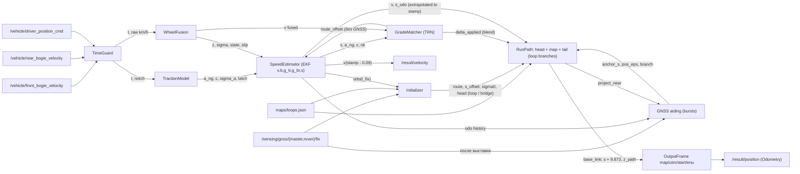

# Математическая модель резервной одометрии

Документ описывает алгоритм пакета `tram_backup_odometry` с точностью, достаточной для
независимой реализации. Источник истины — код:

- `core/preprocess.py`, `core/wheel_fusion.py`, `core/traction.py`, `core/estimator.py`;
- `core/grade_matcher.py`, `core/track_map.py`, `core/initializer.py`, `core/frames.py`;
- `core/pipeline.py` (в том числе GNSS-коррекция положения), `core/config.py`;
- в `node.py` — ковариации и диагностика;
- геометрия разворотных колец — `maps/loops.json`, построение — `tools/build_loops.py`.

Факты о данных, которыми обоснованы решения, взяты из `docs/analysis_notes.md`. Источники чисел
качества:

| Прогон | Что это | Где |
|---|---|---|
| `F4_final` | текущий код, 60 оценочных bag, GNSS первые 10 с (`tools/run_cv.py`, окно по умолчанию) | `results/F4_final` |
| `F4_final_burst` | текущий код, GNSS первые 30 с и далее пачка 1.5 с каждые 120 с (`--gnss-limit 30 --gnss-burst 120 1.5`) | `results/F4_final_burst` |
| `AF_*`, `G_limit*` | абляции текущего кода: `F4_final` с одним переключателем или другим окном GNSS | `results/AF_*`, `results/G_limit*` |
| эмуляция проверяющего | тестовый bag организаторов 30618_88aea4d9, точка `base_link`, ошибка 3D (`tools/checker_sim.py`) | `results/checker_30618_88aea4d9/summary.md` |
| `F3_final` | предыдущая версия: без колец и без GNSS-коррекции, выход в точке главной антенны | `results/F3_final` |

Числа с пометкой «версия F3» получены на `F3_final` и её абляциях. Файлы тех абляций перезаписаны
прогонами текущего кода; эти числа оставлены как история решений. `tools/run_cv.py` оценивает точку
главной антенны (`output_along_offset_m` = 0, `output_z_offset_m` = 3.10, `output_velocity_delay_s` = 0),
поэтому CV-метрики сравнимы между версиями, а метрики проверяющего — нет.

Пути `.work/scratch_*` (скрипты статистики в §7, §8, §10, §11 и в приложении) — рабочие файлы
исследований, в поставку не входят (`.gitignore`). Воспроизводимые аналоги калибровок —
`tools/calibration/*`, соответствие исходникам — `tools/calibration/README.md`, §7.

Все настраиваемые величины — поля dataclass `Params` в `core/config.py` (199 полей). В тексте они
записаны как `имя` = значение по умолчанию. Эти же имена используются как ROS 2-параметры
(`config/params.yaml` генерируется из `config.py` скриптом `tools/gen_params_yaml.py`).
`Params.validate()` вызывается в конструкторе `Pipeline` и отклоняет неизвестные значения
перечислений (`publish_on` ∈ all|cmd|wheels, `tail_mode` ∈ decay|straight, `output_frame` ∈
map|utm|start|enu): опечатка останавливает узел при старте с `ValueError`, а не ухудшает оценку молча.

**Соглашения**

| Обозначение | Смысл |
|---|---|
| $t$ | header stamp входного сообщения (часы ТС), с. Собственные часы узла в оценивании не используются |
| $v$ | скорость вдоль пути, м/с. Всегда $v \ge 0$: движение назад не моделируется |
| $s$ | длина дуги, м |
| $g$ | ускорение свободного падения, $g = 9.81$ м/с² |
| $n$ | позиция контроллера водителя (notch), целое $-15..15$: $n>0$ — тяга, $n<0$ — торможение |
| карта | pathgraph маршрута в системе `map` = UTM 37N (WGS84, $\lambda_0 = 39°$, $k_0 = 0.9996$) минус (300000, 6100000) м |
| T2S, S2T | два направления (два пути). Для каждого есть свой файл карты `maps/t2s.json`, `maps/s2t.json` |
| кольца S, T | разворотные кольца у Щукинской (S: из конца T2S в начало S2T) и у Таллинской (T: из конца S2T в начало T2S), `maps/loops.json` |

**Содержание**

1. [Архитектура и поток данных](#1-архитектура-и-поток-данных)
2. [Время и предобработка (TimeGuard)](#2-время-и-предобработка-timeguard)
3. [Колёсное измерение и слияние тележек (WheelFusion)](#3-колёсное-измерение-и-слияние-тележек-wheelfusion)
4. [Модель тяги и торможения (Hammerstein)](#4-модель-тяги-и-торможения-hammerstein)
5. [Фильтр (EKF)](#5-фильтр-ekf)
6. [Позиция](#6-позиция): маршрут, `RunPath`, кольца, мост, хвост, выходная точка `base_link`, кадры
7. [Начальная выставка (Initializer)](#7-начальная-выставка-initializer): старт на карте, на кольце, мост
8. [TRN: сопоставление с профилем уклона (GradeMatcher)](#8-trn-сопоставление-с-профилем-уклона-gradematcher)
9. [GNSS-коррекция положения](#9-gnss-коррекция-положения)
10. [Ковариации в Odometry](#10-ковариации-в-odometry)
11. [Флаг проскальзывания, сцепление, адаптивность, диагностика](#11-флаг-проскальзывания-сцепление-адаптивность-диагностика)
12. [Допущения](#12-допущения)
13. [Приложение: вклад компонентов](#приложение-вклад-компонентов-60-bag)

---

## 1. Архитектура и поток данных

Оценка одномерна. Фильтр оценивает скорость и пройденный путь вдоль рельса. Положение и курс
берутся из геометрии пути прогона (`RunPath`: кольцо или мост до карты, карта, кольцо после карты) в
точке $s_{route}$. GNSS используется двумя способами:

- **начальная выставка** (§7) — выбор маршрута и привязка одометра к карте в стартовом окне;
- **коррекция положения по ходу рейса** (§9, `gnss_aiding` = true, по умолчанию) — пачки фиксов
  после выставки сдвигают положение вдоль пути, уточняют масштаб пути и выбирают ветвь кольца.

Скорость GNSS не использует ни в одном режиме: поток `/result/velocity` с коррекцией и без неё
совпадает побитно (§9.8). Организаторы разрешили использовать GNSS для положения без штрафа.



**Обработка одного сообщения** (`Pipeline`)

| Вход | Цепочка | Выход |
|---|---|---|
| скорость тележки (front/rear) | TimeGuard → `WheelFusion.add_sample` → `predict_to(t)` → `WheelFusion.measure` → `update` → `_trn_step` (`GradeMatcher.add` + применение поправки) → запись $(t, s, v)$ в историю одометра → проверка выставки → закрытие пачки GNSS по тишине | Output с header stamp этого сообщения |
| команда контроллера | TimeGuard → `TractionModel.add_cmd` → `predict_to(t)` → запись в историю одометра → проверка выставки → закрытие пачки GNSS по тишине | Output с header stamp этого сообщения |
| GNSS fix, до завершения выставки | `Initializer.add_fix` с одометром EKF, экстраполированным к метке фикса. Метка фикса не проходит через TimeGuard. Предварительный результат применяется сразу | нет |
| GNSS fix, после выставки | при `gnss_aiding` = true: фикс добавляется в текущую пачку (§9.2); при `gnss_aiding` = false или в режиме без GNSS — игнорируется | нет |

Опоздавшие по TimeGuard сообщения в историю одометра не пишутся.

Обработка начинается с первого принятого колёсного отсчёта. Он сбрасывает EKF со значением
$v_0 = \max(raw, 0)/K$. До этого выходов нет; команды, пришедшие раньше, уже лежат в буфере модели.

Выход публикуется на каждое сообщение колеса или команды (`publish_on` = `'all'`; `'cmd'` —
только на команды, монотонный поток около 20 Гц; `'wheels'` — только на колёса). Каждый header
stamp публикуется один раз: последние 64 метки (`STAMP_MEMORY` в `pipeline.py`) хранятся для
дедупликации; этого хватает на стартовую пачку (bag повторно отдаёт около 40 сообщений). Передняя
и задняя тележки приходят с одной меткой, поэтому выход формирует первое из пары сообщений; второе
обрабатывается фильтром, но выхода не даёт. Состояние экстраполируется к метке (§5.6). Колёсные
метки отстают от командных примерно на 0.05 с, поэтому в режиме `'all'` метки выхода не монотонны.

До выставки публикуется только `/result/velocity`: у выхода нет позы (`has_pose` = false), и узел
не публикует `/result/position`. Поза появляется после предварительной выставки (§7) или после
перехода в режим без GNSS (§6.8).

**Подписки GNSS.** Признак `Pipeline.gnss_done` = выставка завершена $\land$ (режим без GNSS $\lor$
`gnss_aiding` = false). Только когда он истинен, узел уничтожает подписки на
`/sensing/gnss/{master,rover}/fix` — в ближайшем колбэке колеса или команды либо по таймеру
диагностики. При `gnss_aiding` = true (по умолчанию) и успешной выставке подписки остаются до конца
работы узла. При `gnss_aiding` = false поведение прежнее: GNSS только в окне выставки.

**Топики и QoS** (`node.py`)

| Топик | Тип | QoS |
|---|---|---|
| `/vehicle/front_bogie_velocity`, `/vehicle/rear_bogie_velocity` | `tram_vehicle_msgs/VelocitySensor` (км/ч) | best effort, keep last, глубина `input_qos_depth` = 50 |
| `/vehicle/driver_position_cmd` | `tram_vehicle_msgs/DriverControllerCommand` | то же |
| `/sensing/gnss/{master,rover}/fix` | `sensor_msgs/NavSatFix` | то же; подписка уничтожается после выставки только при `gnss_aiding` = false или в режиме без GNSS |
| `/result/velocity` | `tram_vehicle_msgs/VelocitySensor` (м/с) | reliable, volatile, keep last 50 |
| `/result/position` | `nav_msgs/Odometry` | то же |
| `/backup_odometry/diagnostics` | `diagnostic_msgs/DiagnosticArray` | глубина 10, период `diag_period_s` = 1 с по steady clock |
| `/backup_odometry/slip` | `std_msgs/Bool` | reliable, transient local, глубина 1; публикуется при смене значения |

**Главная формула положения**

$$
s_{route}(t) = s_M(s_{odo}(t)) + \Delta_{out},\qquad
s_M(s_{odo}) = \begin{cases}
s_{off} + \delta_{app} + s_{odo}, & \text{пачек GNSS ещё не было}\\
s_A + (1 + \varepsilon_p)(s_{odo} - o_A) + c_{TRN}(s_{odo}), & \text{после первой принятой пачки (§9)}
\end{cases}
$$

$s_M$ — длина дуги пути прогона для главной антенны (`Pipeline._s_master`).

| Слагаемое | Смысл | Раздел |
|---|---|---|
| $s_{odo}$ | одометр EKF, экстраполированный к метке | §5 |
| $s_{off}$ | привязка одометра к маршруту из начальной выставки | §7 |
| $\delta_{app}$ | вдольпутевая поправка TRN (сравнение с профилем уклона) | §8 |
| $s_A, o_A$ | якорь GNSS: положение и одометр последней принятой пачки | §9.5 |
| $\varepsilon_p$ | поправка масштаба пути по базе между пачками RTK (`pos_eps`) | §9.6 |
| $c_{TRN}$ | смешение с TRN между пачками | §9.7 |
| $\Delta_{out}$ | `output_along_offset_m` = 9.873: выходная точка — `base_link` эталона (0 — главная антенна, 6.22 — середина базы, 12.44 — rover) | §6.6 |

Поза равна `RunPath.pose(s_route)` (§6), $z$ выхода — $z$ пути + `output_z_offset_m` (0). Уровни
оценивания:

| Уровень | Состояние |
|---|---|
| 1. EKF | $[v, b, g_{tr}, g_{br}, s]$ |
| 2. Точечный фильтр TRN | $(\delta_0, \varepsilon)$ |
| 3. Геометрия | маршрут + голова (кольцо или мост) + хвост (ветви кольца); из состояния — только выбранные ветви |
| 4. Якорь GNSS | $(s_A, o_A, \sigma_A^2, \varepsilon_p)$ и часть пути якоря (карта / голова / хвост) |

Уровни 2–4 влияют только на положение. В EKF (поиск уклона) идёт $r_{off} = s_{off} + \delta_{app}$ без
GNSS-якоря.

---

## 2. Время и предобработка (TimeGuard)

**Данные** (`analysis_notes`, разделы timing_units и C1/C4; `tools/calibration/timeguard_flags.py`
на 97 уникальных bag):

- каждая тележка — около 9.36 Гц (медиана); передняя и задняя имеют одинаковые метки (99.9 %
  сообщений) и приходят друг за другом с разницей меньше 1 мс;
- команда — 20.05 Гц;
- в первую секунду записи приходит пачка сообщений 2–6-секундной давности;
- в 5 bag из 97 (2255aade, 40ffd323, 9c362687, 28538acf, af7496f0) метки колёс и команды скачут на
  ±0.4–1 с, в 2255aade и 40ffd323 — все потоки вместе на +1 с в течение 2–3 с;
- в остальных 92 bag после первой секунды сообщение отстаёт от максимума уже пришедших меток не
  больше чем на 0.101 с (p99 0.086 с); отставание больше 0.15 с не встречается.

`TimeGuard` работает только по header-меткам, не используя время приёма. Потоки: `front`, `rear`,
`cmd`.

**Состояние**

- для каждого потока $k$: `last[k]` — последняя сырая метка, `seen[k]` — номер сообщения,
  `base[k]` — последняя неглитчевая метка, `run[k]` — длина серии глитчей;
- общее: счётчик $N$ и часы фильтра $now$.

**Алгоритм для сообщения $(k, t)$**

1. Если $t$ не конечна или $t \le 0$ — флаг 3 (invalid), сообщение отбрасывается.
2. $N \leftarrow N+1$. Опорная метка
   $R = \max\{\,last[k'] : k' \ne k,\ N - seen[k'] \le$ `time_consensus_n` $= 30\,\}$.
   Затем `last[k]` $\leftarrow t$, `seen[k]` $\leftarrow N$. Здесь сохраняется сырая метка, поэтому
   тележки подтверждают друг друга.
3. **Скачок вперёд** — выполнены все условия:
   - $R$ определена;
   - $t > R +$ `time_glitch_s` (0.3);
   - $t > now$;
   - `base[k]` не определена, или $t - base[k] >$ 0.3 + `time_jump_margin_s` (0.15) = 0.45 с.

   Тогда $run[k] \leftarrow run[k] + 1$. Если $run[k] \le$ `time_resync_n` (20):
   $t_{eff} = \max(R, now)$, $now \leftarrow t_{eff}$, флаг 1. Иначе засчитывается resync: новая шкала
   времени принимается, и обработка идёт дальше.
4. $run[k] \leftarrow 0$, $base[k] \leftarrow t$.
5. Если $t < now -$ `time_late_tol_s` (0.15) — флаг 2 (late), $now$ не меняется.
6. Иначе флаг 0, $now \leftarrow \max(now, t)$.

**Использование в `Pipeline`**

| Флаг | Колесо | Команда |
|---|---|---|
| 0 | обрабатывается с $t$ | обрабатывается с $t$ |
| 1 | фильтр получает $t_{eff}$; выход всё равно несёт исходную метку | то же |
| 2 | отсчёт не подаётся в слияние и EKF, но выход (экстраполяция к метке) публикуется | команда вставляется в историю по времени, `predict_to` не вызывается; выход публикуется |
| 3 | игнорируется, выхода нет | игнорируется, выхода нет |

Допуск 0.15 с для опозданий выбран больше 0.101 с — максимального отставания чистых меток.
Скачок вперёд сразу у всех потоков корректируется только для первого сообщения: остальные потоки
подтверждают новую шкалу через `last`. Устойчивый скачок одного потока корректируется
`time_resync_n` = 20 раз подряд, 21-е сообщение принимается (resync). Скачок назад не
пересинхронизируется: сообщения получают флаг 2, пока их метки не станут больше $now - 0.15$ с;
при скачке всех потоков на −1 с это около 0.85 с данных, которые фильтр не получает.

**Проверка на записях** (`timeguard_flags.py`, параметры по умолчанию): в 92 bag без сбоев меток
после первой секунды записи нет ни одного флага (3 775 196 сообщений). В стартовой пачке этих bag
748 сообщений получают флаг 1 и 6 361 — флаг 2. В 5 bag со сбоями после первой секунды — от 0 до
22 флагов 1 и от 0 до 34 флагов 2 на bag; за все записи один resync (28538acf, в стартовой пачке).

---

## 3. Колёсное измерение и слияние тележек (WheelFusion)

### 3.1 Масштаб

$$
v = \begin{cases} raw / K, & raw > 0 \\ 0, & raw \le 0 \end{cases}
$$

Значение $K$ выбирается по параметру `vehicle_id` (`Params.k_for_vehicle()`):

- `wheel_k_30618` = 3.597;
- `wheel_k_30639` = 3.59;
- иначе (`vehicle_id` пуст или неизвестен) `wheel_k` = 3.595.

`vehicle_id` задаётся в `params.yaml` или аргументом запуска `vehicle_id:=30618|30639`. В `config.py` и
`config/params.yaml` он пуст ($K$ = 3.595). Аргумент `vehicle_id` в `launch/backup_odometry.launch.py` по
умолчанию `30618`, так как скрытая проверка идёт на вагоне 30618; `vehicle_id:=''` берёт значение из
`params_file`. Запуск узла без launch-файла с `params.yaml` работает с $K$ = 3.595.
`scripts/run_bag.sh`, `scripts/run_checker.sh` и `tools/run_cv.py` берут `vehicle_id` из префикса имени
bag.

**Данные.** Топики несут км/ч, хотя README говорит о м/с. Поэтому $K \approx 3.6$ и включает перевод
км/ч → м/с вместе с ошибкой радиуса колеса. Между прогонами и датами $K$ меняется до ±1.6 %. Масштабы
передней и задней тележки совпадают до 0.02 %.

Для 30639 медиана отношения к RTK равна 3.585, но выбрано 3.59: перебор $K$ = 3.585 / 3.59 / 3.595 /
3.60 / 3.605 на 11 оценочных прогонах 30639 дал среднее al_rmse 6.37 / 5.61 / 5.58 / 6.09 / 6.94 м и
среднее score_loss 1.78 / 1.66 / 1.67 / 1.75 / 1.86 (версия F3). Без `vehicle_id` ($K$ = 3.595 для всех,
`results/_deliv_novid`, версия F3) медиана al_rmse по 60 bag 3.19 м против 3.03 м (`F3_final`), медиана v_rmse
0.0305 против 0.0295 м/с; у 30639 медиана al_rmse 5.42 против 3.81 м при почти равном среднем
(5.58 против 5.61 м).

### 3.2 Приём отсчёта

Обозначения: $b$ — тележка отсчёта, $o$ — другая тележка, $(t_0, v_0)$ и $(t_1, v_1)$ — два последних
принятых отсчёта $b$.

Отсчёт отклоняется, если выполнено любое условие:

- значение не конечно;
- raw > `wheel_max_kmh` (100);
- raw < `wheel_min_kmh` (−5);
- $t < t_1$.

**Тест на выброс.** Выполняется, если предыдущий отсчёт $b$ сам не был выбросом и $t - t_1 \le$
`wheel_stale_s` (0.5). Порог:

$$
\tau = \frac{\texttt{spike\_kmh}}{K} + \max(\texttt{acc\_max}, \texttt{dec\_max\_consistent})\,(t - t_1)
= \frac{4.0}{K} + 6.0\,(t-t_1)
$$

Если $|v - \hat v_b(t)| > \tau$ и отсчёт не подтверждён другой тележкой, он отклоняется как выброс.
Подтверждение: $o$ свежая, то есть $|t - t_{1,o}| \le 0.5$, и $|v - \hat v_o(t)| \le \tau$. Следующий
отсчёт принимается без теста, поэтому скачок уровня не отбрасывается дважды.

Отсчёт с той же меткой заменяет $v_1$. Иначе происходит сдвиг $(t_0, v_0) \leftarrow (t_1, v_1)$.

### 3.3 Значение тележки в момент $t$

$$
\hat v_b(t) = \max\!\Big(0,\; v_1 + \frac{v_1 - v_0}{t_1 - t_0}\,
\mathrm{clip}\big(t - t_1,\; -(t_1 - t_0),\; \texttt{wheel\_extrap\_max\_s}\big)\Big)
$$

Здесь `wheel_extrap_max_s` = 0.2. Если $t_0$ нет или $t_1 - t_0 < 0.02$, то $\hat v_b = v_1$.

### 3.4 Годность тележки в момент $t$

| Состояние | Условие |
|---|---|
| stale | $t - t_1 >$ 0.5 с |
| frozen | $raw_1 \ne 0$; одно и то же raw держится $\ge$ `frozen_s` (1.5 с); за эту серию диапазон другой тележки превысил `frozen_other_dv_mps` (0.3 м/с) |
| stuck zero | обе годны после проверок stale и frozen, $v_{1,F} = 0$ и $\hat v_R >$ `stuck_zero_other_mps` (0.2) — передняя негодна. Иначе симметричная проверка для задней |

Серия frozen начинается заново при каждом новом значении raw и при raw = 0; диапазон другой
тележки считается по её принятым отсчётам за время серии.

Данные: только у 30639 есть выпадения одной тележки — 11 выпадений в 8 bag длительностью 5.8–73.5 с.
Перед каждым выпадением тележка передаёт 0.0, 10 из 11 начинаются при отправлении после стоянки.

### 3.5 Выравнивание по времени

Включено `wheel_align_other` = True. Тележки имеют общие метки, но при первом из пары сообщений
другая тележка старше примерно на 0.1 с.

Пусть $N$ — более новая тележка ($t_{1,N} > t_{1,O}$), $O$ — более старая, и
$t_{0,N} \le t_{1,O}$, $t_{1,N} \le t$. Тогда изменение за это время берётся у новой тележки:

$$
\tilde v_O = v_{1,O} + \hat v_N(t) - \hat v_N(t_{1,O}), \qquad \tilde v_N = \hat v_N(t)
$$

Иначе $\tilde v = \hat v$.

### 3.6 Согласие и дисперсия

Допуск согласия:

$$
\tau_a = \max\big(\texttt{agree\_abs\_mps},\ \texttt{agree\_rel}\cdot\max(\hat v_F, \hat v_R)\big)
= \max(0.2,\ 0.03\max(\hat v_F, \hat v_R))
$$

Проверяются два сравнения:

- собственное: $|\hat v_F - \hat v_R| \le \tau_a$;
- выровненное: $|\tilde v_F - \tilde v_R| \le \tau_a$.

| Случай | $z$ | $\sigma$ | state | slip |
|---|---|---|---|---|
| обе годны, оба сравнения в допуске | $(\tilde v_F + \tilde v_R)/2$ | `meas_sigma` 0.03 | both | не поднимается (может держаться, §3.8); если синфазный тест не сработал, якорь $\leftarrow (t, z)$ |
| обе годны, в допуске ровно одно сравнение | среднее согласной пары (выровненной, если согласна она, иначе собственной) | `meas_sigma_slip` 0.35 | both | не поднимается |
| обе годны, ни одно не в допуске | тележка, ближайшая к опоре (см. ниже) | 0.35 | disagree | да |
| годна одна | $\hat v_F$ или $\hat v_R$ | `meas_sigma_single` 0.045 | single_front / single_rear | только синфазным тестом (§3.7) или удержанием (§3.8) |
| годных нет | измерения нет, EKF работает на модели; история синфазного теста и флаг не меняются | — | — | — |

Слитое значение ограничено снизу нулём. При поднятом флаге $\sigma$ = 0.35 в любой строке (§3.8).

**Опора при расхождении**, по порядку:

1. скорость якоря — последнего полного согласия, если $0 \le t - t_{anchor} \le$ `slip_anchor_s` (3.0);
2. иначе прогноз EKF $v_{pred}$;
3. иначе последнее слитое значение;
4. если нет ничего — среднее двух тележек.

Боксующая тележка показывает больше истинной скорости, юзящая — меньше. Обе уходят от последнего
общего значения быстрее, чем истинная скорость, поэтому выбирается ближайшая к удержанному якорю.

### 3.7 Синфазный тест (обе тележки проскальзывают одновременно)

Хранится история слитых $(t, z)$. Опорная точка $(t_w, z_w)$ — последний отсчёт с
$t_w \le t -$ `slip_acc_win_s` (0.3). Средний наклон:

$$
\bar a = (z - z_w)/(t - t_w)
$$

Флаг поднимается при $\bar a >$ `slip_acc_flag` = 2.5 или $\bar a <$ −`slip_dec_flag` = −6.0 м/с².
Если в истории нет отсчёта старше 0.3 с, тест не срабатывает. Порог замедления выбран за пределами
настоящего экстренного торможения, поэтому синфазный юз ловится этим тестом только при замедлении
больше 6 м/с². Синфазный юз слабее 6 м/с² при согласных тележках не обнаруживается и не
ограничивается (для согласных тележек предел темпа в EKF тоже 6.0, §5.5). Это сознательный выбор:
по `analysis_notes` (A6) ограничитель −2.4 м/с² на экстренном торможении 616ec56b увеличивал
максимальную ошибку скорости с 0.17 до 2.02 м/с — примерно столько же, сколько выигрывал на юзах.

**Данные** (`analysis_notes`, A5–A7):

| Величина | Значение, м/с² |
|---|---|
| перцентиль 0.01 % (p0.01) замедления за 0.2 с на чистых данных | −2.02 |
| настоящее экстренное торможение (30618_616ec56b, по GNSS −4.72) | −5.15 по колесу за 0.2 с; −4.88 в окне этого теста (≥ 0.3 с) |
| боксование, за 0.2 с | +2.75…+4.3 |
| юз, за 0.2 с | −2.6…−4.75, в отдельных событиях до −6.7…−7.1 |

Расхождений тележек ($|F - R| >$ max(1.5 км/ч, 8 %) дольше 0.3 с) насчитано 18 по первичному анализу
и 12 при повторном подсчёте на 86 bag. Синфазных событий (обе тележки ошибаются) — около 5 в 4 bag,
примерно 0.2–0.3 в час.

### 3.8 Состояние проскальзывания

- **Начало эпизода.** При расхождении или синфазном флаге: если эпизод ещё не идёт,
  $v_{slip,0} \leftarrow$ скорость якоря (или 0). Затем $t_{slip} \leftarrow t +$ `slip_hold_s` (1.0).
- **Флаг.** $slip = \text{disagree} \lor t < t_{slip}$.
- **Блокировка колеса.** Если во время эпизода слитая скорость равна 0 и $v_{slip,0} > 0$, флаг
  держится до $t + v_{slip,0}/$`lock_zero_dec` (1.0 м/с²). Любое $z > 0$ снимает блокировку.
- **Дисперсия.** При $slip$ используется $\sigma = 0.35$.

### 3.9 Подача в фильтр

Измерение берётся в момент $t_m = \max(t_{EKF}, t)$, то есть в момент фильтра после `predict_to(t)`:
колёсная метка, которая старше времени фильтра (но не опоздала, §2), не откатывает фильтр назад.
Если годны обе тележки (в любом состоянии, включая disagree), $\sigma \leftarrow \sqrt2\,\sigma$
(`wheel_pair_sigma_inflate` = True): два обновления на одну метку, от передней и от задней, — одно
свидетельство. Затем `_trn_step` передаёт измерение в TRN (§8).

---

## 4. Модель тяги и торможения (Hammerstein)

**От момента к ускорению.** Физически $a = \big(M(n,\omega)\,i\,\eta/r_w - F_{res}\big)/m - g\gamma$:
момент двигателя $M$, передаточное число $i$, КПД $\eta$, эффективный радиус колеса $r_w$, масса $m$, сила сопротивления движению $F_{res}$.
Момента, тока и массы во входах нет (только позиция контроллера и скорости тележек,
`src/tram_vehicle_msgs/msg`), поэтому сомножители не разделяются: карта $a(n, v)$ ниже прямо даёт
удельную силу привода $M\,i\,\eta/(r_w\,m)$ (за вычетом $r_0$) как одну идентифицированную функцию
позиции и скорости ($\omega = i\,v/r_w$). Сопротивление, кривые и уклон — отдельные слагаемые ($r_0$, $k_c|\kappa|$,
$c\,g\,\gamma$, §4.1, §4.3), отклонение массы рейса поглощают усиления $g_{tr}$, $g_{br}$ и смещение
$b$ (§5.1), скорость — интеграл $\dot v = a$ в EKF с обновлением по колёсам (§5.2). Где в параметрах
масса, радиус колеса и коэффициенты сопротивления из ТЗ — `docs/PARAMETERS.md`, §1.4.

Модель: notch проходит чистую задержку, затем статическую нелинейную карту $a(n, v)$ (при текущей
скорости), затем инерционное звено первого порядка. Табличная карта (узлы по $v$ = 0…16 м/с) вместе
с задержками, уклоном и кривизной подобрана линейным МНК на 68 уникальных bag (`analysis_notes`,
раздел dynamics): RMSE на обучающих данных 0.163 м/с² против 0.205 у одной статической карты.
Параметрические формулы ниже аппроксимируют табличную карту взвешенным МНК по её ячейкам
(взвешенный RMSE: тяга 0.045, торможение 0.075 м/с²). Скрипты: `tools/calibration/fit_dynamics.py`,
`fit_traction_params.py`.

### 4.1 Статические карты

**Тяга** ($n > 0$):

$$
a_{tr}(n,v) = \min\!\Big(b_0 + \frac{a_0\,n}{1 + \max(v - v_1, 0)/v_a},\;
A_0\,\min\big(1, v_b/\max(v, 10^{-3})\big)^{p_w}\Big) - r_0
$$

| Символ | Параметр | Значение |
|---|---|---|
| $b_0$ | `tr_b0` | 0.0968 |
| $a_0$ | `tr_a0` | 0.1131 |
| $v_1$ | `tr_v1` | 3.49 |
| $v_a$ | `tr_va` | 6.90 |
| $A_0$ | `tr_A0` | 1.048 |
| $v_b$ | `tr_vb` | 5.90 |
| $p_w$ | `tr_pw` | 0.571 |
| $r_0$ | `res_r0` | 0.04 |

**Служебное торможение** ($n < 0$, $n \ne -8$):

$$
a_{br}(n,v) = \max\!\big(-(d_0 + d_1|n|)(1 - f e^{-v/v_f}),\; a_{cap}\big) - r_0
$$

| Символ | Параметр | Значение |
|---|---|---|
| $d_0$ | `br_d0` | 0.193 |
| $d_1$ | `br_d1` | 0.1123 |
| $f$ | `br_f` | 0.327 |
| $v_f$ | `br_vf` | 2.98 |
| $a_{cap}$ | `br_cap` | −1.7 |

**Удержание** ($n =$ `hold8_notch` = −8) — замкнутый режим удержания скорости: $a = 0$ при
$v >$ `hold8_v` (2.5), иначе `hold8_low_acc` (−0.85). Слагаемое $r_0$ здесь не вычитается.

**Контрольные значения $a_{tr}$ / $a_{br}$, м/с²** (без усилений, уклона и кривизны)

| $n$ \ $v$, м/с | 0 | 1 | 3 | 6 | 10 | 15 |
|---|---|---|---|---|---|---|
| +1 | 0.170 | 0.170 | 0.170 | 0.140 | 0.115 | 0.099 |
| +5 | 0.622 | 0.622 | 0.622 | 0.471 | 0.348 | 0.269 |
| +10 | 1.008 | 1.008 | 1.008 | 0.886 | 0.639 | 0.481 |
| +15 | 1.008 | 1.008 | 1.008 | 0.998 | 0.735 | 0.575 |
| −1 | −0.245 | −0.274 | −0.309 | −0.332 | −0.342 | −0.345 |
| −5 | −0.548 | −0.618 | −0.704 | −0.762 | −0.786 | −0.793 |
| −8 | −0.85 | −0.85 | 0 | 0 | 0 | 0 |
| −9 | −0.850 | −0.962 | −1.100 | −1.191 | −1.230 | −1.241 |
| −15 | −1.304 | −1.479 | −1.693 | −1.740 | −1.740 | −1.740 |

### 4.2 Команда, задержка, инерция

Команды хранятся в отсортированном буфере; опоздавшие вставляются по времени. $n(\tau)$ — последняя
команда с меткой не позже $\tau$.

**Свежесть команды.** Команда свежая, если последняя команда $\le t$ существует и $t - t_c \le$
`cmd_stale_s` (1.0). Без свежей команды все notch считаются нулевыми, режим — coast, а
$\sigma_a =$ `sigma_a_nocmd` (0.5).

**Чистые задержки:**

$$
n_{tr} = n(t - d_{tr}),\quad n_{br} = n(t - d_{br})
$$

где $d_{tr}$ = `lag_tr_dead_s` (0.05), $d_{br}$ = `lag_br_dead_s` (0.15).

**Уровни ветвей.** Здесь $v$ — скорость EKF в начале подшага:

- $u_{tr} = a_{tr}(n_{tr}, v)$ при $n_{tr} > 0$, иначе 0;
- $u_{br} = a_{br}(n_{br}, v)$ при $n_{br} < 0$, иначе 0.

**Инерционные звенья.** Решение точное при постоянном входе на подшаге $\Delta t$:

$$
z_{tr} \leftarrow z_{tr} + (1 - e^{-\Delta t/\tau_{tr}})(u_{tr} - z_{tr}),\qquad
z_{br} \leftarrow z_{br} + (1 - e^{-\Delta t/\tau_{br}})(u_{br} - z_{br})
$$

где $\tau_{tr}$ = `lag_tr_tau_s` (0.25), $\tau_{br}$ = `lag_br_tau_s` (0.30).

**Ускорение модели без уклона:**

$$
a_{ng} = g_{tr}\,z_{tr} + g_{br}\,z_{br} - r_0\,[\,n_{tr} \le 0 \land n_{br} \ge 0\,]
$$

Усиления $g_{tr}$, $g_{br}$ — состояния EKF (§5). Звенья хранят уровни без усиления, поэтому
$\partial a/\partial g = z$ доступна фильтру напрямую.

### 4.3 Режим, коэффициент уклона, шум процесса

Условия проверяются по порядку сверху вниз. На переходе тяга/тормоз обе ветви могут кратко быть
активными одновременно; режим тогда — traction.

| Условие | Режим | $c$ (к $g\gamma$) | $\sigma_a$, м/с² |
|---|---|---|---|
| нет свежей команды | coast | `grade_c_coast` −0.978 | `sigma_a_nocmd` 0.5 |
| $n_{tr} > 0$ | traction | `grade_c_traction` −0.886 | `sigma_a_traction` 0.11 |
| $n_{br} = -8$ | hold8 | `grade_c_hold8` −0.812 | `sigma_a_hold8` 0.6 |
| $n_{br} \le -9$ | brake | `grade_c_brake` −0.812 | `sigma_a_brake_high` 0.43 |
| $-7 \le n_{br} \le -1$ | brake | −0.812 | `sigma_a_brake` 0.085 |
| иначе | coast | −0.978 | `sigma_a_coast` 0.16 |

Вклад уклона равен $c\,g\,\gamma(s)$, где $\gamma$ — уклон по направлению движения ($dz/ds$).
Физически $c = -1$; подобранные МНК значения −0.81…−0.98 близки к нему (по `analysis_notes` замена
на −1 для всех режимов почти ничего не меняет). Без членов уклона и кривизны ошибка пути модели без
обратной связи вырастает примерно вдвое: `tools/calibration/model_openloop.py`, 49 bag, `ref_la0`
против `nograde`, относительная ошибка пути 4.3 → 8.2 % за 10 с и 7.8 → 18.1 % за 30 с.

Вклад кривизны равен $-k_c|\kappa(s)|$, где $k_c$ = `curve_k` = 3.0 м²/с² (МНК дал 2.2).

Шум процесса по режимам взят из остатков модели:

| Режим | $\sigma$ остатка, м/с² |
|---|---|
| traction | 0.109 |
| coast | 0.162 |
| brake | 0.085 |
| −8 | 0.608 |
| $\le -9$ | 0.433 |

Режим −8 — замкнутый регулятор: скорость может расти, по данным связи с уклоном нет (коэффициент
около 0). В модели для −8 уклон тем не менее учитывается с `grade_c_hold8` = −0.812 (значение по
умолчанию равно тормозному; 0 означал бы полную компенсацию уклона регулятором). Вариант с 0 есть в
`tools/calibration/model_openloop.py` (`hold8_c0`). В этом прогоне $c = 0$ для −8 немного лучше:
относительная ошибка пути за 30 с 7.68 % против 7.76 %, за 60 с 9.40 % против 9.52 %. В EKF с
колёсами эта разница не проверялась.

Модель не моделирует неанонсированное торможение при $n = 0$: в данных 13 событий до −2.5 м/с²
в одном месте карты (повторный подсчёт — 14 событий на карте).

### 4.4 Защёлка стоянки

Таймер удержания тяги:

$$
h \leftarrow \begin{cases} h + \Delta t, & n_{tr} > 0 \land v < v_{st} \\ 0 & \text{иначе} \end{cases}
$$

Защёлка активна при $v < v_{st} \land (n_{tr} \le 0 \lor h < T_{st})$, где $v_{st}$ = `standstill_v`
(0.05), $T_{st}$ = `start_delay_s` (1.2). Защёлка срабатывает и при $n_{tr} \le 0$ на любой скорости
EKF ниже 0.05 м/с, то есть в конце каждого торможения до нуля. Данные о задержке трогания (от
первого тягового notch до $v > 0.1$ м/с): медиана 1.25 с по `analysis_notes` (D8, N = 958);
воспроизводимый расчёт `tools/calibration/standstill_hold8.py` даёт медиану 1.23 с (N = 1247,
p10 1.10, p90 1.35). Порог $v > 0.1$ м/с запаздывает относительно начала движения, а свежие ненулевые
колёса снимают действие защёлки в фильтре (§5.3), поэтому выбрано 1.2 с. Таймер считает по
$n_{tr}$, то есть уже после задержки `lag_tr_dead_s` (0.05 с) от команды.

При защёлке режим выдаётся как `standstill`, а $c$ и $\sigma_a$ остаются от режима до переименования.

Буфер команд подрезается, когда в нём больше 256 записей: остаются команды за последние
`cmd_history_s` (3.0 с) до времени последнего шага модели и команда, действовавшая на начало этого
окна. До первого шага модели действует только жёсткий предел 65 536 записей.

---

## 5. Фильтр (EKF)

### 5.1 Состояние и начальные условия

$$
x = [\,v,\; b,\; g_{tr},\; g_{br},\; s\,]^T
$$

| Компонента | Модель |
|---|---|
| $b$ | смещение модели, процесс Гаусса–Маркова 1-го порядка: $\tau_b$ = `bias_tau_s` (10), стационарное $\sigma_b$ = `bias_sigma` (0.05). Выключается `bias_enable` |
| $g_{tr}, g_{br}$ | случайное блуждание $\sigma_g$ = `gain_sigma` (0.002 1/√с), ограничено $[$`gain_min` 0.8, `gain_max` 1.3$]$ |
| $s$ | одометр с момента сброса; это не длина дуги маршрута. Привязка к карте: $s_{route} = r_{off} + s$, где `route_offset` $r_{off} = s_{off} + \delta_{app}$ |

**Сброс** по первому принятому колёсному отсчёту:

- $v = \max(raw/K, 0)$, $b = 0$;
- $g_{tr} =$ `gain_tr` (1.0), $g_{br} =$ `gain_br` (1.0);
- $s = 0$;
- $P = \mathrm{diag}(\sigma_{v0}^2, \sigma_b^2, \sigma_{g0}^2, \sigma_{g0}^2, 0)$, где $\sigma_{v0}$ = `init_sigma_v` (1.0),
  $\sigma_{g0}$ = `gain_sigma0` (0.07). При `bias_enable` = False $P_{bb} = 0$ и $\varphi = 0$ (смещение
  всегда 0); при `gain_adapt` = False $P_{gg} = 0$ и $Q_{gg}$ не добавляется.

Здесь $raw$ — сырое значение принявшего отсчёт колеса (км/ч), $K$ — масштаб §3.1. Отсчёт, отвергнутый
WheelFusion (§3.2), фильтр не запускает.

### 5.2 Прогноз до момента $t$

Пусть $T = t - t_{EKF}$.

- $T \le 0$ или $T$ не число — состояние не меняется.
- $T >$ `max_gap_s` (5) — обработка разрыва (§5.4).
- Иначе $N = \lceil T/$`max_step_s`$\rceil$ (0.05) равных подшагов $\Delta t = T/N$.

На каждом подшаге сначала делается шаг модели §4 с текущей $v$, затем следующее.

**Обычный подшаг** (без защёлки):

$$
a = a_{ng} + c\,g\,\gamma(\sigma) - k_c\,|\kappa(\sigma)| + b,\qquad
\sigma = r_{off} + s + \ell
$$

- $g$ = 9.81 м/с²; $\gamma$ — уклон маршрута по направлению движения (сглаживание `grade_window_m`
  31 м, §6.1), $\kappa$ — кривизна карты. Обе равны 0 вне $[0, L]$ и до выставки; неконечное значение карты
  пропускается.
- $\ell$ — смещение точки уклона вперёд от главной антенны: `trn_lookahead_t2s_m` (12) или
  `trn_lookahead_s2t_m` (10) по направлению выставки при `model_lookahead` = True, иначе 0 (и 0 до
  выставки). Значения общие с TRN (§8.3) и подобраны по данным, а не выведены из геометрии вагона.
  Вклад мал и на текущем коде не положителен: без смещения в EKF (`results/AF_nolook` против
  `results/F4_final`) al_rmse 1.91 / 3.13 м против 1.98 / 3.15 м (медиана / среднее), score_loss
  0.623 / 0.944 против 0.622 / 0.946; в версии F3 было 3.06 / 4.07 против 3.03 / 4.03 м. По умолчанию смещение
  включено (`model_lookahead` = True); разница в пределах разброса абляций. Без обратной связи (`model_openloop.py`,
  `ref_la_trn` против `ref_la0`) относительная ошибка пути за 30 с 7.63 % против 7.76 %.

**Интегрирование:**

$$
v' = v + a\Delta t;\quad
\Delta s = \begin{cases} v^2/(-2a), & v' < 0\ (\text{затем } v' = 0) \\ (v + v')\Delta t/2 & \text{иначе} \end{cases}
$$

$$
s' = s + \Delta s,\quad b' = \varphi b,\quad \varphi = e^{-\Delta t/\tau_b},\quad g' = g
$$

**Якобиан** (перечислены элементы, отличные от единичной матрицы):

$$
F_{vb} = \Delta t,\ F_{v g_{tr}} = z_{tr}\Delta t,\ F_{v g_{br}} = z_{br}\Delta t,\ F_{bb} = \varphi,\
F_{sv} = \Delta t,\ F_{sb} = \tfrac{\Delta t^2}{2},\ F_{s g_{tr}} = z_{tr}\tfrac{\Delta t^2}{2},\ F_{s g_{br}} = z_{br}\tfrac{\Delta t^2}{2}
$$

Производные карт по $v$ и по положению не учитываются: $F_{vv} = 1$, $F_{vs} = 0$.

**Шум процесса.** Модель — белое ускорение со спектральной плотностью $q = \sigma_a^2\,T_c$, где
$T_c$ = `accel_corr_s` (1.0 с). Это масштаб перевода $\sigma_a$ в плотность; коррелированный процесс
ускорения как состояние не вводится:

$$
Q_{vv} = q\Delta t,\quad Q_{vs} = q\tfrac{\Delta t^2}{2},\quad Q_{ss} = q\tfrac{\Delta t^3}{3},\quad
Q_{bb} = \sigma_b^2(1 - \varphi^2),\quad Q_{gg} = \sigma_g^2 \Delta t
$$

При этом $P_{gg}$ ограничено сверху значением $\sigma_{g0}^2$. Прогноз ковариации:
$P \leftarrow F P F^T + Q$. Здесь $\sigma_a$ — шум режима (§4.3), $z_{tr}, z_{br}$ — выходы звеньев после
шага модели.

### 5.3 Стоянка

Колёса «сообщают движение», если возраст последнего измерения $\le$ `meas_fresh_s` (0.5) и его сырое
значение $z \ge 0.05$.

**Защёлка активна, колёса движения не сообщают.** Тогда $v = 0$, $a = 0$, $b \leftarrow \varphi b$.
Ковариация выбирается по трём случаям:

1. **Стоянка подтверждена.** Есть свежее колёсное измерение (возраст $\le 0.5$ с, значит $z < 0.05$),
   либо `latch_needs_wheels` = False. Строка и столбец $v$ в $P$ обнуляются,
   $P_{vv}$ = `standstill_sigma_v`² = 0.01². $P_{ss}$ не меняется.
2. **Удержание без колёс.** Колёс нет, текущий notch (без задержки, свежая команда) равен −8 и
   `hold8_rest_grow` = True. $P$ распространяется как при движении: $q = \sigma_a^2 T_c$ (для −8 это
   $0.6^2 \cdot 1 = 0.36$), $F_{sv} = \Delta t$, связи с $b$ и $g$ нет. Контур −8 может тронуть вагон без
   тягового notch: по `tools/calibration/standstill_hold8.py` 47 из 1503 троганий с места (3.1 %) не
   имели тягового notch в предыдущие 5 с.
3. **Иначе.** $P_{vv}$, $P_{vs}$, $P_{ss}$ (и связи $v, s$ с $g$) не меняются; связи с $b$ затухают с
   множителем $\varphi$. Модель могла остановиться раньше вагона, поэтому остановка не считается
   известной.

**Защёлка активна, но колёса едут.** Модель неприменима: $a_{model} = 0$ (то есть $a = b$, без уклона
и кривизны), $F_{vg} = 0$, $\sigma_a = \max(\sigma_a,$ `sigma_a_unlatched` 0.6$)$.

### 5.4 Разрыв входа ($T > 5$ с)

1. Модель делает один шаг на $T$; $b \leftarrow e^{-T/\tau_b} b$; $a = 0$.
2. Если модель в защёлке и $v = 0$ — стоянка. Ковариация как в §5.3: сброс строки $v$ при свежих
   колёсах или `latch_needs_wheels` = False, иначе заморозка. После разрыва последнее измерение
   старше 5 с, поэтому при значениях по умолчанию $P$ фактически замораживается.
3. Иначе $s \leftarrow s + vT$: скорость постоянна, смещение не интегрируется. $P$ распространяется с
   $F_{sv} = T$ (без связи с $b$ и $g$), к нему добавляется шум белого ускорения $\sigma_{gap}$ =
   `gap_sigma_a` (0.5 м/с²) на интервале $T$:

$$
P_{vv} \mathrel{+}= \sigma_{gap}^2 T^2,\quad P_{sv} \mathrel{+}= \sigma_{gap}^2 T^3/2,\quad
P_{ss} \mathrel{+}= \sigma_{gap}^2 T^4/3
$$

   При $\sigma_{gap} = 0.5$ это $0.25\,T^2$, $0.125\,T^3$, $0.25\,T^4/3$.

### 5.5 Обновление по колёсному измерению

Модель измерения: $H = [1, 0, 0, 0, 0]$.

1. **Нормализация.** $z = \max(z_m, 0)$, $R = \max(\sigma_m^2, 10^{-8})$. Неконечные значения
   пропускаются.
2. **Согласованность.** $consistent := (state = \text{both}) \land \lnot slip$.
3. **Ограничение скорости изменения** относительно последнего апостериорного $(t_p, v_p)$:

   $$
   z \leftarrow \mathrm{clip}\big(z,\; \max(v_p - d\,\Delta t_p, 0),\; v_p + a_{max}\Delta t_p\big),\quad
   \Delta t_p = \max(t - t_p,\ \texttt{clip\_min\_dt\_s}=0.1)
   $$

   Здесь $a_{max}$ = `acc_max` (1.8). $d$ = `dec_max_consistent` (6.0) при $consistent$, иначе
   `dec_max_slip` (2.4).

   Обрезанное значение сохраняет свою $\sigma$: $R = \max(R,$ `meas_sigma_clip`$^2)$, по умолчанию 0.
   Если обрезка длится $\ge$ `clip_resync_s` (3.0) с, принимается сырое $z$ и $P_{vv} \mathrel{+}= (z - v)^2$
   (resync). Отсчёт времени обрезки сбрасывается только необрезанным измерением, поэтому после
   resync сырыми принимаются и следующие измерения, пока одно из них не попадёт в окно. Так
   измерения никогда не блокируются навсегда. Первое измерение после сброса фильтра не обрезается.
4. **Невязка.** $y = z - v$, $S = P_{vv} + R$.
5. **Адаптация усилений** разрешена, только если выполнены все условия:
   - `gain_adapt` = True и $consistent$;
   - не было обрезки и resync;
   - режим не hold8 и не standstill, защёлки нет;
   - $y^2 \le$ `gain_gate_sigma`$^2 S$ (3σ).
6. **Активные состояния.** $\mathcal A = \{v, b\} \cup \{g_{tr}, g_{br}$ при адаптации$\} \cup \{s$ при
   `s_correction`$\}$. Используется обновление Шмидта: неактивные состояния — consider-состояния.

   $$
   K_i = \begin{cases} P_{iv}/S, & i \in \mathcal A \\ 0 \end{cases},\qquad
   x_i \mathrel{+}= K_i\,y,\qquad
   P_{ij} \mathrel{-}= P_{iv}P_{jv}/S\ \ \text{если } i \in \mathcal A \lor j \in \mathcal A
   $$

   Это совпадает с формой Джозефа при $K_i = 0$ для неактивных состояний. Блок неактивных
   состояний не меняется. Через $P_{sv}$ невязка скорости исправляет путь, накопленный, например, за
   выпадение колёс.
7. **Ограничения.** $g \in [0.8, 1.3]$, $v \ge 0$. Если модель в защёлке и $z < 0.05$:
   $v = 0$, $P_{v\cdot} = 0$, $P_{vv} = 0.01^2$.

**Обоснование значений:**

| Параметр | Значение | Причина |
|---|---|---|
| `acc_max` | 1.8 | выше максимума ускорения на чистых данных: 1.55 за 1 с (тяга), p99.99 % 1.45 за 0.2 с |
| `dec_max_slip` | 2.4 | ниже перцентиля 0.01 % замедления на чистых данных за 0.2 с (−2.02) |
| `dec_max_consistent` | 6.0 | реальное неанонсированное экстренное торможение 616ec56b: −5.15 по колесу за 0.2 с (−4.72 по GNSS) |
| `clip_min_dt_s` | 0.1 | период отсчётов одной тележки; для простого среднего тележек порог 0.02 с обрезал 3.9 % обновлений, 0.1 с — 0.01 % (оценка из docstring `estimator.py`, в текущем коде не перепроверялась) |

Источник первых трёх строк — `analysis_notes` (A6, A7). Синфазные юзы с замедлением меньше 6 м/с² по
модулю, при которых тележки согласованы, этим ограничением не ловятся (§3.7).

### 5.6 Выходы фильтра

**Дисперсии:**

$$
\mathrm{var}_v = P_{vv},\qquad \mathrm{var}_s = P_{ss} + (\sigma_K\,d)^2
$$

Здесь $d$ — путь, проинтегрированный прогнозом с момента сброса (поправки $s$ из обновлений в него не
входят), $\sigma_K$ = `odo_scale_sigma` (0.003) — систематическая ошибка масштаба колеса. Это СКО,
растущее линейно с путём, а не случайное блуждание. Обе дисперсии берутся на момент фильтра $t_{EKF}$
и к метке выхода не экстраполируются. $\mathrm{var}_s$ входит в дисперсию вдоль пути, только пока TRN
не активен (и в режиме без GNSS); с TRN используется $P_{ss}$ со своей формулой (§10.1).

**Экстраполяция к метке выхода $t_o$** (состояние не меняется):

$$
\Delta = \mathrm{clip}(t_o - t_{EKF}, \pm\texttt{extrap\_max\_s}=1.0),\quad
a_e = \begin{cases}0, & \text{стоянка}\\ a_{last}\end{cases},\quad
v_e = v + a_e\Delta
$$

- если $v_e \ge 0$: $s_e = s + (v + v_e)\Delta/2$;
- иначе $v_e = 0$, $s_e = s + v\,t_z/2$, где $t_z = -v/a_e$.

$\Delta$ может быть отрицательным (метка позади фильтра). «Стоянка» — признак, который ставится
подшагом в защёлке, разрывом в защёлке при $v = 0$ или обновлением в защёлке с $z < 0.05$, и
снимается обычным подшагом. $a_{last}$ — полное ускорение последнего подшага (модель, уклон,
кривизна, $b$); после разрыва оно равно 0.

**Выход `Pipeline`:** скорость $v_e$ заменяется значением на момент $t_o -$ `output_velocity_delay_s`
(0.09 с, §6.6), затем умножается на $(1 + \varepsilon)$ только при `trn_scale_feedback` = True и активном
TRN (по умолчанию False) и ограничивается снизу нулём; ускорение $a_{last}$; $\mathrm{var}_v$; путь $s_e$
(без задержки) входит в $s_{route}$ (§1).

---

## 6. Позиция

### 6.1 Подготовка маршрута

Для каждого направления:

1. Удаляются подряд идущие совпадающие точки (сегмент $\le 10^{-6}$ м).
2. $s$ — накопленная длина 2D-сегментов, $L$ — длина маршрута.
3. Строится равномерная сетка из $\lceil L\rceil + 1$ узлов ($\Delta s \approx 1$ м). $x, y, z, \kappa$
   интерполируются линейно; $\kappa$ — поле `curv` карты, знак + означает поворот влево.
4. Курс: $\psi = \mathrm{unwrap}(\mathrm{atan2}(\nabla y, \nabla x))$, центральные разности.
5. Уклон: $\gamma$ — скользящее среднее $\nabla z/\Delta s$ по `grade_window_m` = 31 узлу, края
   дополняются крайними значениями.

Итог: T2S $L = 4707.96$ м, S2T $L = 4708.34$ м, $\max|\gamma| = 0.0398$.

Поиск значений — линейная интерполяция по сетке. `pose(s)` зажимает $s$ в $[0, L]$; $\gamma$ и
$\kappa$ вне карты равны 0.

### 6.2 Путь прогона `RunPath`

`RunPath` (`core/track_map.py`) — путь одного прогона в координате $s$ маршрута выбранного направления.
Он собирается в `_apply_init` (§7.9) из трёх частей:

| Часть | Диапазон | Источник |
|---|---|---|
| голова (`head`) | $s_{min} \le s < 0$, $s_{min} = -L_{head}$ | ветвь кольца, ведущая в начало маршрута (старт на кольце, §7.7), или мост Эрмита (§6.4) |
| карта | $0 \le s \le L$ | pathgraph (§6.1) |
| хвост (`tails[tail_idx]`) | $L < s \le L + L_{tail}$ | ветвь кольца, выходящая из конца маршрута (§6.3); без колец — затухающая кривизна (§6.5) |

**Альтернативы.** `heads` — все ветви кольца, ведущие в начало маршрута (для старта на кольце: выбранная
ветвь и остальные ветви того же кольца), `tails` — все ветви кольца, у которого `from` равно направлению
прогона. По умолчанию `tail_idx` = 0 (ветвь A). `set_head` и `set_tail` переключают ветвь; их вызывает
только GNSS-коррекция (§9.4). `tail_L` — длина текущей ветви хвоста, 0 без колец.

**`pose(s)`:**

- $0 \le s \le L$ — карта;
- $L < s \le L + L_{tail}$ — линейная интерполяция $x, y, z, \psi$ ветви по её дуге $u = s - L$;
- $s > L + L_{tail}$ (дальше конца ветви) — прямая по курсу последней точки ветви, $z$ последней точки;
  без колец — хвост §6.5;
- $s_{min} \le s < 0$ — голова (ветвь кольца или мост), линейная интерполяция по сетке головы;
- $s < s_{min}$ — прямая назад по курсу начала головы; без головы — прямая назад от начала карты по
  $\psi(0)$.

Уклон и кривизна вне карты равны 0 и для колец: модель EKF и TRN используют только карту.

**`project_near(x, y, s_pred, w)`** — ближайшая точка пути в окне $|s - s_{pred}| \le w$ по всем частям и
альтернативам (используется GNSS-коррекцией, §9.3):

1. карта — отрезки pathgraph, попадающие в окно $[s_{pred} - w,\ s_{pred} + w] \cap [0, L]$;
2. если $s_{pred} - w < 0$ — каждая ветвь из `heads` в её координате $s = u - L_{br}$;
3. если $s_{pred} + w > L$ — каждая ветвь из `tails` в координате $s = L + u$;
4. выбирается кандидат с наименьшим расстоянием $d$. Возврат: $(s, d, \text{part}, \text{idx})$, где
   part ∈ {`map`, `head`, `tail`}, idx — номер ветви.

Проекция на ломаную (`project_poly`) ищет ближайшую точку отрезков с параметром, зажатым в $[0, 1]$.

Данные: вне карты проходит 20–30 % прогона (разворотные кольца). Подъезд T2S до карты — около 187 м,
S2T — около 599 м.

### 6.3 Разворотные кольца (`maps/loops.json`)

Каждый прогон начинается на конечной перед разворотным кольцом (голова: вне карты до $s = 0$) и
заканчивается после $s = L$ в кольце другой конечной (хвост). Геометрия колец восстановлена офлайн
`tools/build_loops.py` по GNSS обучающих заездов; `load_loops` читает файл при старте узла, без файла
или при `loops_enable` = false используются мост и хвост прежней версии.

**Построение** (docstring `tools/build_loops.py`):

1. Фиксы главной антенны со status = 2 в системе `map` всех уникальных обучающих bag (оба вагона).
   Сбои меток и скачки положения (смещение за 1 с против скорости по доплеру GNSS) отбрасываются,
   дубликаты записей используются один раз. Качество прогона $q$ — доля фиксов на карте в пределах
   0.15 м от его поперечного смещения и 0.3 м от $z_{map} + 3.10$; геометрию строят прогоны с
   $q \ge 0.45$.
2. Сегменты: голова — фиксы до первого фикса на карте (только прогоны, входящие на карту в пределах
   20 м от $s = 0$), хвост — после последнего фикса на карте (в пределах 5 м от $s = L$). Параметр —
   длина дуги $u$ собственного трека от стыка с картой.
3. Кластеры по (конечная, голова/хвост): жадно, эталонные прогоны ($q \ge 0.85$, длина дуги в пределах
   2 % от колёсного пути) первыми; прогон входит в кластер, если p90 расстояния до его первого трека
   меньше 2 м.
4. Шаблон кластера: трек-затравка, разбитый по 1 м колёсного пути (медиана в ячейке), затем 3 итерации
   «проекция всех фиксов, медиана поперечного смещения по прогону и по прогонам, скользящее среднее
   7 м, сдвиг шаблона по нормали». $z$ = медиана (высота GNSS − 3.10), скользящее среднее 15 м.
   Траектория антенны сдвигается на осевую линию пути: главная антенна смещена наружу кривой на
   $0.03 + 8.7\,\kappa$ м (κ в 1/м).
5. Ветви (от конца маршрута `from` до начала маршрута `to`): монотонизация, скользящее среднее 5 м,
   пересэмплирование через 1 м (проверка: дуга − хорда на 10 м < 0.3 м). Концы пересаживаются на
   проекции стыков с картой и сшиваются на 15 м (xy) / 20 м (z) с продолжением карты по её кривизне.

**Содержимое файла** (`maps/loops.json`, version 1; $n$ — число прогонов, давших геометрию):

| Кольцо | Из → в | Ветвь | $L_{br}$, м | $n$ (хвост / голова) | Ненаблюдаемая дуга, м |
|---|---|---|---|---|---|
| S (Щукинская) | T2S → S2T | A | 1108.67 | 51 (26 / 25) | нет |
| T (Таллинская) | S2T → T2S | A | 519.98 | 39 (24 / 15) | нет |
| T | S2T → T2S | B | 586.14 | 6 (4 / 2) | 227.9–365.1 |
| T | S2T → T2S | C | 521.06 | 6 (0 / 6) | 296.7–321.7 |

- T/A — хвост S2T и голова T2S, сшитые на платформе.
- T/B — двухпутная ветвь: хвосты уходят по одному пути, головы возвращаются по параллельному в 3.5 м.
  Разворот за пределами записей не наблюдался: на дуге 227.9–365.1 м стоит **заглушка** — петля
  радиусом 18 м. Положение на ней — догадка; длина ветви B, а значит и $s$ после неё, тоже зависят от
  заглушки.
- T/C — ветвь A со смещением на параллельный путь платформы (по наблюдённым головам), с переходом на
  25 м до первой наблюдённой точки.

Каждая точка ветви хранит $u, x, y, z, \psi$. Для хвоста ветвь используется как есть ($s = L + u$), для
головы — через `branch_as_head`: $s = u - L_{br}$, то есть конец ветви совпадает с $s = 0$.

**Выбор ветви.** Для головы ветвь выбирает старт на кольце (§7.7) по ближайшей проекции. Для хвоста
без GNSS по ходу рейса остаётся ветвь A (`tail_idx` = 0). С GNSS ветвь меняет пачка, большинство фиксов
которой легло на другую ветвь (§9.4).

**Утечка в CV.** Кольца построены по тем же обучающим bag, на которых считается CV. Поэтому CV-метрики
вне карты для текущей версии (`e2d_offmap_mean`, e3d, дрейф в конце прогона) оптимистичны: эталон
вне карты и геометрия колец получены из одних и тех же фиксов. Независимая проверка — только тестовый
bag организаторов (§9.9), который в построении не участвует (`build_loops.py` лишь печатает по нему
валидацию).

### 6.4 Мост (G1 кубический Эрмит)

Мост используется как голова, если старт вне карты и ни одна ветвь кольца не ближе
`loop_max_dist_m` (8 м) с согласованным курсом (§7.7), а также при `loops_enable` = false или без
`maps/loops.json`.

Кривая идёт от точки выставки $p_0$ с курсом $\theta_0$ к началу маршрута $p_1$ с курсом
$\theta_1 = \psi(0)$. Хорда $c = |p_1 - p_0|$, $\mathbf t_i = (\cos\theta_i, \sin\theta_i)$:

$$
B(u) = h_{00}p_0 + h_{10}\,kc\,\mathbf t_0 + h_{01}p_1 + h_{11}\,kc\,\mathbf t_1,\quad u \in [0,1]
$$

$$
h_{00} = 2u^3 - 3u^2 + 1,\ h_{10} = u^3 - 2u^2 + u,\ h_{01} = -2u^3 + 3u^2,\ h_{11} = u^3 - u^2
$$

**Коэффициент касательной $k$:**

- `bridge_tangent_k_t2s` = 1.55;
- `bridge_tangent_k_s2t` = 1.25;
- для других имён — `bridge_tangent_k` = 1.5.

Калибровка — нулевая медианная ошибка длины на записанных стартах: T2S +0.1 м, S2T −0.4 м.
При $k = 1.5$ S2T имел бы смещение −35 м.

**Построение:**

1. Кривая вычисляется в 4001 точке $u$.
2. Длина дуги $L_b$ накапливается по точкам.
3. Кривая пересэмплируется в $\lceil L_b\rceil + 1$ равномерных точек.
4. Курс — по градиенту.
5. $z$ линейна по длине от $z_{GNSS} - 3.10$ до $z_{map}(0)$.

Параметризация: $s \in [-L_b, 0]$.

**Вне моста:**

- $s < -L_b$ (откат до старта) — прямая по курсу начала моста;
- моста нет — прямая назад от начала маршрута по $\psi(0)$.

### 6.5 Хвост без колец

Этот хвост используется, только если колец нет (`loops_enable` = false или нет `maps/loops.json`). С
кольцами после конца ветви хвоста идёт прямая по курсу её последней точки (§6.2), и `tail_mode` не
действует: абляция `tail_mode=straight` (`results/AF_tail_straight`) на текущем коде совпадает с
`results/F4_final` во всех метриках.

Режим `tail_mode` = `'decay'` (по умолчанию) — кривизна конца карты затухает экспоненциально, как
в переходной кривой:

$$
\theta(d) = \theta_L + k_L\lambda\,(1 - e^{-d/\lambda}),\quad
k_L = \frac{\psi(L) - \psi(L - w)}{w},\ w = \min(\texttt{tail\_curv\_window\_m}=20, L),\
\lambda = \texttt{tail\_curv\_decay\_m} = 40
$$

Здесь $\theta_L = \psi(L)$, $d = s - L$. Хвост интегрируется шагом 1 м по курсу в середине шага на
длину до 3000 м, дальше — прямая. $z = z(L)$.

Кривизна конца карты за последние 20 м: T2S 0.00335 1/м (поворот влево, радиус ≈ 300 м), S2T
−0.00010 1/м (практически прямая).

**Ограничение S2T (причина появления колец).** После конца карты S2T вагон уходит в разворотное кольцо
у Таллинской (поворот влево примерно на 247°, $R_{min} \approx 17$ м). Кривизна конца карты S2T почти
нулевая, поэтому хвост идёт почти прямо. В версии F3 (`results/F3_final`, без колец) ошибка в последней
опорной точке у S2T — медиана ≈ 100 м, максимум ≈ 270 м; у T2S — медиана ≈ 14 м; медианный дрейф S2T
1.87 %, T2S 0.26 %. На текущем коде без колец (`results/AF_noloops`) медианный дрейф S2T 1.87 %, T2S
0.26 %; с кольцами (`results/F4_final`) — 0.056 % и 0.044 %.

В режиме `'straight'` курс берётся по хорде последних 10 м карты. Абляция `tail_mode=straight` в версии
F3 (до колец): медианный дрейф 1.46 % против 0.32 % (T2S 1.44 % против 0.26 %; S2T не менялся — 1.87 %),
e3d 8.40 м против 4.74 м, на карте без изменений (al_rmse 3.03 м).

### 6.6 Выходная точка, высота и задержка скорости

По разъяснению организаторов эталон `/localization/kinematic_state` — точка `base_link`, которая лежит
на pathgraph на 9.873 м впереди главной антенны; её $z$ — $z$ pathgraph; ошибка положения считается в
3D. Проверяющий сопоставляет выход с эталоном через `ApproximateTimeSynchronizer` (slop 0.05 с).

**Точка вдоль пути.** Вся оценка ведётся для главной антенны ($s_M$, §1); выходная точка сдвигается
вперёд вдоль пути прогона:

$$
s_{route} = s_M(s_{odo}) + \texttt{output\_along\_offset\_m},\qquad \texttt{output\_along\_offset\_m} = 9.873
$$

и поза берётся как `RunPath.pose(s_route)`: сдвиг идёт по дуге, в том числе по кольцу и мосту, а не по
касательной. Другие значения: 0 — главная антенна, 6.22 — середина базы, 12.44 — rover.

**Высота.**

$$
z_{out} = z_{path}(s_{route}) + \texttt{output\_z\_offset\_m},\qquad \texttt{output\_z\_offset\_m} = 0
$$

$z_{path}$ — $z$ карты, ветви кольца (медиана высоты GNSS − 3.10, §6.3) или моста. `z_offset_m` = 3.10 —
высота главной антенны над $z$ карты — используется только в выставке: сравнение высоты фиксов с картой и
$z$ опорной точки без высоты. `output_z_offset_m` = 3.10 возвращает прежний выход на высоте антенны.

**Задержка скорости.** Twist эталона отстаёт от своей метки примерно на 0.09 с. Поэтому выходная скорость
на метке $t_o$ — это оценка на момент $t_o - \tau_v$, $\tau_v$ = `output_velocity_delay_s` = 0.09 с:

1. при каждом шаге фильтра (колесо и команда, кроме опоздавших) пара $(t_{EKF}, v)$ пишется в историю
   `_v_hist` глубиной около 2 с;
2. если $t_o - \tau_v$ внутри истории — линейная интерполяция по ней;
3. если $t_o - \tau_v$ не раньше последней записи — экстраполяция состояния фильтра к $t_o - \tau_v$
   (§5.6);
4. если $t_o - \tau_v$ раньше начала истории — остаётся $v_e(t_o)$.

Путь $s_{odo}$ и положение задержку не получают: они берутся на метке $t_o$.

**Проверка** (`results/checker_30618_88aea4d9/summary.md`, эмуляция проверяющего на тестовом bag):

| Вариант | v_rmse, м/с | 3D RMSE, м | 3D медиана, м | z RMSE, м |
|---|---|---|---|---|
| итоговый (`base_link`, $z$ пути, задержка 0.09 с) | 0.0335 | 1.11 | 0.50 | 0.04 |
| без задержки скорости | 0.0566 | 1.11 | 0.50 | 0.04 |
| точка главной антенны (`output_along_offset_m` = 0, `output_z_offset_m` = 3.10) | 0.0335 | 10.26 | 10.22 | 3.07 |

Ограничение: задержка 0.09 с подобрана по одному bag (тестовому bag организаторов, эталон
`/localization/kinematic_state` есть только в нём), на обучающих bag такого эталона нет. CV
(`tools/run_cv.py`) считается без задержки и в точке главной антенны.

### 6.7 Курс и системы координат

**Курс** — $\psi$ пути прогона в точке $s_{route}$, приводится к $(-\pi, \pi]$. Высота — §6.6.

**Системы координат** — `output_frame`:

| Режим | frame_id | Преобразование |
|---|---|---|
| `map` | `frame_id_map` = `map` | без изменений |
| `utm` | `frame_id_utm` = `utm_37n` | + (300000, 6100000) |
| `start` | `frame_id_start` = `odom` | минус точка выставки `start_xyz` |
| `enu` | `frame_id_enu` = `enu` | локальная касательная плоскость ENU |

Режим задаётся параметром `output_frame` или аргументом запуска `output_frame:=map|utm|start|enu`.
Неизвестное значение (как и у `tail_mode`, `publish_on`) отклоняет `Params.validate()`: его вызывает
конструктор `Pipeline`, и узел завершается при старте с `ValueError`.

**`start`.** Начало — точка выставки `start_xyz` $(x, y, z_{GNSS})$, поэтому $z$ считается от высоты
главной антенны в начале (при `output_z_offset_m` = 0 выход в начале примерно на 3.10 м ниже нуля).

**`enu`.** Цепочка: обратная UTM (ряд Крюгера) → геодезические координаты WGS84 → ECEF → локальная
касательная плоскость ENU. Высотой служит $z_{out}$ (§6.6) как высота над эллипсоидом в системе
высот фиксов GNSS; при `output_z_offset_m` = 0 это $z$ пути, на 3.10 м ниже антенны. `enu_origin_alt`
задаётся в той же системе высот.

- `enu_origin_auto` = true (по умолчанию) — начало в точке выставки `start_xyz`. Как и у `start`, оно
  пересчитывается при каждом применении результата выставки. Предварительный результат применяется
  после каждого принятого фикса (§7.9), окончательный — один раз. После окончательной выставки начало
  неподвижно. В момент завершения выставки выход может сместиться скачком на разность предварительной
  и окончательной опорной точки.
- `enu_origin_auto` = false — фиксированное начало `enu_origin_lat`, `enu_origin_lon` (градусы WGS84),
  `enu_origin_alt` (м).
- Курс: направление из сетки UTM переводится в ENU конечной разностью на 1 м, то есть добавляется
  сближение меридианов в начале ENU. На этом маршруте это ≈ +1.33°. К концу карты (≈ 4.7 км) `enu` и
  `start` расходятся примерно на 100 м.

Ковариация позы в любом кадре строится одинаково — поворотом на выходной курс (§10.3).

### 6.8 Режим без GNSS

Если выставка закончилась с kind = `'none'`, при любом `output_frame` включается кадр `start` с
`frame_id_start` = `odom`:

- $x = s_{odo} - s_{odo}(\text{момент перехода})$, $y = z = 0$, курс 0 (ось $x$ — направление движения);
- дисперсия вдоль пути — $\mathrm{var}_s$ (§5.6), без $\sigma_0$;
- поперечная дисперсия и дисперсия курса — константы `pose_sigma_cross_m`² = 0.64 и
  `pose_sigma_yaw_rad`² = 9·10⁻⁴ (§10.3).

---

## 7. Начальная выставка (Initializer)

### 7.1 Приём фиксов

Фикс принимается, если выполнены все условия:

- lat/lon конечны, $|lat| \le 84$, $|lon| \le 180$, фикс не равен (0, 0);
- `status` $\ge 0$; в этих данных 2 означает RTK;
- метка конечна и $> 0$;
- точка в пределах `init_max_dist_m` (20 км) от охватывающего прямоугольника маршрутов.

Отсутствующая высота даёт NaN, но горизонтальный фикс остаётся годным.

**Одометр фикса.** Каждому фиксу приписывается одометр $odo = s_{odo}$, экстраполированный к header-метке
фикса. Экстраполяция не больше `extrap_max_s` = 1 с. До первого колёсного отсчёта $odo = 0$.

**Проекция.** Главные фиксы проецируются на оба маршрута: ближайшая точка ломаной даёт
$(s_{proj}, d, \text{lateral}, \text{beyond})$. До начала и после конца маршрута используется
касательная прямая; тогда $s < 0$ или $s > L$ и ставится флаг beyond.

### 7.2 Набор фиксов

Используются фиксы главной антенны. Если их нет, используются фиксы rover — режим rover-only.

RTK-отбор: если число фиксов со status = 2 не меньше $\min($`init_rtk_min_fixes` 3$, n)$, берутся
только они (rtk = True). Иначе берутся все (rtk = False).

### 7.3 Курс $\psi$

**Базовая линия.**

1. Для каждого главного фикса берётся ближайший по времени фикс rover с $|\Delta t| \le$
   `init_pair_dt_s` (0.1).
2. Пара принимается, если $|d - $`rover_ahead_m`$| \le$ `init_baseline_tol_m`, где `rover_ahead_m` =
   12.44 и допуск 2.5.
3. $\psi = \mathrm{atan2}$ направления от главной антенны к rover.
4. Пары делятся на классы по приоритету: rtk2 (оба RTK) > rover_rtk > any. Используется лучший
   непустой класс.
5. Вычисляется круговое среднее $\mu$. Остаются углы с $|\psi - \mu| \le$ `init_heading_trim_deg` (20°);
   если не осталось ни одного, остаются все. Результат — круговое среднее оставшихся.

**Движение.**

1. Фиксы сортируются по времени; берутся первая и последняя трети (по $\lfloor n/3\rfloor$, минимум 1).
2. Считаются разности медиан координат и одометра.
3. Нужны смещение $D \ge D_{min}$ и приращение одометра $\ge D_{min}/2$. $D_{min}$ =
   `init_motion_min_m` (2) при RTK, иначе $\max(2,$ `init_motion_min_nortk_m` 10$)$ = 10.
4. Тогда $\psi_m = \mathrm{atan2}(\Delta y, \Delta x)$.

**Выбор.** $\psi_m$ заменяет $\psi$, если базовой линии нет, или если rtk и
$\cos(\psi - \psi_m) < \cos($`init_heading_tol_deg` 60°$)$.

### 7.4 Опорная точка

Берутся фиксы, у которых одометр отличается от одометра последнего фикса не более чем на
`init_ref_odo_m` (0.5); на стоянке это все фиксы. $x_{ref}, y_{ref}, z_{ref}, odo_{ref}$ — медианы.
$z$ берётся по конечным значениям; если их нет — $z_{map} + 3.10$.

### 7.5 Выбор маршрута

Точка $(x_{ref}, y_{ref})$ проецируется на оба маршрута. Проекции с флагом beyond не рассматриваются.
Курс согласован с маршрутом, если $\cos(\psi - \psi_{route}(s_{proj})) > \cos 60°$.

**Есть курс** — правила по порядку:

1. `onmap_heading`: $d <$ `init_onmap_dist_m` (3) и курс согласован; берётся ближайший маршрут.
2. `near_heading`: $d <$ `init_near_dist_m` (8) и курс согласован.
3. `far_heading`: $d <$ `init_far_dist_m` (30) и курс согласован.
4. иначе — старт вне карты: кольцо (§7.7), если ни одно не подошло, — мост (§7.8).

**Курса нет** — правила по порядку:

1. `onmap_single`: ровно один маршрут с $d < 3$.
2. `onmap_nearer`: таких два, и $d_2 - d_1 \ge$ `init_track_margin_m` (1); берётся ближний.
3. `onmap_start`: два в пределах 1 м; берётся маршрут, чьё начало ближе. Пути направлений
   параллельны, расстояние между ними ≈ 3.46 м (медиана; 3.40–3.53 м для 90 % точек карты).
4. `near_nearest`: ближайший с $d < 8$.
5. иначе — старт вне карты: кольцо (§7.7) или мост (§7.8).

### 7.6 Старт на карте

$$
s_{off} = \mathrm{median}_i\,(s_{proj,i} - odo_i) - back
$$

Медиана берётся по отобранным фиксам. $back$ = 12.44 в режиме rover-only, иначе 0.

$\sigma_0$ по правилу:

| Условие | $\sigma_0$ |
|---|---|
| rtk и правило `onmap_*` | `sigma0_rtk_onmap_m` 3 |
| `far_heading` | $\mathrm{hypot}($`sigma0_nortk_m` 10$, d)$ |
| иначе | $\max(3, 10) = 10$ |

### 7.7 Старт на кольце (kind `'loop'`)

Проверяется, только если правила §7.5 не выбрали маршрут и кольца загружены (`_loop_start`):

1. Перебираются все ветви всех колец, у которых маршрут `to` известен.
2. Опорная точка проецируется на всю ветвь (`project_poly`): $(u, d)$. Ветвь отбрасывается при
   $d >$ `loop_max_dist_m` (8 м).
3. Если курс $\psi$ есть: нужно $\cos(\psi - \psi_{br}(u)) > \cos 60°$ (`init_heading_tol_deg`).
4. Из оставшихся берётся ветвь с наименьшим $d$. Маршрут прогона — `to` её кольца.

Результат:

$$
s_{off} = (u - L_{br}) - odo_{ref} - back,\qquad
\sigma_0 = \begin{cases} \texttt{loop\_sigma0\_m} = 1.5, & \text{rtk}\\
\mathrm{hypot}(1.5,\ \texttt{sigma0\_nortk\_m} = 10), & \text{иначе} \end{cases}
$$

- голова `RunPath` — выбранная ветвь (`branch_as_head`, $s = u - L_{br}$); альтернативы `heads` — она и
  остальные ветви того же кольца (для кольца T: A, B, C);
- $\psi_0 = \psi_{br}(u)$; если высоты фиксов нет, $z = z_{br}(u) + 3.10$;
- rover-only: `start_xyz` сдвигается назад на 12.44 м по $\psi_0$;
- если ни одна ветвь не подошла — мост (§7.8).

$\sigma_0$ мала, потому что длина дуги ветви измерена по тем же GNSS, что и эталон (утечка CV, §6.3), а
не калибрована по отдельным данным.

### 7.8 Старт вне карты (мост)

1. Маршрут — тот, чьё начало ближе к опорной точке.
2. $\theta_0 = \psi$; если курса нет — направление хорды.
3. Мост строится по §6.4 от $(x_{ref}, y_{ref})$ к началу маршрута:

$$
s_{off} = -L_b - odo_{ref} - back
$$

$$
\sigma_0 = \max(\sigma_{b},\ \texttt{init\_bridge\_sigma\_frac}\cdot L_b),\quad
\sigma_b = \texttt{sigma0\_bridge\_t2s\_m}\ 8\ /\ \texttt{sigma0\_bridge\_s2t\_m}\ 12
$$

Здесь `init_bridge_sigma_frac` = 0.03. Затем:

- без RTK: $\sigma_0 \leftarrow \mathrm{hypot}(\sigma_0, 10)$;
- без курса: $\sigma_0 \leftarrow \mathrm{hypot}(\sigma_0,$ `init_noheading_sigma_frac`$\cdot c)$, где
  `init_noheading_sigma_frac` = 0.2.

Хорда $c < 10^{-3}$ означает старт ровно в начале маршрута: $s_{off} = -odo_{ref} - back$,
$\sigma_0 = 3$ при RTK, иначе 10.

**Rover-only:**

- мост: `start_xyz` сдвигается назад на 12.44 м по $\theta_0$;
- старт на карте: `start_xyz` заменяется точкой карты.

### 7.9 Время и применение

**Вызов.** `maybe_finalize(t)` вызывается на каждом сообщении колеса или команды, $t$ — исправленная
метка. $T_0$ — момент первого вызова, тайм-аут `init_timeout_s` = 10 с. Тайм-аут идёт по часам
колёс и команд, а не по меткам GNSS. Поэтому испорченная метка фикса сдвигает только окно
$t_{first\ fix} + 3$ с, но не может задержать завершение дольше тайм-аута.

**Завершение.** Выставка окончательна при выполнении обоих условий: $t \ge t_{first\ fix} +$
`init_window_s` (3) и $\max(\#master, \#rover) \ge$ `init_min_fixes` (5). Либо по тайм-ауту. Если
фиксов нет к тайм-ауту — kind = `'none'` и включается режим без GNSS (§6.8).

**Предварительный результат** пересчитывается после каждого принятого фикса и применяется сразу.
Поза есть с первого фикса, режим `init_provisional`. Точечный фильтр TRN создаётся только
окончательным результатом. После завершения фиксы идут в GNSS-коррекцию (§9) при `gnss_aiding` = true;
при `gnss_aiding` = false GNSS игнорируется, и узел уничтожает подписки (§1).

**Применение** (`_apply_init`):

- выбирается маршрут; `RunPath` собирается из головы результата (ветвь кольца или мост), её
  альтернатив `heads` и хвостов `tails` — ветвей кольца, у которого `from` равно направлению (§6.2);
- если якорь GNSS уже был (`gnss_active`), он сбрасывается: новый путь прогона делает старый якорь
  недействительным. Это защитная ветка: пачки обрабатываются только после завершения выставки, а
  после завершения `_apply_init` больше не вызывается;
- задаётся lookahead;
- задаются $s_{off}$ и $\sigma_0$, $r_{off} = s_{off} + \delta_{app}$;
- начало кадра = `start_xyz`;
- TRN создаётся с априорным $\sigma = \min(\sigma_0,$ `trn_delta_range_m`$/3 = 40)$.

**Проверка на 60 оценочных прогонах** (версия F3: до колец, окно GNSS 10 с; скрипт
`.work/scratch_deliv/model_init_trn_stats.py`). В текущей версии старты вне карты рядом с кольцом
получают kind `'loop'` вместо моста; эта статистика для текущего кода не пересчитывалась:

| Направление | Правило | $L_b$, м | $\sigma_0$, м |
|---|---|---|---|
| T2S, 30 | мост в 28; `onmap_heading` в 2 (старты посреди маршрута, s ≈ 664 и 1257) | 133–214, медиана 186 | 8.0 при RTK; 12.8 = hypot(8, 10) без RTK (3 прогона); 3.0 на карте |
| S2T, 30 | мост во всех | 459–600, медиана 599 | обычно 18.0 — работает нижняя граница $0.03 L_b$; 13.8 при $L_b$ = 459; 20.4–20.6 без RTK (3 прогона) |

- Источник курса: `baseline_rtk2` — 52 прогона, `baseline_rover_rtk` — 6 (главная антенна без RTK),
  `baseline_any` — 2. Маршрут выбран верно во всех 60.
- Выставка окончательна через 3.0–3.2 с после первого фикса по меткам.

---

## 8. TRN: сопоставление с профилем уклона (GradeMatcher)

Продольная динамика содержит член, зависящий от положения: $c\,g\,\gamma(s)$, до примерно
0.35 м/с² на уклонах ±35 ‰. Поэтому сравнение измеренного ускорения с модельным показывает, где на
карте находится вагон.

### 8.1 Модель ошибки и сетка

$$
s_{true} = s_r + \delta_0 + \varepsilon\,(s_r - s_a)
$$

- $s_r = s_{off} + s$ — неисправленная координата главной антенны, без $\delta_{app}$;
- $s_a$ — якорь, то есть $\bar s$ первого обновления;
- $\delta_0$ — сдвиг в якоре;
- $\varepsilon$ — остаточная ошибка масштаба колеса.

**Сетка:**

- $\delta_0 \in \{-120, \dots, 120\}$, шаг 1 м (`trn_delta_range_m`, `trn_delta_step_m`) — 241 значение;
- $\varepsilon \in \{-0.015, \dots, 0.015\}$, шаг 0.001 (`trn_eps_range`, `trn_eps_step`) — 31 значение;
- итого 7471 ячейка.

**Априорное распределение:**

$$
\log p_0(\delta_0, \varepsilon) = -\tfrac12(\delta_0/\sigma_0)^2 - \tfrac12(\varepsilon/\sigma_\varepsilon)^2
$$

Здесь $\sigma_0 = \min(\sigma_{0,init}, 40)$, не меньше $10^{-3}$; NaN даёт плоское распределение.
$\sigma_\varepsilon$ = `trn_eps_prior` = 0.004.

**Профили.** У фильтра свой уклон $\gamma_m$ — скользящее среднее $\nabla z$ по
`trn_grade_window_m` = 9 м. Он резче, чем 31 м у EKF, и потому несёт больше информации о положении.
Модуль кривизны $|\kappa|$ берётся из карты.

### 8.2 Входной поток и условия обновления

**Входной отсчёт.** После каждого колёсного обновления в фильтр подаётся $(t, s_r, v_m, a_{ng}, c, ok)$.
$v_m$ — слитая скорость колёс (без измерения — $v$ EKF). $a_{ng}$ и $c$ берутся из последнего выхода
модели.

$$
ok = (state = \text{both}) \land \lnot slip \land \lnot latch \land \text{свежая команда} \land
mode \notin \{\text{hold8}, \text{standstill}\} \land |n| \le 10
$$

«Свежая команда» — последняя команда не старше `cmd_stale_s` = 1 с. При отсутствии колёсного измерения
$ok$ = false.

**Окно** — последние `trn_win_s` = 1.0 с:

- неконечный вход очищает окно, $t_{bad} = t$;
- метка старше новейшей более чем на окно — окно перезапускается;
- слегка несвоевременная метка игнорируется;
- та же метка заменяет запись;
- $\lnot ok$ даёт $t_{bad} = t$.

**Обновление** выполняется при всех условиях:

- $s_r \ge s_{next}$;
- $t - t_{bad} > W$, то есть всё окно годно;
- $v_m \ge$ `trn_min_v` (2);
- $0 \le s_r \le L$;
- окно годно: $\ge$ `trn_min_samples` (5) отсчётов, охват $\ge 0.8W$, минимум $v \ge 2$.

После обновления $s_{next} = s_r +$ `trn_update_every_m` (2).

### 8.3 Наблюдение окна

**Наклон МНК:**

$$
a_{obs} = \sum_i c_i v_i,\quad c_i = \frac{t_i - \bar t}{S_{tt}}
$$

Для $v_i = v_0 + \int a$ это равно $\int a(\tau)K(\tau)d\tau$ с ядром $K(\tau) = \sum_{t_i > \tau} c_i \ge 0$
(параболическое, интеграл 1).

**Модельная сторона** взвешивается тем же ядром. Для интервалов $j = 1..n-1$:
$K_j = \sum_{i \ge j} c_i$, $w_j = K_j (t_j - t_{j-1})$. Тогда

$$
\bar a_{ng} = \frac{\sum_j w_j\,\tfrac12(a_{ng,j} + a_{ng,j-1})}{\sum_j w_j}
$$

и так же вычисляются $\bar c$ и $\bar s$. Обе стороны видят одинаковую временную характеристику.

### 8.4 Правдоподобие

Для ячейки $h = (\delta_0, \varepsilon)$:

$$
x_h = \bar s + \ell + \delta_0 + \varepsilon(\bar s - s_a),\qquad
\hat a_h = \bar a_{ng} + \bar c\,g\,\gamma_m(x_h) - k_c|\kappa(x_h)|,\qquad
r_h = a_{obs} - \hat a_h
$$

- $\ell$ — точка уклона впереди главной антенны: `trn_lookahead_t2s_m` = 12 или `trn_lookahead_s2t_m` =
  10. При `model_lookahead` = true то же смещение использует EKF;
- $k_c$ = `curve_k` = 3.0 м²/с²; член кривизны учитывается при `trn_use_curv` = true.

$$
q_h = \min(r_h^2, \texttt{trn\_trunc}^2 = 0.09),\qquad
\ell_h = -\tfrac12\,\frac{\Delta s}{L_c}\,\frac{q_h}{\sigma_r^2}
$$

- ячейки с $x_h$ вне карты получают среднее $q$ по годным ячейкам;
- $\Delta s = \mathrm{clip}(\bar s - \bar s_{prev}, 0, L_c)$; при первом обновлении $\Delta s = 2$;
- $L_c$ = `trn_corr_len_m` (20);
- $\sigma_r$ = `trn_sigma` (0.1), или `trn_sigma_t2s` / `trn_sigma_s2t` для направления, если они $> 0$.

**Апостериорное распределение:** $\log p \leftarrow \log p + \ell_h$. При `trn_forget` $f < 1$:
$\log p \leftarrow \log p_0 + f(\log p - \log p_0) + \ell_h$. После обновления распределение
нормируется по максимуму.

**Обоснование:**

- *Отсечка.* Усечение остатка защищает от выбросов модели, например от неанонсированного торможения.
- *Темперирование.* Остаток модели коррелирован примерно на 20 м при окне 1 с. Поэтому вес
  обновления пропорционален пройденному пути: суммарная информация равна (путь)/$L_c$ независимых
  отсчётов и не зависит от частоты сообщений.
- *Выбор $\sigma_r$.* Измеренный СКО остатка 0.061–0.070 м/с². Значение 0.1 подобрано
  кросс-валидацией и поглощает ошибку модели.

### 8.5 Моменты и поправка

После каждого обновления кэшируются маргинальные $E$ и $\mathrm{Var}$ для $\delta_0$ и $\varepsilon$ и
$\mathrm{Cov}(\delta_0, \varepsilon)$. Поправка в точке $s_r$, при $x = s_r - s_a$:

$$
\hat\delta(s_r) = E\delta_0 + x\,E\varepsilon,\qquad
\sigma_\delta^2(s_r) = \mathrm{Var}\,\delta_0 + x^2\,\mathrm{Var}\,\varepsilon + 2x\,\mathrm{Cov}(\delta_0, \varepsilon)
$$

### 8.6 Применение

После каждого колёсного сообщения, если было хотя бы одно обновление TRN:

1. Запоминаются $\sigma_\delta$ и $\hat\varepsilon = E\varepsilon$.
2. Если $\sigma_\delta <$ `trn_apply_sigma_m` (15): $\delta_{target} = \hat\delta$, флаг `trn_active`
   поднимается и больше не сбрасывается.
3. $\delta_{app}$ движется к $\delta_{target}$ со скоростью не больше `trn_apply_rate_mps` (1.0 м/с)
   по времени ТС.
4. $r_{off} = s_{off} + \delta_{app}$ — поиск уклона в EKF следует за исправленным положением. GNSS
   в $r_{off}$ не входит (§9.8).
5. В положение $\delta_{app}$ входит напрямую только до первой принятой пачки GNSS. После неё выход
   строится от якоря GNSS, а TRN участвует через смешение §9.7.

TRN видит только неисправленную координату $s_r = s_{off} + s$: ни якорь GNSS, ни $\varepsilon_p$ в TRN
не возвращаются.

`trn_scale_feedback` = false: выходная скорость не умножается на $(1 + \hat\varepsilon)$. Абляция с
умножением (`results/AF_scalefb` против `results/F4_final`) почти нейтральна: медиана v_rmse 0.0292
против 0.0295 м/с, среднее 0.0504 против 0.0511 м/с. Позиция не меняется (al_rmse 1.98 / 3.15 м в
обоих).

**Наблюдаемое поведение** (версия F3, 60 оценочных прогонов, конец прогона; скрипт
`.work/scratch_deliv/model_init_trn_stats.py`; для текущего кода не пересчитывалось):

| Направление | TRN активен | Обновлений за прогон | Итоговое $\delta_{app}$, м | $\sigma_\delta$, м | $\hat\varepsilon$ |
|---|---|---|---|---|---|
| T2S ($\sigma_0 = 8 < 15$) | с первого обновления на карте (30 из 30) | 1126–1756, медиана 1573 | медиана −3.5; p10…p90 −11.3…+4.9 | 9.9–13.7, медиана 12.1 | медиана −0.0007; от −0.0059 до +0.0029 |
| S2T ($\sigma_0 \approx 18 > 15$) | с $s \approx 200$ м (медиана; p10…p90 174…432 м) | 1276–1655, медиана 1503 | медиана −2.2; p10…p90 −11.5…+4.0 | 12.1–14.5, медиана 13.3 | медиана +0.0002; от −0.0015 до +0.0022 |

К концу прогона $\sigma_\delta$ ≈ 12–13 м, тогда как медианная al_rmse ≈ 3 м. Темперированное
апостериорное распределение консервативно; это учтено множителем `pose_trn_sigma_scale` (§10.1).

**Абляция** `trn_enable=false` на текущем коде (`results/AF_trn_off` против `results/F4_final`, GNSS
первые 10 с):

| Метрика | С TRN (`F4_final`) | Без TRN |
|---|---|---|
| al_rmse, медиана / среднее | 1.98 / 3.15 м | 2.38 / 4.49 м |
| al_max, медиана / среднее | 8.14 / 11.9 м | 9.59 / 13.9 м |
| дрейф, медиана / среднее | 0.047 / 0.127 % | 0.068 / 0.178 % |
| дрейф на карте, медиана / среднее | 0.046 / 0.177 % | 0.064 / 0.429 % |
| e3d, медиана / среднее | 1.66 / 2.80 м | 2.14 / 4.13 м |

В версии F3 (до колец) картина та же: al_rmse 3.03 / 4.03 м с TRN против 3.08 / 5.91 м без него. TRN мало
меняет типичный прогон, но убирает крупные ошибки вдоль пути.

---

## 9. GNSS-коррекция положения

Код — `Pipeline._aid_fix`, `_gnss_flush`, `_process_burst`, `_trn_blend`, `_s_master`,
`_var_along_base` (`core/pipeline.py`). Включается `gnss_aiding` = true (по умолчанию) и работает только
после завершения выставки (§7.9) и только при известном пути прогона (не в режиме без GNSS).

### 9.1 Назначение и правила

По разъяснению организаторов GNSS в середине маршрута можно использовать для **положения** без штрафа,
а скорость должна идти только от тележек и контроллера; RTK гарантирован в стартовом окне, дальше
GNSS может быть редким или пропадать. Отсюда устройство:

- коррекция одномерная — только вдоль пути: поперечное положение и курс по-прежнему даёт геометрия;
- фиксы обрабатываются **пачками** (несколько фиксов подряд), а не по одному: медиана и проверка
  разброса отсекают многолучёвость;
- положение между пачками — счисление от последнего якоря с оценённым масштабом и смешением с TRN;
- скорость не меняется ни при каких фиксах (§9.8).

### 9.2 Пачки и привязка к одометру

**Приём фикса после выставки** (`_aid_fix`): антенна `master` или `rover`, status $\ge 0$, lat/lon конечны и не
(0, 0). Координаты переводятся в систему `map`. Метка фикса — header stamp без TimeGuard. Высота не
используется.

**Пачка.** Фикс добавляется в текущую пачку. Пачка закрывается и обрабатывается, если:

- следующий фикс пришёл позже последнего фикса пачки больше чем на `gnss_burst_gap_s` = 0.5 с;
- в пачке набралось `gnss_burst_max_fixes` = 20 фиксов;
- на колесе или команде с исправленной меткой $t$ выполнено $t - t_{last\ fix} > 0.5$ с (`_gnss_flush`).

**История одометра.** После каждого шага фильтра (колесо и команда, кроме опоздавших) пара
$(t_{EKF}, s)$ пишется в `_odo_hist`; хранятся последние `gnss_hist_s` = 30 с. Одометр фикса с меткой
$t_f$:

- $t_f$ внутри истории — линейная интерполяция;
- $t_f$ не раньше последней записи — экстраполяция EKF к $t_f$ (§5.6, не больше 1 с);
- $t_f$ раньше начала истории — фикс пропускается.

Так фикс, пришедший с задержкой, сравнивается с положением на момент своего измерения, а не приёма.

### 9.3 Прогноз, окно и гейт

Для каждого фикса $i$ пачки с одометром $o_i$:

$$
s_{pred,i} = s_M(o_i) + b_i,\qquad
\sigma_i = \sqrt{\sigma_{al,0}^2(o_i)},\qquad
w_i = \max(\texttt{gnss\_window\_min\_m} = 80,\ \texttt{gnss\_window\_sigma\_k} = 5\cdot\sigma_i)
$$

- $b_i$ = `rover_ahead_m` = 12.44 для rover, 0 для главной антенны;
- $s_M$ — формула §1 (с якорем, если он уже есть);
- $\sigma_{al,0}^2$ — дисперсия вдоль пути без внекартовых надбавок (`_var_along_base`, §10.1).

Проекция: $(s_i, d_i, \text{part}_i, \text{idx}_i)$ = `RunPath.project_near`$(x_i, y_i, s_{pred,i}, w_i)$
(§6.2) — по карте и по всем альтернативным ветвям головы и хвоста. Фикс отбрасывается, если проекции нет
или $d_i >$ `gnss_gate_rtk_m` = 2.0 м (status = 2) / `gnss_gate_nortk_m` = 6.0 м (иначе). Невязка
фикса: $\nu_i = s_i - s_{pred,i}$.

Окно в 80 м не даёт спроецировать фикс на соседний участок пути (например, на другую сторону кольца),
а при большой неопределённости расширяется до $5\sigma$.

### 9.4 Медиана, разброс, ветвь

1. **Набор.** Если фиксов RTK, прошедших гейт, не меньше `gnss_min_fixes` = 2, используются только они
   (пачка RTK). Иначе — все прошедшие гейт (пачка без RTK). Если и их меньше 2, пачка отклоняется
   (`gnss_rejected` += 1).
2. **Невязка пачки** $\nu = \mathrm{median}_i\,\nu_i$.
3. **Разброс** $r$ = верхняя медиана $|\nu_i - \nu|$. Если $r >$ `gnss_spread_rtk_m` = 1.0 м (RTK) /
   `gnss_spread_nortk_m` = 4.0 м (без RTK), пачка отклоняется.
4. **Часть пути** $\text{part}_{now}$ — самая частая part среди использованных фиксов.
5. **Смена ветви.** Для part ∈ {`head`, `tail`}: если на неё легло больше половины использованных фиксов,
   берётся самый частый idx. Для хвоста при idx ≠ `tail_idx` вызывается `set_tail(idx)`; для головы при
   idx ≠ `head_idx` (и idx есть в `heads`) — `set_head(heads[idx])`. Ветвь меняется до обновления якоря, и следующие прогнозы
   идут уже по ней. Так выбирается ветвь кольца T (A, B или C), по которой вагон едет на самом деле.
6. **Одометр пачки** $o$ = верхняя медиана $o_i$.

### 9.5 Обновление якоря (скалярный фильтр Калмана)

$$
\sigma_{pr}^2 = \max(\sigma_{al,0}^2(o),\ 10^{-4}),\qquad
k = \frac{\sigma_{pr}^2}{\sigma_{pr}^2 + \sigma_g^2},\qquad
\sigma_g = \texttt{gnss\_sigma\_rtk\_m} = 1.2\ \text{(RTK)}\ /\ \texttt{gnss\_sigma\_nortk\_m} = 3.0
$$

$$
s_A \leftarrow s_M(o) + k\,\nu,\qquad o_A \leftarrow o,\qquad \sigma_A^2 \leftarrow (1 - k)\,\sigma_{pr}^2
$$

Дополнительно запоминаются часть пути якоря $\text{part}_A = \text{part}_{now}$ и опорное смещение TRN
$\delta_A$ (§9.7), поднимается `gnss_active`, `gnss_bursts` += 1, `gnss_nu` = $\nu$. С этого момента
$s_M$ считается от якоря (§1), режим — `nav_gnss`.

$\sigma_g$ — СКО вдоль пути поправки по пачке, а не паспортная точность фикса. Значения подобраны вместе
с `gnss_drift_frac*` по покрытию 95 % на CV с `--gnss-burst` (комментарий в `config.py`).

### 9.6 Масштаб пути $\varepsilon_p$ (`pos_eps`)

Масштаб обновляется **до** обновления якоря, по невязке относительно прежнего якоря, если выполнены все
условия:

- якорь уже был (`gnss_active`) и пачка RTK;
- прежний якорь точный: $\sigma_A^2 \le (3\cdot 1.2)^2 = 12.96$ м²;
- прежний и новый якорь на карте ($\text{part}_A$ = $\text{part}_{now}$ = `map`): геометрия колец —
  медиана прогонов, и длина её дуги не годится для оценки масштаба;
- база $B = o - o_A >$ `gnss_scale_min_m` = 300 м.

$$
\varepsilon_p \leftarrow \mathrm{clip}\big(\varepsilon_p + \texttt{gnss\_scale\_gain}\cdot\nu/B,\ \pm\texttt{gnss\_scale\_max}\big),\qquad
\texttt{gnss\_scale\_gain} = 0.3,\ \texttt{gnss\_scale\_max} = 0.02
$$

и поднимается `scale_known`. Невязка $\nu$ на базе $B$ — это остаточная ошибка масштаба после прежней
оценки, поэтому поправка накапливается; коэффициент 0.3 сглаживает шум пачек. Юнит-тест
`test_scale_is_learned_between_rtk_bursts`: при колёсах на 1 % быстрее истины $\varepsilon_p$ попадает в
$(-0.013, -0.004)$.

### 9.7 Между пачками: одометр и TRN

После якоря положение главной антенны (`_s_master`):

$$
s_M(s_{odo}) = s_A + (1 + \varepsilon_p)\,D + c_{TRN},\qquad D = s_{odo} - o_A
$$

**Дрейф одометра** после якоря: $\sigma_{odo}^2 = (f D)^2$, $f$ = `gnss_drift_frac` = 0.006, после оценки
масштаба — `gnss_drift_frac_scaled` = 0.004.

**Смешение с TRN** (`_trn_blend`, `gnss_trn_blend` = true). TRN даёт независимую оценку того же
положения: $s_{TRN} = s_{off} + \delta_{app} + s_{odo}$ (§8). Невязка:

$$
\iota = (\delta_{app} - \delta_A) - \varepsilon_p D,\qquad
\iota \leftarrow \mathrm{clip}\big(\iota,\ \pm 3\sqrt{\sigma_{odo}^2 + \sigma_\delta^2}\big)
$$

$$
w = \frac{\sigma_{odo}^2}{\sigma_{odo}^2 + \sigma_\delta^2},\qquad
c_{TRN} = w\,\iota,\qquad \sigma_{blend}^2 = (1 - w)\,\sigma_{odo}^2
$$

Опорное смещение $\delta_A$ задаётся при обновлении якоря:

| Когда была пачка | $\delta_A$ | Смысл $\iota$ |
|---|---|---|
| TRN уже активен | $\delta_{app}$ в момент якоря | изменение поправки TRN после якоря минус дрейф, уже учтённый масштабом: TRN даёт только относительный дрейф, его абсолютное расхождение с GNSS в момент якоря не используется |
| TRN ещё не активен (пачки стартового окна) | $s_A - s_{off} - o_A$ | $\iota = s_{TRN} - (s_A + (1 + \varepsilon_p)D)$: расхождение абсолютного положения TRN с продолжением якоря |

Вторая строка нужна для случая «GNSS только на старте»: без неё якорь из стартового окна отключил бы
поправки TRN в выходе до конца рейса. Юнит-тест `test_start_window_burst_keeps_trn_corrections`: после
пачки до старта TRN рост $\delta_{app}$ на 5 м при $D$ = 1000 м и $\sigma_\delta$ = 1 м сдвигает выход
больше чем на 3 м и не больше чем на 5 м.

Без смешения (`gnss_trn_blend` = false, TRN не активен, $\delta_A$ нет или $\sigma_\delta$ не конечна):
$c_{TRN} = 0$, $\sigma_{blend}^2 = \sigma_{odo}^2$. При $D = 0$: $c_{TRN} = 0$, $\sigma_{blend}^2 = 0$.

Вес $w$ растёт с удалением от якоря: сразу после пачки выход идёт по GNSS, через километры — всё больше по
TRN. $\sigma_\delta$ здесь не умножается на `pose_trn_sigma_scale`, то есть TRN берётся с его
консервативной дисперсией (§8.6).

**Дисперсия вдоль пути** с якорем: $\sigma_{al,0}^2 = \sigma_A^2 + \sigma_{blend}^2$ (§10.1).

### 9.8 Почему скорость не использует GNSS

- Правило организаторов: скорость — только от тележек и контроллера (§9.1).
- EKF не имеет измерения положения: $s$ в нём — одометр. Единственная связь EKF с положением — поиск
  уклона и кривизны по $r_{off} = s_{off} + \delta_{app}$ (§5.2). В `est.route_offset` записывается только
  это выражение; якорь, $\varepsilon_p$ и $c_{TRN}$ в него не входят, и TRN получает неисправленную
  $s_r = s_{off} + s$ (§8.1).
- Смена ветви кольца скорость не меняет: вне карты уклон и кривизна равны 0 для любой ветви.
- Задержка скорости (§6.6) и история `_v_hist` от GNSS не зависят.

Следствие: поток скорости с коррекцией и без неё совпадает побитно. Это проверяют юнит-тест
`test_bursts_correct_along_track_drift_and_never_touch_speed` (разность потоков $\le 10^{-9}$), CV (v_rmse
0.0295 / 0.0511 м/с — медиана / среднее — одинаково в `results/F4_final`, `results/F4_final_burst`,
`results/AF_noaiding`) и эмуляция проверяющего (v_rmse 0.0335 м/с во всех вариантах с задержкой,
`results/checker_30618_88aea4d9/summary.md`). Цена: уклон ищется по положению без GNSS, то есть коррекция
положения не улучшает модель тяги.

### 9.9 Проверка

**Эмуляция проверяющего** на тестовом bag 30618_88aea4d9 (GNSS есть на всём рейсе;
`results/checker_30618_88aea4d9/summary.md`):

| Вариант | 3D RMSE, м | 3D медиана, м | 3D p95, м | 3D max, м | z RMSE, м | пачки: приняты / отклонены | 3D RMSE в последней минуте, м |
|---|---|---|---|---|---|---|---|
| итоговый | 1.11 | 0.50 | 1.98 | 14.0 | 0.04 | 49 / 1 | 3.7 |
| `gnss_aiding` = false | 7.16 | 4.20 | 6.55 | 50.7 | 0.09 | 0 / 0 | 30.2 |
| GNSS только первые 35 с | 7.02 | 4.11 | 5.67 | 50.8 | 0.08 | 29 / 1 | 30.3 |
| `loops_enable` = false | 23.09 | 0.89 | 28.66 | 173.8 | 0.25 | 46 / 4 | 112.7 |
| версия до разъяснений (без коррекции, колец, `base_link`, задержки) | 24.24 | 6.52 | 30.50 | 169.3 | 3.15 | 0 / 0 | 109.2 |

Сквозной прогон в ROS 2 (Docker, реальное время, собственный чекер организаторов
`hackathon_solution_checker`, итоговый образ `results/docker_build.log`;
`results/checker_ros_30618_88aea4d9_final/checker_final.txt`, разбор в `README.md` там же): скорость RMSE
0.0324 м/с (max 0.302), 3D RMSE 1.111 м (max 14.02), z RMSE 0.037 м, 38 437 пар; офлайн-эмуляция на том же
bag — 0.0335 м/с и 1.115 м (`results/checker_30618_88aea4d9/summary.json`, вариант final). Предварительный
прогон на образе до правки §9.7 (опорное смещение $\delta_A$ при неактивном TRN;
`results/checker_ros_30618_88aea4d9/`) дал 0.0322 м/с и 1.116 м (max 14.03), 38 435 пар.

**CV на 60 bag** (точка главной антенны, медиана / среднее по прогонам):

| Прогон | GNSS | al_rmse, м | e3d_mean, м | дрейф, % | e2d вне карты, м | p_in95 | p_nees |
|---|---|---|---|---|---|---|---|
| `AF_noaiding` | первые 10 с, только выставка | 2.15 / 3.12 | 1.74 / 2.75 | 0.046 / 0.125 | 1.42 / 2.68 | 0.993 / 0.929 | 0.271 / 1.78 |
| `F4_final` | первые 10 с, выставка + пачки окна | 1.98 / 3.15 | 1.66 / 2.80 | 0.047 / 0.127 | 1.33 / 2.78 | 0.995 / 0.947 | 0.151 / 1.55 |
| `F4_final_burst` | первые 30 с + пачка 1.5 с каждые 120 с | 0.83 / 1.97 | 0.82 / 1.47 | 0.013 / 0.121 | 0.62 / 1.43 | 0.980 / 0.929 | 0.431 / 4.69 |

Источники: `results/AF_noaiding`, `results/F4_final`, `results/F4_final_burst` (`summary.json`, `overall`).

- **Пачки по ходу рейса** — главный выигрыш: `F4_final_burst` лучше `F4_final` по al_rmse больше чем на
  0.5 м в 43 bag из 60 и хуже в 3 (30639_4285f2bc 17.49 против 6.74 м, 30618_28538acf 13.86 против 8.97 м,
  30639_0be558e2 3.69 против 2.06 м). Медианы al_rmse по направлениям T2S / S2T: 0.50 / 1.34 м против
  1.58 / 2.50 м.
- **GNSS только в стартовом окне** почти ничего не даёт: `F4_final` против `AF_noaiding` — медиана
  al_rmse 1.98 против 2.15 м, среднее 3.15 против 3.12 м; лучше больше чем на 0.5 м в 4 bag, хуже в 3.
  Среднее определяют два прогона 30639 со стартом без RTK: 30639_9c362687 (12.98 против 8.84 м) и
  30639_92226df0 (17.56 против 15.88 м). Покрытие ковариации с пачками окна ближе к номиналу (p_in95
  среднее 0.947 против 0.929).
- Окно GNSS (`results/G_limit*`, `--gnss-limit`), al_rmse: 0 с (только первая эпоха) — 2.15 / 3.17 м;
  0.5 и 1 с — 2.15 / 3.12 м, как у `AF_noaiding`; 3 с — 2.04 / 3.07 м; 5 с — 1.96 / 3.15 м; 30 с —
  1.97 / 3.16 м. Длиннее окно — меньше медиана; среднее от окна почти не зависит.

**Оговорки** (честно):

1. **Эталон и пачки — одни и те же фиксы.** В `F4_final_burst` фиксы пачек и опорные точки эталона —
   RTK-фиксы одного bag, поэтому ошибка рядом с пачками занижена по построению. Независимый эталон
   (`/localization/kinematic_state`) есть только в тестовом bag.
2. **Ковариация при пачках занижена** на части прогонов: p_nees 0.431 / 4.69, p_in95 < 0.7 в 4 bag; худшие
   NEES — 30639_4285f2bc (89.3) и 30618_28538acf (47.0).
3. **Сдвиги часов GNSS.** В 7 из 60 bag метки GNSS на 18–60 с сдвинуты примерно на ±1 с
   (`results/robustness/summary.md`, раздел 4). Пачка привязывается к одометру по метке фикса, поэтому
   сдвиг $\Delta t$ при скорости $v$ даёт ошибку якоря около $v\,\Delta t$ (метры при 1 с); гейт по
   расстоянию до пути её не ловит (фикс лежит на пути, но в другом месте). Среди них 30618_28538acf — один из трёх bag, где пачки ухудшили результат.
   `evaluate.py --clean-ref` эти сдвиги в эталоне не исправляет.
4. **Ветвь хвоста без GNSS по ходу рейса.** Без пачек в кольце хвост остаётся на ветви A. Тестовый bag
   заканчивается на ветви B кольца T, поэтому при GNSS только на старте ошибка в последней минуте 30.3 м
   (с пачками — 3.7 м).
5. **Заглушка T/B.** Разворот ветви B не наблюдался (§6.3); пачки внутри заглушки проецируются на
   догадку.
6. **Утечка CV по кольцам** (§6.3): вне карты CV оптимистичен и для всех прогонов текущей версии.

### 9.10 Параметры и тесты

| Параметр | Значение | Роль |
|---|---|---|
| `gnss_aiding` | true | коррекция после выставки; false — GNSS только в окне выставки, подписки уничтожаются |
| `gnss_burst_gap_s`, `gnss_burst_max_fixes` | 0.5 с, 20 | закрытие пачки |
| `gnss_min_fixes` | 2 | минимум фиксов в пачке |
| `gnss_gate_rtk_m`, `gnss_gate_nortk_m` | 2.0, 6.0 м | гейт расстояния до пути |
| `gnss_window_min_m`, `gnss_window_sigma_k` | 80 м, 5 | окно проекции вдоль пути |
| `gnss_spread_rtk_m`, `gnss_spread_nortk_m` | 1.0, 4.0 м | предел разброса пачки |
| `gnss_sigma_rtk_m`, `gnss_sigma_nortk_m` | 1.2, 3.0 м | СКО измерения пачки |
| `gnss_scale_min_m`, `gnss_scale_gain`, `gnss_scale_max` | 300 м, 0.3, 0.02 | оценка $\varepsilon_p$ |
| `gnss_drift_frac`, `gnss_drift_frac_scaled` | 0.006, 0.004 | рост СКО после якоря |
| `gnss_hist_s` | 30 с | история одометра для опоздавших фиксов |
| `gnss_trn_blend` | true | смешение с TRN |

Юнит-тесты `test/test_gnss_aiding.py`: коррекция дрейфа пачками и побитное равенство скорости; оценка
масштаба; сохранение поправок TRN после пачки стартового окна; отклонение пачки в 30 м от пути;
`RunPath` с хвостом-кольцом и `project_near`.

---

## 10. Ковариации в Odometry

### 10.1 Дисперсия вдоль пути (`Pipeline`)

Дисперсия вдоль пути до внекартовых надбавок (`_var_along_base`, §10.2):

$$
\sigma_{al,0}^2 = \begin{cases}
\sigma_A^2 + \sigma_{blend}^2, & \text{после первой принятой пачки GNSS (§9)}\\
k_{TRN}^2\,\big(\sigma_\delta^2 + (\delta_{target} - \delta_{app})^2 + P_{ss}\big), & \text{TRN активен}\\
\sigma_0^2 + \mathrm{var}_s = \sigma_0^2 + P_{ss} + (\sigma_K\,d)^2, & \text{иначе}
\end{cases}
$$

- $\sigma_A^2$ — дисперсия якоря после обновления Калмана (§9.5), $\sigma_{blend}^2 = (1 - w)(fD)^2$ — рост
  после якоря с учётом смешения с TRN (§9.7). При $D = 0$ остаётся $\sigma_A^2$. Ветвь GNSS имеет
  приоритет над TRN: TRN входит в неё только через вес $w$;

- $k_{TRN}$ = `pose_trn_sigma_scale` = 0.6 (только ветвь TRN);
- $(\delta_{target} - \delta_{app})^2$ — ещё не применённая часть поправки;
- $\sigma_K$ = `odo_scale_sigma` = 0.003, $d$ — путь, пройденный с начала (§5.6). В ветви TRN этого
  члена нет: ошибку масштаба описывает $\varepsilon$ в $\sigma_\delta$.

**Почему $k_{TRN} < 1$.** Правдоподобие TRN темперировано ($\sigma_r$ = 0.1, $L_c$ = 20 м), поэтому
апостериорное распределение примерно вдвое шире фактической ошибки вдоль пути (§8.6). Множитель
подобран по покрытию 95 %-эллипса на 60 bag (§10.4) и действует только в ветви TRN.

### 10.2 Надбавки вне карты

Удаление от восстановленной геометрии $d_{off}$ (оно же `off_map_m` в диагностике и в формуле курса)
зависит от участка пути прогона (§6.2). $L$ — длина карты, $L_{tail}$ — длина выбранной ветви хвоста
(0 без колец), $s_{min} = -L_{head}$ — начало головы-кольца.

| Участок | $d_{off}$ | $\sigma_{al}^2$ | $\sigma_{ct}^2$ (`var_cross`) |
|---|---|---|---|
| карта, $0 \le s \le L$ | 0 | без надбавки | `pose_sigma_cross_m`² = 0.64 |
| ветвь кольца в хвосте, $L < s \le L + L_{tail}$ | 0 | без надбавки | $0.64 +$ `loop_cross_sigma_m`² $= 0.64 + 1.0$ |
| за концом ветви или хвост без колец, $s > L + L_{tail}$ | $s - L - L_{tail}$ | $+(0.03\,d_{off})^2 + (0.3\,d_{off})^2$ | $0.64 + (0.3\,d_{off})^2$ |
| голова-кольцо (выставка kind `'loop'`, §7.7), $s_{min} \le s < 0$ | 0 | без надбавки | $0.64 + 1.0$ |
| мост ($s < 0$) или голова-кольцо при $s < s_{min}$ | $-s$ | без надбавки: ошибка длины моста уже в $\sigma_0$ | $0.64 + (0.06\,d_{off})^2$ |

`loop_cross_sigma_m` = 1.0 м — поперечная ошибка на ветви кольца (в `config.py`: геометрия ветви и
смещение хорды); ветвь — медиана прогонов, на T/B — заглушка (§6.3). Вдоль пути ветвь надбавки не даёт,
курс на ней — без внекартового роста ($d_{off} = 0$). Голова за началом кольца ($s < s_{min}$) считается
как мост с $d_{off} = -s$.

Коэффициенты:

- `tail_sigma_frac` = 0.03 — рост СКО вдоль пути на метр хвоста; на мосту не применяется;
- `tail_cross_frac` = 0.3 — геометрическая ошибка хвоста, изотропно (после конца карты путь может
  повернуть), добавляется и вдоль, и поперёк;
- `bridge_cross_frac` = 0.06 — только поперёк: длина моста калибрована, его форма — нет.

**Почему `pose_sigma_cross_m` = 0.8 м** (раньше 0.3). Поперечная ошибка на карте — смесь двух
распределений:

- у 90 % опорных точек |ошибка| ≤ 0.34 м, медиана 0.05 м;
- часть прогонов S2T при $s \approx 500$–1200 м идёт по параллельному пути в 4.2 м справа от pathgraph.
  В каждой карте один путь, съездов нет.

Отсюда p95 = 1.04 м и p99 = 4.2 м. По направлениям p95 для T2S 0.61 м, для S2T 3.44 м. Одна
константа такую смесь не описывает. При 0.8 м средний квадрат нормированной поперечной ошибки на
карте равен 1.00; при 0.3 м он был 7.1 (§10.4).

Курс:

$$
\sigma_\psi = \min\big(\pi,\ \mathrm{hypot}(\texttt{pose\_sigma\_yaw\_rad}=0.03,\ \texttt{offmap\_yaw\_rad\_per\_m}\cdot d_{off} = 0.005\,d_{off})\big)
$$

### 10.3 Матрицы в сообщении (`node.py`)

**`pose.covariance`** — 6×6 по строкам (x, y, z, roll, pitch, yaw), $c = \cos\psi$, $s = \sin\psi$:

$$
C_{xy} = R(\psi)\,\mathrm{diag}(\sigma_{al}^2, \sigma_{ct}^2)\,R(\psi)^T
$$

| Индекс | Значение |
|---|---|
| [0] | $\sigma_{al}^2c^2 + \sigma_{ct}^2s^2$ |
| [7] | $\sigma_{al}^2s^2 + \sigma_{ct}^2c^2$ |
| [1] = [6] | $(\sigma_{al}^2 - \sigma_{ct}^2)cs$ |
| [14] | `pose_sigma_z_m`² = 0.25 |
| [21] = [28] | `pose_sigma_tilt_rad`² = 4·10⁻⁴ |
| [35] | $\sigma_\psi^2$ |
| остальные | 0 |

**`twist.covariance`:**

| Индекс | Значение |
|---|---|
| [0] | $P_{vv}$ |
| [7] = [14] | 10⁻⁴: поперечная и вертикальная скорость на рельсах |
| [21] = [28] = [35] | 10⁶: угловые скорости не оцениваются |

`twist.linear.x` = $v$. В `VelocitySensor` ковариации нет.

Кадры:

- `Odometry`: `header.frame_id` — кадр выхода (§6.7), `child_frame_id` = `base_link` (параметр
  `child_frame_id`);
- `VelocitySensor`: `header.frame_id` = `velocity_frame_id` = `base_link`.

**Санитизация:**

- неконечные (NaN/inf) `var_cross` или `var_yaw` заменяются константами `pose_sigma_cross_m`² = 0.64
  и `pose_sigma_yaw_rad`² = 9·10⁻⁴;
- неконечные `var_along` и `var_v` заменяются на 10⁶;
- отрицательная дисперсия (ошибка округления) заменяется на 0;
- неконечная $v$ — весь выход отбрасывается;
- неконечная поза — публикуется только скорость.

В режиме без GNSS (§6.8) `Pipeline` выдаёт `var_cross` = `var_yaw` = NaN, поэтому узел подставляет
константы: $\sigma_{al}^2 = \mathrm{var}_s$, $\sigma_{ct} = 0.8$ м, $\sigma_\psi = 0.03$ рад.

### 10.4 Калибровка на 60 bag

Метрики считает `tools/evaluate.py` по опорным точкам (RTK главной антенны). Горизонтальная ошибка
раскладывается по осям вдоль/поперёк выданного курса:

$$
m^2 = \frac{e_{al}^2}{\sigma_{al}^2} + \frac{e_{ct}^2}{\sigma_{ct}^2}
$$

- p_in95 — доля точек с $m^2 \le 5.991$ ($\chi^2_2$, 95 %). При идеальной калибровке 0.95;
- p_nees — $\mathrm{mean}(\min(m^2, 10^4))/2$. При идеальной калибровке 1.

**Текущий код** (`results/<прогон>/summary.json` и `per_bag.json`, точка главной антенны):

| Прогон | p_in95, медиана / среднее | p_nees, медиана / среднее | прогонов с p_in95 < 0.7 |
|---|---|---|---|
| `F4_final` | 0.995 / 0.947 | 0.151 / 1.55 | 2 |
| `AF_noaiding` (без коррекции) | 0.993 / 0.929 | 0.271 / 1.78 | 4 |
| `F4_final_burst` (пачки каждые 120 с) | 0.980 / 0.929 | 0.431 / 4.69 | 4 |
| `AF_noloops` (без колец) | 0.922 / 0.904 | 2.31 / 5.84 | 4 |

Кольца вернули покрытие вне карты: без них хвост уходит от пути на десятки метров, а
`tail_cross_frac` это покрывает не полностью. С пачками медиана p_nees ближе к 1, но среднее
определяют прогоны с недооценённой ошибкой якоря (§9.9): 30639_4285f2bc (p_nees 89.3),
30618_28538acf (47.0), 30639_9c362687 (23.9), 30618_68d1748a (5.0).

**Калибровка множителей (версия F3**, до колец и GNSS-коррекции; `pose_trn_sigma_scale` и
`pose_sigma_cross_m`):

| Метрика | Было: 1.0 и 0.3 м | Стало: 0.6 и 0.8 м | Идеал |
|---|---|---|---|
| p_in95 по прогонам, медиана / среднее | 0.986 / 0.926 | 0.998 / 0.956 | 0.95 |
| p_nees по прогонам, медиана / среднее | 0.378 / 5.30 | 0.245 / 1.05 | 1 |
| прогонов с p_in95 < 0.7 | 5 | 2 | — |
| все точки на карте: in95 / NEES | 0.928 / 3.65 | 0.954 / 0.78 | 0.95 / 1 |
| на карте, одномерное покрытие 95 %: вдоль / поперёк | 0.992 / 0.924 | 0.964 / 0.963 | 0.95 / 0.95 |
| мост: in95 / NEES | 0.990 / 0.34 | 0.991 / 0.31 | 0.95 / 1 |
| хвост: in95 / NEES | 0.976 / 0.47 | 0.975 / 0.49 | 0.95 / 1 |
| все точки: in95 / NEES | 0.942 / 2.88 | 0.961 / 0.69 | 0.95 / 1 |

До калибровки на карте $\sigma_{al}$ была завышена: 95-й процентиль $|e_{al}|/\sigma_{al}$ равнялся 0.94
при ожидаемых 1.96. $\sigma_{ct}$ была занижена: тот же процентиль 3.47. Калибровка уменьшила первую
(×0.6) и увеличила вторую (0.3 → 0.8 м).

Для типичного прогона ковариация консервативна: медиана p_nees 0.25 в версии F3 и 0.151 в `F4_final`.
Среднее определяют два прогона с недооценённой ошибкой (одни и те же в обеих версиях):

- `30639_92226df0` (T2S) — версия F3: p_in95 0.52, al_rmse 15.9 м; `F4_final`: p_in95 0.58, al_rmse
  17.6 м, p_nees 3.6;
- `30639_9c362687` (T2S) — версия F3: p_in95 0.58, al_rmse 8.8 м, на карте только 33 % точек, медиана
  поперечной ошибки на карте 8.5 м, p_nees 23.6; `F4_final`: p_in95 0.63, al_rmse 13.0 м, p_nees 23.9.

Оба стартуют без RTK ($\sigma_0$ = 12.8 м). Итоговая поправка TRN у обоих около −36 м, тогда как
медиана по T2S −3.5 м (версия F3, §8.6). В `F4_final` у обоих al_rmse хуже, чем без коррекции
(`AF_noaiding`: 15.9 и 8.8 м); разница между прогонами — только пачки стартового окна, у этих bag
без RTK (§9.9).

**Как подбирались множители.** Ковариация не влияет на оценку. Поэтому `tools/calibration/covariance_consistency.py`
прогоняет bag один раз, раскладывает выданные дисперсии по формулам §10.1–10.2 и пересчитывает метрики
для сетки `--scales` × `--cross`. Подбор сделан на тех же 60 bag, без разбиения на фолды, поэтому
это оценка in-sample. Варианты на коде версии F3 (повторный запуск с `--scales 1.0,0.6,0.4 --cross 0.3,0.8`):

| scale / cross | in95 на карте | NEES на карте | p_in95 по прогонам, медиана / среднее | прогонов < 0.7 |
|---|---|---|---|---|
| 1.0 / 0.3 (было) | 0.928 | 3.65 | 0.986 / 0.926 | 5 |
| 1.0 / 0.8 | 0.963 | 0.60 | 0.998 / 0.964 | 1 |
| **0.6 / 0.8** (выбрано) | 0.954 | 0.78 | 0.998 / 0.956 | 2 |
| 0.4 / 0.8 | 0.922 | 1.13 | 0.996 / 0.930 | 4 |

Выбрано 0.6: доля в 95 %-эллипсе на карте ближе всего к 0.95, NEES ближе всего к 1. При 1.0 ковариация
вдоль пути избыточно консервативна.

Таблицы «было / стало» по участкам проверены повторным прогоном
`.work/scratch_deliv/model_cov_check.py`; аргументы `key=value` задают параметры, например
`pose_trn_sigma_scale=1.0 pose_sigma_cross_m=0.3` для столбца «было».

---

## 11. Флаг проскальзывания, сцепление, адаптивность, диагностика

### 11.1 Флаг проскальзывания

Флаг определён в §3.8. Он выдаётся в трёх местах:

- `Output.slip`;
- топик `/backup_odometry/slip` (`std_msgs/Bool`), QoS reliable + transient local, глубина 1.
  Публикуется при первом выходе (начальное значение, обычно `false`) и далее только при изменении.
  Поздний подписчик получает последнее значение;
- ключ диагностики `slip` и уровень WARN.

**Влияние на оценку:**

- $\sigma$ измерения 0.35 (×√2 при двух годных тележках);
- ограничение замедления 2.4 м/с² вместо 6.0;
- усиления не адаптируются;
- окно TRN блокируется на 1 с после последнего плохого отсчёта.

### 11.2 Сцепление и проскальзывание по тележкам (диагностика)

$$
\lambda_b = \frac{v_b - \hat v}{\max(\hat v, 1)}
$$

Здесь $v_b$ — экстраполированная скорость тележки, $\hat v$ — выходная скорость. Ключи
`slip_ratio_front`, `slip_ratio_rear`: $\lambda_b > 0$ — боксование, $< 0$ — юз.

$\mu_{used} = |a|/g$ (ключ `adhesion_used`), где $a$ — последнее полное ускорение EKF: модель, уклон,
кривизна и смещение. Это кинематическое продольное ускорение в долях $g$, а не измеренный предел
сцепления; член уклона в нём присутствует.

### 11.3 Адаптивные элементы

| Элемент | Что адаптируется | Условие |
|---|---|---|
| $g_{tr}, g_{br}$ | усиления тяги и тормоза, случайное блуждание | `gain_adapt` = true; обе тележки согласны, нет slip, обрезки, resync, hold8, стоянки и latch; невязка в `gain_gate_sigma` = 3σ |
| $b$ | медленное смещение модели, Гаусс–Марков, $\tau$ = 10 с | всегда |
| $\sigma$ измерения | 0.03 / 0.045 / 0.35, ×√2 для пары | по состоянию слияния |
| $\sigma_a$ | по режиму модели (§4.3) | всегда |
| ограничение скорости изменения | асимметричное, с resync через 3 с | всегда |
| TRN $\delta_0, \varepsilon$ | положение и остаточный масштаб | окно годно, $v \ge 2$, на карте |
| якорь GNSS $s_A, o_A, \sigma_A^2$ | положение вдоль пути, скалярный Калман | принятая пачка: не меньше 2 фиксов в гейте, разброс в пределе (§9.4–9.5) |
| масштаб пути $\varepsilon_p$ | поправка масштаба в положение (не в скорость) | пачка RTK, прежний якорь RTK-точности, оба якоря на карте, база > 300 м (§9.6) |
| ветвь кольца (голова / хвост) | выбор ветви `RunPath` | больше половины фиксов пачки на другой ветви (§9.4) |
| вес смешения GNSS–TRN $w$ | доля TRN между пачками | растёт с удалением от якоря (§9.7) |
| ковариация позы | растёт вне карты | §10.2 |

**Итоговые усиления на 60 bag** (версия F3; `.work/scratch_deliv/model_gain_stats.py`):

| | $g_{tr}$ | $g_{br}$ |
|---|---|---|
| медиана | 0.94 | 0.95 |
| p10…p90 | 0.91…1.03 | 0.89…1.04 |
| медиана 30618 (49) / 30639 (11) | 0.94 / 1.02 | 0.94 / 1.03 |

У 30639 усиления примерно на 9 % выше, чем у 30618.

**Абляция** `gain_adapt=false` (усиления фиксированы на `gain_tr` = `gain_br` = 1.0;
`results/AF_noadapt` против `results/F4_final`, в скобках — `F4_final`):

| | медиана | среднее |
|---|---|---|
| al_rmse, м | 2.74 (1.98) | 3.78 (3.15) |
| e3d_mean, м | 2.34 (1.66) | 3.16 (2.80) |
| v_rmse, м/с | 0.0297 (0.0295) | 0.0513 (0.0511) |
| score_loss | 0.702 (0.622) | 1.011 (0.946) |

По направлениям al_rmse: T2S 2.12 против 1.58 м, S2T 3.71 против 2.50 м. В версии F3: al_rmse 3.89 / 4.73
против 3.03 / 4.03 м, T2S 3.21 против 2.51 м, S2T 4.44 против 3.44 м. На скорость адаптация почти
не влияет, но нужна TRN. Модельное ускорение с усилениями входит в невязку $r_h$ (§8.4), поэтому
ошибка усилений превращается в ложный уклон и смещает оценку положения.

### 11.4 Режим (`mode`)

Строка вида `<база>:<слияние>`:

- база ∈ {`no_gnss`, `init`, `init_provisional`, `nav`, `nav_trn`, `nav_gnss`}: после окончательной
  выставки `nav_gnss`, если принята хотя бы одна пачка GNSS (§9.5), иначе `nav_trn` при активном TRN,
  иначе `nav`;
- слияние ∈ {`both`, `disagree`, `single_front`, `single_rear`, `model_only`}.

### 11.5 Диагностика

Топик `/backup_odometry/diagnostics` (`DiagnosticArray`), один статус `backup_odometry: estimator`,
`hardware_id` = `tram_<vehicle_id>` (`tram_unknown`, если id не задан). Период `diag_period_s` = 1.0 с
по монотонным часам (steady clock), поэтому публикация идёт и при паузе `ros2 bag play`. Метка заголовка —
метка последнего выхода, до первого выхода — часы узла.

**Уровни:**

- ERROR — исключения в callback за период;
- WARN — нет входа, простой больше 1 с, нет позы, slip, отброшенные неконечные выходы;
- иначе OK.

**Ключи:**

| Группа | Ключи |
|---|---|
| состояние | `mode`, `slip`, `init_done`, `gnss_subscribed`, `has_pose`, `velocity_mps`, `sigma_along_m`, `output_frame`, `vehicle_id` |
| время callback | `cb_count_window`, `cb_p50_ms`, `cb_p95_ms`, `cb_max_ms`, `cb_max_ms_total`, `input_idle_s` |
| счётчики `msgs_*` | front, rear, cmd, master, rover, out_vel, out_pos, errors, stamp_fallback, nonfinite |
| конвейер `pipe_*` | `s_route`, `off_map_m` (только при наличии позы), `s_odo`, `delta`, `delta_std`, `eps`, `gnss_bursts`, `gnss_rejected`, `pos_eps`, `gnss_nu`, `gain_tr`, `gain_br`, `bias`, `v_front`, `v_rear`, `slip_ratio_front`, `slip_ratio_rear`, `adhesion_used`, `a` |

GNSS-ключи: `pipe_gnss_bursts` / `pipe_gnss_rejected` — число принятых / отклонённых пачек (§9.4),
`pipe_pos_eps` — $\varepsilon_p$ (§9.6), `pipe_gnss_nu` — невязка $\nu$ последней принятой пачки, м.

**Особенность `init_done`.** Ключ `init_done` узла показывает не завершение выставки, а признак
`Pipeline.gnss_done` (§1): «GNSS больше не нужен». При `gnss_aiding` = true и успешной выставке он
остаётся `False` до конца работы, а `gnss_subscribed` — `True`. Завершение выставки видно по `mode`
(`nav*` вместо `init*`).

---

## 12. Допущения

1. **Одномерность.** Вагон всегда на пути прогона: голова (ветвь кольца или мост), карта выбранного
   направления (T2S или S2T), хвост (ветвь кольца). Направление фиксируется при выставке и в прогоне
   не меняется: переход на карту обратного направления после хвостового кольца не моделируется, за
   концом ветви хвоста — прямая (§6.2). Ветвь кольца меняет только пачка GNSS (§9.4). Курс и поперечное
   положение берутся только из геометрии пути. Допущение нарушается: часть прогонов S2T при
   $s \approx 500$–1200 м идёт по параллельному пути в 4.2 м от pathgraph. Это покрыто только
   дисперсией `pose_sigma_cross_m` = 0.8 м (§10.2).
2. **Нет движения назад.** $v \ge 0$. Отрицательные колёсные значения до `wheel_min_kmh` = −5 км/ч
   дают 0, ниже — отбрасываются.
3. **Масштаб колеса.** Масштаб $K$ постоянен для вагона: `wheel_k_30618` = 3.597, `wheel_k_30639` =
   3.59, для неизвестного `vehicle_id` `wheel_k` = 3.595. Внутри прогона масштаб стабилен. Между
   датами он меняется: общий разброс около 1.6 %, от −0.66 до +0.95 % (`docs/analysis_notes.md`,
   A2_scale_by_day). Остаток учтён двумя способами: `odo_scale_sigma` = 0.3 % в $\mathrm{var}_s$ и
   $\varepsilon$ в TRN (сетка ±1.5 %; итоговые $\varepsilon$ на 60 bag от −0.59 до +0.29 %). В скорость
   $\varepsilon$ не возвращается (`trn_scale_feedback` = false).
   `vehicle_id` по умолчанию пуст в `config.py` и `params.yaml` ($K$ = 3.595), аргумент launch-файла по
   умолчанию `30618` (§3.1): скрытая проверка идёт только на вагоне 30618. Без `vehicle_id` (общий $K$,
   прогон `_deliv_novid`, версия F3) медианы al_rmse 3.19 против 3.03 м и v_rmse 0.0305 против
   0.0295 м/с.
4. **Масштаб сетки UTM не учитывается.** На маршруте 100 м сетки = 100.028 м на эллипсоиде. Одометр
   измеряет истинный путь, а длина маршрута — в метрах сетки. Расхождение около 0.03 %, то есть
   около 1.3 м на 4.7 км. Оно меньше разброса $K$ и поглощается калибровкой $K$ и $\varepsilon$.
5. **Время.** Все header-метки относятся к одним часам ТС и являются моментами измерения. Тележки
   имеют общие метки.
6. **Управление.** Единственный управляющий вход — notch. Неанонсированное торможение, режим −8 и
   различия нагрузки не моделируются явно. Они поглощаются шумом процесса по режимам, смещением $b$,
   усилениями и усечением остатка в TRN.
7. **Уклон.** Коэффициенты уклона постоянны для режима. Профиль $z$ карты достаточно точен. Вне
   карты (кольца, мост, хвост) уклон и кривизна равны 0 для модели EKF и TRN. Высота ветвей кольца —
   медиана высоты GNSS обучающих заездов минус 3.10 м (§6.3), моста — линейна, хвоста без колец и
   прямой за концом ветви — постоянна.
8. **Линеаризация EKF.** Зависимости $\partial a/\partial v$ (карты тяги и тормоза) и
   $\partial a/\partial s$ (градиент уклона) в $F$ не учитываются. Ошибка ускорения — белый шум со
   спектральной плотностью $\sigma_a^2\tau_a$ плюс смещение Гаусса–Маркова.
9. **Разрывы.** На разрывах входа больше `max_gap_s` = 5 с скорость постоянна (или 0 на стоянке),
   смещение не интегрируется и затухает. $P_{vv}$ увеличивается на $(\texttt{gap\_sigma\_a}\cdot T)^2$,
   `gap_sigma_a` = 0.5 м/с² (§5.4).
10. **Антенны и выходная точка.** Rover стоит на 12.44 м впереди главной антенны вдоль пути. Антенны
    на 3.10 м выше $z$ карты. Эталонная точка `base_link` — на pathgraph в 9.873 м впереди главной
    антенны, её $z$ — $z$ пути (разъяснение организаторов); выход сдвигается на 9.873 м по дуге пути
    прогона (§6.6).
11. **Вне карты.** Сначала — ветви колец `maps/loops.json`: голова при старте на кольце (§7.7), хвост —
    ветвь A или выбранная пачкой GNSS. Подъезд к карте вне кольца — кривая Эрмита с калиброванным $k$
    по направлению (§6.4). Затухающая кривизна (§6.5) — только без колец. За концом ветви — прямая.
12. **Ошибка одометра** на карте — сдвиг плюс линейный масштаб: $\delta_0 + \varepsilon(s - s_a)$.
    Скачки пути от проскальзываний этой моделью не описываются: их ограничивают слияние тележек и
    усечение в TRN.
13. **GNSS** используется для выставки (окно `init_window_s` = 3 с, не дольше `init_timeout_s` = 10 с) и
    после неё — только для положения, пачками (§9; `gnss_aiding` = true). Скорость GNSS не использует
    (§9.8). По ходу рейса GNSS может быть редким или отсутствовать: тогда положение ведут одометр и TRN
    от последнего якоря, ковариация растёт (§9.7). При `gnss_aiding` = false узел отписывается от fix
    после выставки. Окно GNSS в CV (`results/G_limit*`, текущий код): только первая эпоха — al_rmse
    2.15 / 3.17 м (медиана / среднее), 0.5 с — 2.15 / 3.12 м, 5 с — 1.96 / 3.15 м, 30 с — 1.97 / 3.16 м
    (§9.9). В версии F3 первая эпоха давала 12.9 / 24.1 м, 0.5 с — 3.03 / 4.03 м.
14. **Поперечная и вертикальная скорость** равны 0 (дисперсия 10⁻⁴), угловые скорости не
    оцениваются.
15. **Геометрия колец из обучающих GNSS.** Ветви — медиана прогонов обучающих bag (§6.3). Разворот T/B
    не наблюдался: на дуге 227.9–365.1 м стоит заглушка, положение там и длина ветви B — догадка. Без
    пачек GNSS в кольце хвост остаётся на ветви A: тестовый bag заканчивается на T/B, и при GNSS только
    на старте ошибка в последней минуте 30.3 м (§9.9). Кольца построены по тем же bag, что и CV, поэтому
    CV-метрики вне карты оптимистичны (утечка).
16. **Правила организаторов** (`docs/LIMITATIONS_ROADMAP.md`, §1.5): GNSS по ходу рейса можно
    использовать для положения, скорость — только от тележек и контроллера; скрытая проверка — только
    на вагоне 30618; RTK в окне старта гарантирован; старт — на конечной перед разворотным кольцом.
    Выставка и старт на кольце (§7.7) рассчитаны на эти условия; старт без RTK (как у двух bag 30639,
    §10.4) правилами исключён, но обрабатывается.
17. **Эталон и задержка скорости.** Эталон `/localization/kinematic_state` есть только в тестовом bag.
    Задержка `output_velocity_delay_s` = 0.09 с подобрана по нему одному (§6.6); CV считается без неё и
    в точке главной антенны.
18. **Часы GNSS.** Метки fix считаются моментами измерения. В 7 из 60 bag они на 18–60 с сдвинуты
    примерно на ±1 с (`results/robustness/summary.md`, раздел 4); пачка на таком участке ставит якорь с
    ошибкой около $v \cdot 1$ с (§9.9). Сдвиги не обнаруживаются, `evaluate.py --clean-ref` их в эталоне
    не исправляет.
19. **Отказы, которые пакет обрабатывает плохо** (`results/robustness/summary.md`, раздел 4):
    - молчание всех входов 15 с: первый выход после паузы несёт состояние до паузы с новой меткой
      (Δs медиана −115 м), следующий перекрывает паузу с постоянной скоростью (§2, §5.4);
    - конец синфазного боксования обеих тележек: возврат колёс отбрасывается фильтром выбросов, а
      экстраполяция и resync принимают неверное значение (скачок выхода до 5.44 м/с);
    - синфазный юз обеих тележек −30 %: |Δs| эпизода 7.30 м против 5.44 м у наивной оценки;
    - онлайн-оценки отношения масштабов тележек нет (масштаб одной тележки +5 % держит состояние
      `disagree` большую часть движения);
    - «замёрзшая» команда 30 с уводит адаптивные усиления к границе 0.8 (в 7 из 12 заездов);
    - торможение вне контроллера (30618_616ec56b) `adhesion_used` не видит: он считается по ускорению
      модели.

---

## Приложение: вклад компонентов (60 bag)

**Источник.** `results/<tag>/summary.json`, ключи `overall` и `by_direction`. Прогоняются 122 bag,
оцениваются 60 (`eval_ok`), ошибок 0. Каждая абляция — `F4_final` с одним переключателем, точка главной
антенны, окно GNSS 10 с. Команды — в `scripts/rerun_results.sh`:

```
python tools/run_cv.py --tag <tag> --jobs 6 --set <key>=<value>
```

Формат ячеек «медиана / среднее» по прогонам; одно число — медиана. Полужирным выделено ухудшение
относительно `F4_final` больше 3 % по медиане или среднему. Кольца (`maps/loops.json`) построены по тем
же bag, поэтому всё, что вне карты (e3d, дрейф), для прогонов с кольцами оптимистично (§6.3).

| Абляция | Переключатель | al_rmse, м | e3d_mean, м | v_rmse, м/с | дрейф, % | score_loss |
|---|---|---|---|---|---|---|
| итоговая | `F4_final` | 1.98 / 3.15 | 1.66 / 2.80 | 0.0295 / 0.0511 | 0.047 | 0.622 / 0.946 |
| без GNSS-коррекции | `gnss_aiding=false` | **2.15** / 3.12 | **1.74** / 2.75 | 0.0295 / 0.0511 | 0.046 | **0.646** / 0.942 |
| без колец | `loops_enable=false` | **2.48 / 3.99** | **4.66 / 6.79** | 0.0295 / 0.0511 | **0.32** | **1.212 / 1.487** |
| без TRN | `trn_enable=false` | **2.38 / 4.49** | **2.14 / 4.13** | 0.0295 / 0.0511 | **0.068** | **0.738 / 1.080** |
| без адаптации усилений | `gain_adapt=false` | **2.74 / 3.78** | **2.34 / 3.16** | 0.0297 / 0.0513 | **0.060** | **0.702 / 1.011** |
| без смещения $b$ | `bias_enable=false` | **2.05** / 3.21 | **1.75** / 2.83 | 0.0295 / 0.0512 | 0.041 | 0.635 / 0.952 |
| без выравнивания тележек | `wheel_align_other=false` | 1.94 / 3.16 | 1.66 / 2.88 | 0.0301 / **0.0581** | **0.049** | **0.651 / 1.001** |
| без lookahead в EKF | `model_lookahead=false` | 1.91 / 3.13 | 1.63 / 2.78 | 0.0295 / 0.0512 | **0.052** | 0.623 / 0.944 |
| без √2 для пары | `wheel_pair_sigma_inflate=false` | 1.96 / 3.14 | 1.63 / 2.79 | 0.0298 / 0.0514 | 0.045 | 0.624 / 0.948 |
| без коррекции $s$ | `s_correction=false` | **2.12** / 3.21 | 1.69 / 2.88 | 0.0295 / 0.0511 | 0.046 | 0.639 / 0.954 |
| масштаб TRN в скорость | `trn_scale_feedback=true` | 1.98 / 3.15 | 1.66 / 2.80 | 0.0292 / 0.0504 | 0.047 | 0.623 / 0.933 |
| прямой хвост | `tail_mode=straight` | 1.98 / 3.15 | 1.66 / 2.80 | 0.0295 / 0.0511 | 0.047 | 0.622 / 0.946 |
| наивная одометрия (`B1_naive`) | `tools/baseline_naive.py`, без модели, EKF, TRN, колец | **2.81 / 5.91** | **5.23 / 8.57** | **0.0541 / 0.0728** | **0.47** | **2.001 / 2.132** |
| наивная + кинематический KF (`B1_naive_kf`) | `baseline_naive:run_bag_kf` | **3.13 / 5.97** | **5.14 / 8.63** | 0.0296 / **0.0527** | **0.47** | **1.608 / 1.700** |

Пачки GNSS по ходу рейса (`F4_final_burst`, `--gnss-limit 30 --gnss-burst 120 1.5`): al_rmse 0.83 / 1.97 м,
e3d_mean 0.82 / 1.47 м, v_rmse 0.0295 / 0.0511 м/с, дрейф 0.013 %, score_loss 0.566 / 0.815 (оговорки §9.9).

**Покрытие ковариации** (p_in95 / p_nees, медиана / среднее): у большинства абляций как у `F4_final`
(0.995 / 0.947 и 0.151 / 1.55). Отличаются: `loops_enable=false` — 0.922 / 0.904 и 2.31 / 5.84;
`gnss_aiding=false` — 0.993 / 0.929 и 0.271 / 1.78; `trn_enable=false` — 0.998 / 0.952 и 0.102 / 1.73;
`s_correction=false` — p_nees 0.216 / 1.57.

**По направлениям**, медиана al_rmse и медианный дрейф, T2S / S2T:

| | al_rmse T2S, м | al_rmse S2T, м | дрейф T2S, % | дрейф S2T, % |
|---|---|---|---|---|
| `F4_final` | 1.58 | 2.50 | 0.044 | 0.056 |
| `F4_final_burst` | 0.50 | 1.34 | 0.009 | 0.017 |
| `gnss_aiding=false` | 1.84 | 2.49 | 0.044 | 0.046 |
| `loops_enable=false` | 2.04 | 3.38 | 0.26 | 1.87 |
| `trn_enable=false` | 1.95 | 3.31 | 0.064 | 0.079 |
| `gain_adapt=false` | 2.12 | 3.71 | 0.045 | 0.068 |
| `bias_enable=false` | 1.61 | 2.41 | 0.038 | 0.053 |
| `model_lookahead=false` | 1.67 | 2.43 | 0.046 | 0.052 |
| `B1_naive` | 2.61 | 3.56 | 0.30 | 1.88 |

**Выводы:**

- главный вклад вне карты — кольца: без них e3d 4.66 / 6.79 против 1.66 / 2.80 м, медианный дрейф S2T
  1.87 % против 0.056 %, score_loss 1.212 / 1.487 против 0.622 / 0.946 (с оговоркой об утечке);
- на карте главные — TRN (среднее al_rmse 4.49 против 3.15 м) и адаптация усилений (медиана 2.74 против
  1.98 м);
- `s_correction` и смещение $b$ дают по 3–7 % медианы al_rmse;
- GNSS-коррекция только в окне старта улучшает медиану (1.98 против 2.15 м), но не среднее (3.15 против
  3.12 м) (§9.9); её эффект — в пачках по ходу рейса;
- на текущем коде без положительного вклада по положению: `model_lookahead` (1.91 против 1.98 м),
  `wheel_pair_sigma_inflate` (1.96 против 1.98 м), `wheel_align_other` (1.94 против 1.98 м, но среднее
  v_rmse 0.0581 против 0.0511 м/с — выравнивание нужно скорости);
- `trn_scale_feedback=true` не меняет позицию и слегка улучшает средние по скорости (v_rmse 0.0511 →
  0.0504, score_loss 0.946 → 0.933). По умолчанию остаётся `false`;
- `tail_mode` при кольцах не действует (§6.5);
- наивная одометрия с той же выставкой, без колец: al_rmse 2.81 / 5.91 м, v_rmse 0.0541 / 0.0728 м/с.

**Окно GNSS** (`--gnss-limit <с>`, `results/G_limit*`, текущий код):

| Вариант | al_rmse, м | e3d_mean, м | v_rmse, м/с | p_in95 | p_nees |
|---|---|---|---|---|---|
| `G_limit0` (только первая эпоха) | 2.15 / 3.17 | 1.77 / 2.80 | 0.0295 / 0.0511 | 0.993 / 0.919 | 0.271 / 1.81 |
| `G_limit05`, `G_limit1` (0.5 и 1 с) | 2.15 / 3.12 | 1.74 / 2.75 | 0.0295 / 0.0511 | 0.993 / 0.929 | 0.271 / 1.78 |
| `G_limit3` | 2.04 / 3.07 | 1.68 / 2.72 | 0.0295 / 0.0511 | 0.994 / 0.941 | 0.220 / 1.69 |
| `G_limit5` | 1.96 / 3.15 | 1.66 / 2.80 | 0.0295 / 0.0511 | 0.995 / 0.948 | 0.139 / 1.51 |
| `F4_final` (10 с) | 1.98 / 3.15 | 1.66 / 2.80 | 0.0295 / 0.0511 | 0.995 / 0.947 | 0.151 / 1.55 |
| `G_limit30` | 1.97 / 3.16 | 1.61 / 2.81 | 0.0295 / 0.0511 | 0.994 / 0.945 | 0.215 / 1.66 |

### История: версия F3

Версия F3_final — до колец и GNSS-коррекции; файлы абляций перезаписаны прогонами текущего кода, числа
ниже оставлены как история решений (команда тогда: `python tools/run_cv.py --tag <tag> --bags all
--jobs 4 --set <key>=<value>`, таблицу печатал `.work/scratch_deliv/model_appendix_table.py`).
Полужирным — ухудшение относительно `F3_final` больше 3 %.

| Абляция | Переключатель | al_rmse, м | e3d_mean, м | v_rmse, м/с | дрейф, % | score_loss |
|---|---|---|---|---|---|---|
| итоговая | `F3_final` | 3.03 / 4.03 | 4.74 / 6.73 | 0.0295 / 0.0511 | 0.32 | 1.246 / 1.486 |
| без TRN | `trn_enable=false` | 3.08 / **5.91** | **5.17 / 8.59** | 0.0295 / 0.0511 | **0.47** | **1.472 / 1.683** |
| прямой хвост | `tail_mode=straight` | 3.03 / 4.03 | **8.40 / 9.59** | 0.0295 / 0.0511 | **1.46** | **1.561 / 1.777** |
| без адаптации усилений | `gain_adapt=false` | **3.89 / 4.73** | **5.72 / 7.29** | 0.0297 / 0.0513 | 0.32 | **1.300 / 1.563** |
| без смещения $b$ | `bias_enable=false` | 3.08 / 4.12 | **4.94** / 6.80 | 0.0295 / 0.0512 | 0.33 | 1.278 / 1.496 |
| без выравнивания тележек | `wheel_align_other=false` | 2.96 / 4.01 | **4.95** / 6.72 | 0.0302 / **0.0581** | 0.32 | **1.341 / 1.536** |
| без lookahead в EKF | `model_lookahead=false` | 3.06 / 4.07 | 4.82 / 6.76 | 0.0295 / 0.0512 | 0.32 | 1.240 / 1.489 |
| без √2 для пары | `wheel_pair_sigma_inflate=false` | 3.02 / 4.03 | 4.73 / 6.73 | 0.0298 / 0.0515 | 0.32 | 1.247 / 1.487 |
| без коррекции $s$ | `s_correction=false` | 3.03 / 4.02 | 4.80 / 6.73 | 0.0295 / 0.0511 | 0.32 | 1.247 / 1.486 |
| масштаб TRN в скорость | `trn_scale_feedback=true` | 3.03 / 4.03 | 4.74 / 6.73 | 0.0295 / 0.0506 | 0.32 | 1.245 / 1.475 |

**Покрытие ковариации (F3).** p_in95 и p_nees почти не меняются: p_in95 медиана 0.997–0.998, среднее
0.951–0.956. Исключение — `gain_adapt=false`: p_nees 0.31 / 1.11 против 0.24 / 1.05.

**По направлениям (F3)**, медиана al_rmse, T2S / S2T, м:

| | T2S | S2T |
|---|---|---|
| `F3_final` | 2.51 | 3.44 |
| `trn_enable=false` | 2.76 | 3.68 |
| `gain_adapt=false` | 3.21 | 4.44 |
| `bias_enable=false` | 2.61 | 3.46 |
| `model_lookahead=false` | 2.64 | 3.40 |

Медианный дрейф S2T 1.87–1.88 % во всех вариантах, кроме `gain_adapt=false` (1.92 %). Это ошибка
конца S2T-маршрута (§6.5), компоненты на неё не влияют. Прямой хвост меняет только T2S: 1.44 % против 0.26 %.

**Выводы (F3):**

- без заметного вклада по медиане: `model_lookahead`, `wheel_pair_sigma_inflate`, `s_correction`,
  `trn_scale_feedback`. Разница в al_rmse и e3d не больше 2 %;
- `trn_scale_feedback=true` не меняет позицию и слегка улучшает средние по скорости (v_rmse 0.0511 →
  0.0506, score_loss 1.486 → 1.475). По умолчанию остаётся `false`;
- `wheel_align_other=false` чуть уменьшает al_rmse (2.96 против 3.03), но ухудшает скорость в худших
  прогонах (среднее v_rmse 0.0581 против 0.0511) и e3d.

**Окно GNSS и `vehicle_id` (F3)** (`--gnss-limit <с>`, `--set vehicle_id=unknown`):

| Вариант | al_rmse, м | e3d_mean, м | v_rmse, м/с | p_in95 | p_nees |
|---|---|---|---|---|---|
| `F3_final` (окно 10 с) | 3.03 / 4.03 | 4.74 / 6.73 | 0.0295 / 0.0511 | 0.998 / 0.956 | 0.245 / 1.05 |
| `G_limit0` (только первая эпоха) | 12.9 / 24.1 | 12.7 / 20.8 | 0.0295 / 0.0511 | 0.917 / 0.909 | 2.01 / 5.32 |
| `G_limit05` … `G_limit30` (0.5–30 с) | 3.03 / 4.03 | 4.74 / 6.73 | 0.0295 / 0.0511 | 0.998 / 0.956 | 0.245 / 1.05 |
| `_deliv_novid` ($K$ = 3.595 для всех) | 3.19 / 4.08 | 5.05 / 6.79 | 0.0305 / 0.0513 | 0.997 / 0.958 | 0.28 / 1.04 |
