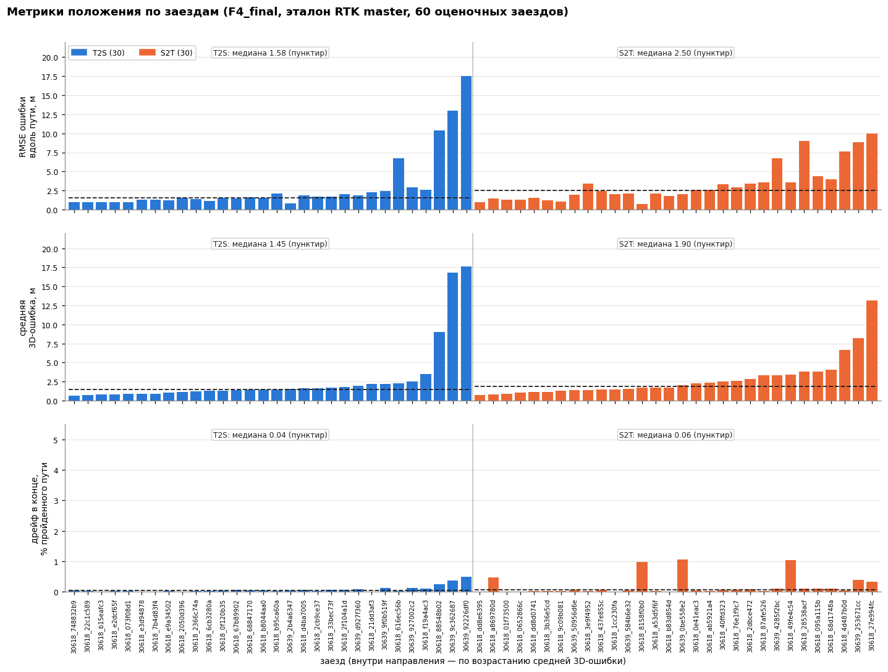
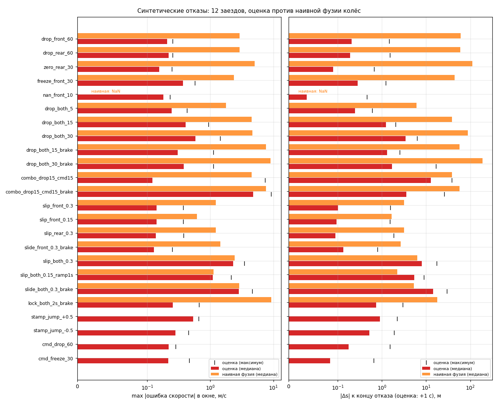

# Результаты: точность, абляции, устойчивость, реальное время

Документ сводит все измерения качества пакета `tram_backup_odometry` на текущем коде
(27.09.2026). Каждое число взято из файла в `results/` или `docs/`, путь указан рядом с таблицей.
Команды для воспроизведения собраны в разделе 8. Алгоритм описан в [MODEL.md](MODEL.md),
параметры в [PARAMETERS.md](PARAMETERS.md), сборка и запуск в [JURY_GUIDE.md](JURY_GUIDE.md).

Результаты получены на двух стендах, и их числа нельзя сравнивать напрямую:

- **Эмуляция чекера организаторов** на тестовом bag `30618_88aea4d9`. Эталон здесь
  `/localization/kinematic_state` (точка `base_link`, ошибка 3D). Так будет считать скрытая проверка.
  Эмуляцию подтверждает прогон настоящего чекера организаторов в ROS 2 (§2.5).
- **Кросс-валидация (CV)** на 60 оценочных bag датасета. Эталон здесь RTK главной антенны. На этом
  стенде выбраны параметры и сделаны абляции.

Условные имена прогонов:

| прогон | что это | где |
|---|---|---|
| `F4_final` | текущий код, CV, GNSS только первые 10 с после первого fix | `results/F4_final/` |
| `F4_final_burst` | текущий код, CV, GNSS первые 30 с и далее пачка 1.5 с каждые 120 с | `results/F4_final_burst/` |
| `AF_*`, `G_limit*` | абляции текущего кода: `F4_final` с одним выключенным механизмом или другим окном GNSS | `results/AF_*/`, `results/G_limit*/` |
| `B1_naive`, `B1_naive_kf` | безмодельные базовые линии (`tools/baseline_naive.py`) | `results/B1_naive*/` |
| `F3_final` | предыдущая версия: без разворотных петель, без GNSS-коррекции положения | `results/F3_final/` |
| чекер, эмуляция | `tools/checker_sim.py`, 7 вариантов конфигурации | `results/checker_30618_88aea4d9/` |
| чекер, ROS | настоящий `hackathon_solution_checker` в Docker, `scripts/run_checker.sh`; итоговый образ и предварительный | `results/checker_ros_30618_88aea4d9_final/`, `results/checker_ros_30618_88aea4d9/` |
| устойчивость | `tools/robustness.py`: 336 прогонов с отказами, 60 чистых, 11 аномальных | `results/robustness/summary.md` |
| реальное время | `--measure` в прогонах ROS-чекера (итоговый и предварительный образы 27.09); `scripts/measure.sh` в Docker (образ 26.09) | `results/checker_ros_30618_88aea4d9_final/`, `results/checker_ros_30618_88aea4d9/`, `results/rt/*_final/` |

`results/B0_naive` снят со скелетной версии кода и в этом документе не используется. Его заменяет
`B1_naive`.

---

## 0. Коротко

| что | условия | скорость | положение | источник |
|---|---|---|---|---|
| тестовый bag организаторов, эмуляция чекера | `30618_88aea4d9`, 22 мин; GNSS по всему bag (пачки по ходу) | RMSE **0.0335 м/с** | 3D RMSE **1.11 м** (медиана 0.50, p95 1.98, max 14.0) | `results/checker_30618_88aea4d9/summary.md` |
| то же, GNSS только в окне старта | GNSS первые 35 с | 0.0335 м/с | 3D RMSE 7.02 м | там же, `final_gnss_first_35s_only` |
| тестовый bag, настоящий чекер организаторов в ROS 2 | Docker, итоговый образ, `ros2 bag play -r 1.0`, `vehicle_id:=30618`, весь bag | RMSE **0.0324 м/с** (max 0.302) | 3D RMSE **1.111 м** (max 14.02), 38 437 пар | `results/checker_ros_30618_88aea4d9_final/checker_final.txt` |
| CV, 60 заездов, режим скрытой проверки | GNSS первые 10 с | v_rmse 0.0295 / 0.0511 м/с (медиана / среднее); смещение в переходных режимах 0.0121 м/с | al_rmse 1.98 / 3.15 м; e3d 1.66 / 2.80 м; дрейф 0.047 % пути | `results/F4_final/summary.md` |
| CV, 60 заездов, редкий GNSS по ходу | 30 с + пачка 1.5 с / 120 с | то же (скорость от GNSS не зависит) | al_rmse 0.834 / 1.97 м; e3d 0.82 / 1.47 м; дрейф 0.0125 % | `results/F4_final_burst/summary.md` |
| устойчивость | 12 заездов × 28 отказов = 336 прогонов | 0 падений, 0 NaN, 0 отрицательных скоростей; обе тележки молчат 30 с: v_rmse окна 0.204 м/с против 2.84 у наивной фузии | смещение пути к концу отказа 3.44 м против 87.5 м | `results/robustness/summary.md` |
| реальное время, итоговый образ | Docker, прогон чекера на тестовом bag с `--measure` | задержка вход → `/result/velocity` p50 1.16, p99 3.07, max 32.1 мс | CPU 0.071 ядра в среднем (max 0.259), RSS max 64.1 МиБ | `results/checker_ros_30618_88aea4d9_final/latency.txt`, `resources.txt` |

Главное:

- **Чекер организаторов подтверждает эмуляцию.** На итоговом образе в ROS 2 получилось 3D RMSE
  1.111 м против 1.115 в эмуляции и скорость 0.0324 против 0.0335 м/с. Разница по скорости идёт от
  порядка обработки сообщений двух тележек в executor rclpy, а не от сопоставления (§2.5).
- **Скорость.** На чистых данных v_rmse 0.0295 м/с (медиана по 60 заездам). Столько же даёт
  безмодельный фильтр Калмана `B1_naive_kf` (0.0296). Тяговая модель выигрывает при отказах
  датчиков: без обеих тележек 30 с ошибка скорости 0.204 м/с против 2.84 у наивной фузии (§6).
  От GNSS скорость не зависит. С GNSS-коррекцией и без неё она побитово совпадает (тест
  `test/test_gnss_aiding.py`). На CV v_rmse `F4_final`, `AF_noaiding` и `F4_final_burst` совпадает
  на каждом из 60 заездов.
- **Положение.** Больше всего дают разворотные петли `maps/loops.json`: вне карты ошибка падает
  с 11.3 до 1.33 м (медиана, CV) и с 23.09 до 1.11 м на тестовом bag. Сильно помогают и GNSS-пачки
  по ходу рейса: 7.16 → 1.11 м на тестовом bag, al_rmse 1.98 → 0.834 м на CV.
  Без GNSS после старта ошибка на тестовом bag растёт до 5–6 м к середине рейса, а на последней
  минуте доходит до 30 м (§2.4).
- **Под чекер.** Точка выхода `base_link` (9.873 м впереди главной антенны, z по pathgraph) даёт
  10.26 → 1.11 м. Задержка скорости 0.09 с даёт 0.0566 → 0.0335 м/с. Её подобрали на единственном
  bag с эталоном чекера (§2.3).

Оговорки к числам:

1. Геометрию петель восстановили по RTK тех же обучающих заездов, на которых идёт CV. Поэтому
   CV-метрики вне карты оптимистичны (§4.5). Тестового bag организаторов среди 122 bag датасета
   (по имени) нет. В построение петель он не входит, `tools/build_loops.py` только печатает по нему
   проверку.
2. Когда GNSS есть только в окне старта, хвост маршрута после конца карты идёт по ветке A петли.
   Если трамвай уходит на другую ветку, на последней минуте тестового bag ошибка 30.3 м (§2.4).
3. Ветка B петли T — заглушка: разворот за пределами записей не наблюдался (`tools/build_loops.py`).
4. Задержку скорости `output_velocity_delay_s` = 0.09 с подобрали на одном bag.
5. В 7 из 60 заездов часы GNSS сдвинуты примерно на ±1 с на 18–60 с. Эти сдвиги портят эталон, а не
   оценку, и `evaluate.py --clean-ref` их не исправляет. Сюда попадают худшие по v_rmse заезды
   `30618_4d487b0d` и `30618_40ffd323` (§3.3).
6. Известные недостатки устойчивости перечислены в §6.4. Главный: после 15-секундной тишины всех
   входов первый выход несёт состояние до паузы, Δs около −115 м.

---

## 1. Методика

### 1.1 Эмуляция чекера организаторов (`tools/checker_sim.py`)

Условия чекера (`check_code/check-code/src/checker_ros/.../metrics.py`) и уточнения организаторов:

- **Эталон** — `/localization/kinematic_state`, `nav_msgs/Odometry`, 50 Гц, frame `map`. Точка
  `base_link` лежит на pathgraph в 9.873 м впереди главной антенны, z берётся по pathgraph.
- **Сопоставление** — `message_filters.ApproximateTimeSynchronizer` (Python, очередь 100,
  slop 0.05 с): отдельно эталон с `/result/velocity` и эталон с `/result/position`.
- **Метрики** — скорость `twist.linear.x`: RMSE и max. Положение: RMSE по x, y, z и
  $d = \lVert p_{est} - p_{ref}\rVert$ в 3D.

Эмуляция прогоняет bag через тот же класс `Pipeline`, что и ROS-нода. Сообщения идут в порядке
записи, выход «приходит» через 1 мс после входа. Синхронизатор эмулируется так: при каждом приходе
берётся ближайший по stamp элемент другой очереди в пределах slop, и оба сообщения выходят из
очередей. `vehicle_id` = 30618. Варианты отличаются только параметрами (`VARIANTS` в
`tools/checker_sim.py`):

| вариант | переопределения параметров |
|---|---|
| `final` | нет (поставка) |
| `no_gnss_aiding` | `gnss_aiding` = false: после выставки GNSS не используется |
| `no_loops` | `loops_enable` = false |
| `no_velocity_delay` | `output_velocity_delay_s` = 0 |
| `master_antenna_point` | `output_along_offset_m` = 0, `output_z_offset_m` = 3.10 (точка главной антенны) |
| `pre_checker_version` | всё перечисленное сразу: конфигурация до уточнений организаторов |
| `final_gnss_first_35s_only` | поставка, но GNSS подаётся только первые 35 с после первого fix |

Во всех вариантах: эталонных сообщений 65 579, выходов 38 476, пар (скорость и положение) по
38 439 (`results/checker_30618_88aea4d9/summary.json`, поля `n_ref`, `n_out`, `n_vel_pairs`,
`n_pos_pairs`).

### 1.2 Кросс-валидация (`tools/run_cv.py`, `tools/evaluate.py`)

- **Заезды.** Прогоняются все 122 bag датасета (0 ошибок). В метрики идут 60 `eval_ok`:
  уникальные записи, у которых есть ≥ 60 с RTK-эталона (`.work/bag_index.json`). Из них 30 T2S и
  30 S2T, 49 на вагоне 30618 и 11 на 30639.
- **Эталон.** Главная антенна (master) со статусом RTK 2 в UTM 37N минус (300000, 6100000).
  Скорость берётся из GNSS. Дополнительно считается ошибка против антенны rover и середины между
  антеннами.
- **Сопоставление.** Для каждой точки эталона берётся выход с ближайшим header stamp, если
  $|\Delta t| \le 0.05$ с. Если у одного stamp несколько выходов, берётся последний опубликованный.
- **Точка выхода.** `run_cv.build_params` оценивает точку главной антенны:
  `output_along_offset_m` = 0, `output_z_offset_m` = 3.10, `output_velocity_delay_s` = 0.
  `vehicle_id` берётся по префиксу имени bag. Поэтому CV-метрики сравнимы между версиями
  (F3 ↔ F4), а с метриками чекера нет.
- **Режимы GNSS** (`replay.run_bag`):
  - `--gnss-limit 10` (по умолчанию): GNSS подаётся первые 10 с после первого fix, дальше только
    тележки, контроллер и карта. Это режим скрытой проверки, где RTK гарантирован в окне старта.
  - `--gnss-limit 30 --gnss-burst 120 1.5`: первые 30 с, затем пачка 1.5 с каждые 120 с. Это
    имитация редкого GNSS по ходу рейса, которым организаторы разрешили корректировать положение.
  - `G_limit*`: окно старта 0 (только первый fix), 0.5, 1, 3, 5 и 30 с.

### 1.3 Метрики CV

| метрика | определение |
|---|---|
| `v_rmse`, `v_mae`, `v_p99`, `v_max` | по $e_v = v_{est} - v_{ref}$ на сопоставленных точках |
| `v_bias` | среднее $e_v$ (со знаком) |
| `v_bias_trans` | $\max_r \lvert \overline{e_v}\rvert_r$ по режимам $r$. Режимы задаются по эталону, сглаженному по 11 отсчётам: разгон при $a > 0.15$ м/с², торможение при $a < -0.15$, стоянка при $v < 0.1$ м/с, остальное — движение |
| `e2d_mean`, `e3d_mean`, `e3d_rmse`, `e3d_max` | $\lvert xy_{est} - xy_{ref}\rvert$ и $\lVert xyz_{est} - xyz_{ref}\rVert$ |
| `al_*`, `ct_rmse` | вдоль пути и поперёк. Обе точки проецируются на полилинию карты своего направления: $al = s_{est} - s_{ref}$ (> 0 — оценка впереди), $ct = l_{est} - l_{ref}$. Считается только на карте: эталон в пределах 5 м от полилинии и не за её концами. `al_mean_abs` = среднее $\lvert al\rvert$ |
| `e2d_onmap_mean`, `e2d_offmap_mean` | средняя 2D-ошибка на карте и вне её (петли, разворот) |
| `end_e2d`, `drift_pct` | 2D-ошибка в последней сопоставленной точке; она же в % от пройденного пути (путь — одометр по доплеровской скорости GNSS) |
| `drift_onmap_pct`, `al_growth_pct` | $\lvert al\rvert$ в последней точке на карте в % от дуги на карте; $(al_{last} - al_{first})$ / дуга, со знаком. Не считается, если дуга < 200 м |
| `p_in95` | доля точек с $m^2 = e_a^2/\sigma_a^2 + e_c^2/\sigma_c^2 \le 5.991$ (χ², 2 степени свободы). При согласованной ковариации 0.95 |
| `p_nees` | среднее $m^2/2$. При согласованной ковариации 1: < 1 — ковариация завышена, > 1 — занижена |
| `p_sigma_med` | медиана $\sqrt{\sigma_a^2 + \sigma_c^2}$, м |
| `score_loss` | $\sum_i w_i \min(m_i/y_i, 10) / \sum_i w_i$, пары $(y_i, w_i)$: v_rmse (0.05, 20), v_bias_trans (0.02, 10), drift_pct (0.3, 10), al_mean_abs (2, 7), al_rmse (3, 7), al_max (10, 7), ct_rmse (0.5, 4). Меньше — лучше; 1.0 — «на уровне эталонной величины по всем метрикам» |

В сводках `summary.md` для каждой метрики приведены медиана, среднее, p90 и максимум модуля по
60 заездам. Сравнение двух прогонов `run_cv.py --compare A B` даёт медиану по bag разности
«B − A» и число bag, где B лучше. Ниже это записано как «лучше на k/60».

---

## 2. Тестовый bag организаторов `30618_88aea4d9`

### 2.1 Все варианты (эмуляция чекера)

Источник: `results/checker_30618_88aea4d9/summary.md`, `summary.json`. Команда:
`tools/checker_sim.py --gnss-start-only 35 --out results/checker_30618_88aea4d9`.

| вариант | v_rmse, м/с | v_mae / v_max, м/с | 3D RMSE, м | 3D среднее / медиана / p95 / max, м | x / y / z RMSE, м | пачек GNSS принято / отклонено | выставка |
|---|---|---|---|---|---|---|---|
| **`final`** | **0.0335** | 0.0195 / 0.324 | **1.11** | 0.72 / 0.50 / 1.98 / 14.0 | 0.91 / 0.65 / 0.04 | 49 / 1 | `loop` |
| `no_gnss_aiding` | 0.0335 | 0.0195 / 0.324 | 7.16 | 4.06 / 4.20 / 6.55 / 50.7 | 5.46 / 4.64 / 0.09 | 0 / 0 | `loop` |
| `final_gnss_first_35s_only` | 0.0335 | 0.0195 / 0.324 | 7.02 | 3.94 / 4.11 / 5.67 / 50.8 | 5.32 / 4.58 / 0.08 | 29 / 1 | `loop` |
| `no_loops` | 0.0335 | 0.0195 / 0.324 | 23.09 | 6.28 / 0.89 / 28.66 / 173.8 | 8.18 / 21.59 / 0.25 | 46 / 4 | `bridge` |
| `no_velocity_delay` | 0.0566 | 0.0378 / 0.380 | 1.11 | 0.72 / 0.50 / 1.98 / 14.0 | 0.91 / 0.65 / 0.04 | 49 / 1 | `loop` |
| `master_antenna_point` | 0.0335 | 0.0195 / 0.324 | 10.26 | 10.23 / 10.22 / 11.47 / 16.5 | 7.98 / 5.68 / 3.07 | 49 / 1 | `loop` |
| `pre_checker_version` | 0.0566 | 0.0378 / 0.380 | 24.24 | 12.62 / 6.52 / 30.50 / 169.3 | 10.37 / 21.68 / 3.15 | 0 / 0 | `bridge` |

Процессорное время поставки на весь 22-минутный bag — 0.75 с (`cpu_s`).

### 2.2 3D RMSE по минутам

Источник: `results/checker_30618_88aea4d9/summary.md`, поле `d3_rmse_per_minute`. Значения в метрах.

| минута (с от начала) | `final` | `no_gnss_aiding` | `final_gnss_first_35s_only` | `no_loops` | `master_antenna_point` | `pre_checker_version` |
|---|---|---|---|---|---|---|
| 0–1 (0) | 1.2 | 0.5 | 1.2 | 18.6 | 11.5 | 22.5 |
| 1–2 (60) | 0.9 | 0.2 | 0.9 | 20.5 | 11.1 | 27.3 |
| 2–3 (120) | 1.0 | 0.4 | 1.0 | 11.0 | 11.3 | 17.1 |
| 3–4 (180) | 0.4 | 0.5 | 0.5 | 2.7 | 10.7 | 12.7 |
| 4–5 (240) | 0.3 | 0.5 | 0.3 | 1.4 | 10.6 | 12.9 |
| 5–6 (300) | 0.2 | 0.3 | 0.4 | 0.2 | 10.2 | 13.9 |
| 6–7 (360) | 0.8 | 0.6 | 0.5 | 0.8 | 9.7 | 12.7 |
| 7–8 (420) | 1.2 | 2.1 | 1.6 | 1.2 | 9.4 | 9.6 |
| 8–9 (480) | 1.7 | 4.3 | 3.6 | 1.8 | 8.8 | 6.4 |
| 9–10 (540) | 1.7 | 6.2 | 5.3 | 1.7 | 8.7 | 4.6 |
| 10–11 (600) | 1.5 | 6.3 | 5.4 | 1.5 | 9.0 | 4.5 |
| 11–12 (660) | 0.5 | 6.0 | 5.3 | 0.5 | 9.8 | 4.7 |
| 12–13 (720) | 0.5 | 5.7 | 5.1 | 0.5 | 10.3 | 5.0 |
| 13–14 (780) | 1.1 | 6.2 | 5.6 | 1.1 | 11.3 | 4.7 |
| 14–15 (840) | 0.4 | 5.9 | 5.5 | 0.4 | 9.9 | 4.9 |
| 15–16 (900) | 0.3 | 4.3 | 4.2 | 0.3 | 10.1 | 6.4 |
| 16–17 (960) | 0.3 | 4.4 | 4.3 | 0.3 | 10.3 | 6.3 |
| 17–18 (1020) | 0.2 | 4.7 | 4.6 | 0.2 | 10.2 | 6.0 |
| 18–19 (1080) | 0.2 | 5.1 | 5.0 | 0.2 | 10.3 | 5.6 |
| 19–20 (1140) | 0.2 | 4.5 | 4.5 | 0.2 | 10.3 | 6.2 |
| 20–21 (1200) | 0.2 | 2.9 | 3.2 | 4.8 | 10.3 | 8.9 |
| 21–22 (1260) | 3.7 | 30.2 | 30.3 | 112.7 | 11.5 | 109.2 |

### 2.3 Вклад каждого изменения

Сравнивается поставка `final` с вариантом, где выключено одно изменение (§2.1).

| изменение | без него → с ним | где проявляется |
|---|---|---|
| разворотные петли (`loops_enable`, `maps/loops.json`) | 3D RMSE 23.09 → 1.11 м | Старт в петле: минуты 0–3 18.6 / 20.5 / 11.0 → 1.2 / 0.9 / 1.0 м. Последняя минута в петле другой конечной: 112.7 → 3.7 м. Выставка идёт на ветку петли (`loop`), а не через мост к началу карты (`bridge`) |
| GNSS-коррекция положения по ходу рейса (`gnss_aiding`) | 7.16 → 1.11 м | Минуты 8–20: 2.9–6.3 → 0.2–1.7 м; последняя минута 30.2 → 3.7 м. На первых трёх минутах вариант без коррекции точнее (0.2–0.5 против 0.9–1.2 м) |
| точка `base_link` (`output_along_offset_m` = 9.873, `output_z_offset_m` = 0) | 10.26 → 1.11 м; z RMSE 3.07 → 0.04 м | Постоянное смещение по всему bag: 8.7–11.5 м в каждой минуте. Порядок величины $\sqrt{9.873^2 + 3.10^2} \approx 10.35$ м |
| задержка скорости 0.09 с (`output_velocity_delay_s`) | v_rmse 0.0566 → 0.0335 м/с; v_max 0.380 → 0.324 м/с | На положение не влияет (3D RMSE 1.11 в обоих вариантах) |
| всё вместе (`pre_checker_version` → `final`) | 24.24 → 1.11 м; 0.0566 → 0.0335 м/с | |

Про задержку скорости. Скорость в эталоне `/localization/kinematic_state` отстаёт от своего stamp
примерно на 0.09 с. Параметр `output_velocity_delay_s` = 0.09 публикует оценку на момент
stamp − 0.09 с. Это **подгонка под эталон, а не физика**, и подобрана она на единственном bag, где
есть эталон чекера. На CV параметр равен 0 (`run_cv.build_params`), потому что там эталоном служит
скорость GNSS на её собственном stamp. Если в скрытой проверке эталон устроен так же, как в
тестовом bag (по словам организаторов, это тот же топик), выигрыш сохранится. Чтобы выключить
подгонку: `output_velocity_delay_s:=0.0`.

### 2.4 Только окно старта и хвост по ветке A

Вариант `final_gnss_first_35s_only` моделирует худший случай скрытой проверки: RTK есть только
в окне старта (организаторы гарантируют его там), дальше GNSS нет. 3D RMSE 7.02 м (медиана 4.11,
p95 5.67). Это практически совпадает с `no_gnss_aiding` (7.16 м), где нода отписывается от GNSS
сразу после выставки.

- **Первые 8 минут** ошибка 0.3–1.6 м (у `final` 0.2–1.2 м).
- **Минуты 8–20**: ошибка 3.2–5.6 м. Дальше она не растёт.
- **Последняя минута**: 30.3 м против 3.7 м у `final`. После конца карты путь продолжается
  хвостом по ветке петли. Без GNSS хвост идёт по ветке по умолчанию (`tail_idx` = 0, ветка A,
  см. [MODEL.md](MODEL.md), раздел о `RunPath`). С GNSS пачка, большинство фиксов которой легло на
  другую ветку, переключает хвост (`Pipeline._process_burst`, `path.set_tail`). Выбрать ветку
  до входа в петлю без GNSS пакет не умеет. Это известное ограничение.

### 2.5 Настоящий ROS-чекер в Docker

Источники: `results/checker_ros_30618_88aea4d9_final/README.md`, `checker_final.txt`, `node.log`
(итоговый прогон) и `results/checker_ros_30618_88aea4d9/README.md` (предварительный прогон и разбор
расхождения по скорости). Команда:
`scripts/run_checker.sh ../check_code/check-code/bags/30618_88aea4d9 results/checker_ros_30618_88aea4d9_final --measure`.

Условия прогона:

- **Чекер.** Собственный чекер организаторов `hackathon_solution_checker`, собран из их исходников
  против нашего `tram_vehicle_msgs`. Параметры по умолчанию: slop 0.05 с, очередь 100.
- **Нода.** `ros2 launch tram_backup_odometry backup_odometry.launch.py use_sim_time:=false
  vehicle_id:=30618`, параметры по умолчанию: точка выхода `base_link`, кадр `map`, GNSS-коррекция
  включена.
- **Проигрывание.** `ros2 bag play -r 1.0`, весь bag (1311 с проигрывания). Итог — финальная сводка,
  которую чекер печатает при остановке (exit code 0).
- **Итоговый образ.** Собран 27.09 в 17:31 (`RUN_TESTS=1 scripts/build.sh`) после исправления
  `anchor_delta` в `core/pipeline.py` (§5) и смены умолчания `vehicle_id` в launch на 30618. pytest в
  образе: 120 passed, 11 skipped. Код в `src/` после сборки не менялся. Во время прогона тяжёлые
  офлайн-расчёты на хосте не шли.
- **Предварительный образ.** Собран в 17:00, до исправления; во время прогона на хосте шли абляции.
  На этом bag с пачками GNSS по всему маршруту исправление эмуляцию `final` не меняет (1.11 м до и
  после), поэтому оба прогона сравнимы.

| метрика | ROS 2 + чекер, итоговый образ | ROS 2 + чекер, предварительный образ | эмуляция `tools/checker_sim.py`, `final` |
|---|---|---|---|
| скорость: RMSE / max, м/с | **0.0324** / 0.302 | 0.0322 / 0.309 | 0.0335 / 0.324 |
| x / y / z RMSE, м | 0.904 / 0.645 / 0.037 | 0.909 / 0.646 / 0.037 | 0.907 / 0.647 / 0.037 |
| 3D: RMSE / max, м | **1.111** / 14.02 | 1.116 / 14.03 | 1.115 / 14.02 |
| пар | 38 437 | 38 435 | 38 439 |
| выходов `/result/velocity` / `/result/position` | 38 476 / 38 473 | 38 476 / 38 473 | 38 476 |

- **Положение.** 3D RMSE отличается от эмуляции на 0.004 м в итоговом прогоне и на 0.001 м в
  предварительном. Число пар отличается не больше чем на 4 (0.01 %).
- **Нода** (`node.log` итогового прогона, сводка при остановке): входы front 12 216, rear 12 225,
  cmd 26 249, fix master 438, rover 435; ошибок 0, подмен stamp 0, отброшенных нечисловых выходов 0.
- **Эмулятор синхронизатора проверен отдельно** (предварительный прогон). Функцию `sync_pairs` из
  `tools/checker_sim.py` прогнали на временах прихода, записанных в прогоне (`result_bag/`). Она даёт
  скорость 0.032197 / max 0.308957, ровно как чекер.
- **Откуда разница по скорости** (−0.0011 м/с в итоговом прогоне, −0.0013 в предварительном). Она
  идёт от самих выходов, а не от сопоставления. Разбор сделан на предварительном прогоне
  (`results/checker_ros_30618_88aea4d9/README.md`).
  - У 12.5 % выходов ROS-ноды (4820) stamp другой, чем офлайн. Там, где stamp совпадает, скорость
    отличается в среднем на 0.006 м/с (p99 0.048).
  - Причина — порядок обработки почти одновременных сообщений передней и задней тележек.
    Офлайн-воспроизведение идёт строго по времени записи, а executor rclpy берёт готовые подписки
    в своём порядке, и выход запускает то одна, то другая тележка.
  - Систематически на точность это не влияет. Против ближайшего эталона (±0.05 с) RMSE скорости
    0.0327 у ROS и 0.0339 офлайн (`tools/compare_ros.py`).
- **Контрольный прогон 120 с** (`--duration 120`, предварительный образ): скорость 0.0226 м/с,
  3D 1.081 м, 3588 пар.

---

## 3. Скорость

Скорость одинакова во всех вариантах, которые меняют только положение: петли, GNSS-коррекция,
окно GNSS, TRN. В `F3_final`, `F4_final`, `F4_final_burst`, `AF_noaiding` и `AF_noloops` медиана
v_rmse 0.0295 м/с, среднее 0.0511. Побитовое совпадение скорости с GNSS-коррекцией и без неё
проверяет `test/test_gnss_aiding.py`.

### 3.1 Общие метрики и базовые линии

Источники: `results/F4_final/summary.md`, `results/B1_naive/summary.md`,
`results/B1_naive_kf/summary.md`. Режимные метрики — медианы модуля по 60 заездам из `per_bag.json`
(команда в §8).

- `B1_naive` — среднее двух тележек / K, нулевой порядок удержания, без проверок.
- `B1_naive_kf` — кинематический фильтр Калмана [s, v, a] с белым рывком. Интенсивность рывка
  0.3 м/с³/√Гц выбрана по всем 60 заездам, то есть в пользу базовой линии.

Обе базовые линии без петель и без GNSS-коррекции (`tools/baseline_naive.py`). Поэтому их
положение не сравнимо с F4 напрямую.

| метрика (медиана по 60) | `F4_final` | `B1_naive` | `B1_naive_kf` |
|---|---|---|---|
| v_rmse, м/с (медиана / среднее) | **0.0295** / 0.0511 | 0.0541 / 0.0728 | 0.0296 / 0.0527 |
| v_mae, м/с | 0.0206 | 0.0349 | 0.0216 |
| v_p99, м/с | 0.0927 | 0.160 | 0.0920 |
| v_max, м/с | 0.2365 | 0.3274 | 0.2195 |
| v_bias_trans, м/с (медиана / среднее) | 0.0121 / 0.0229 | 0.0501 / 0.0640 | 0.0121 / 0.0230 |
| v_rmse в разгоне | 0.0346 | 0.0648 | 0.0344 |
| v_rmse в торможении | 0.0332 | 0.0699 | 0.0330 |
| v_rmse в движении без разгона | 0.0338 | 0.0339 | 0.0337 |
| v_rmse на стоянке | 0.0122 | 0.0121 | 0.0121 |
| \|смещение\| в разгоне | 0.0097 | 0.0408 | 0.0093 |
| \|смещение\| в торможении | 0.0067 | 0.0492 | 0.0073 |

Парные сравнения (`run_cv.py --compare`):

- `B1_naive` → `F4_final`: v_rmse 0.0541 → 0.0295 (лучше на 60/60); v_bias_trans 0.0501 → 0.0121
  (лучше на 58/60).
- `B1_naive_kf` → `F4_final`: v_rmse 0.0296 → 0.0295 (лучше на 34/60, в пределах шума).

Вывод. Наивная фузия проигрывает в разгоне и торможении: она запаздывает, и смещение в переходных
режимах получается 0.04–0.05 м/с. Обычный фильтр Калмана это запаздывание компенсирует, поэтому на
чистых данных тяговая модель по скорости его **не обгоняет**. Модель нужна при отказах: когда
молчат обе тележки, заклинило колёса или пропали данные одной тележки (§6). Там у безмодельной
фузии ошибка — метры в секунду.

### 3.2 По направлениям, вагонам и группам

Источник: `results/F4_final/summary.md` (медианы).

| срез | n | v_rmse | v_bias_trans |
|---|---|---|---|
| S2T | 30 | 0.0298 | 0.0124 |
| T2S | 30 | 0.0286 | 0.0101 |
| вагон 30618 | 49 | 0.0292 | 0.0121 |
| вагон 30639 | 11 | 0.0305 | 0.0119 |
| группа 30618_2026-07-27 | 26 | 0.0283 | 0.0121 |
| группа 30618_2026-08-10 | 9 | 0.0401 | 0.0151 |
| группа 30618_2026-08-26 | 12 | 0.0282 | 0.0106 |
| группа 30618_2026-09-03 | 2 | 0.0513 | 0.0502 |
| группа 30639_2026-05-05 | 3 | 0.0639 | 0.0603 |
| группа 30639_2026-08-26 | 8 | 0.0290 | 0.0102 |

Базовые линии по направлениям (S2T / T2S): `B1_naive` 0.0577 / 0.0488, `B1_naive_kf`
0.0303 / 0.0286 (`results/B1_naive*/summary.md`).

### 3.3 Худшие заезды по скорости

По `results/F4_final/summary.md`: `30618_4d487b0d` 0.637, `30618_40ffd323` 0.18, `30639_50956d6e`
0.126, `30618_28538acf` 0.126 м/с. У двух худших ошибка идёт от эталона, а не от оценки: в этих
заездах сдвинуты часы GNSS. В `results/robustness/summary.md` (таблица 10) они считаются против
эталона трёх видов:

| заезд | как есть | очищенный (`--clean-ref`) | со сдвигом часов, исправленным до сравнения |
|---|---|---|---|
| `30618_4d487b0d` | 0.640 | 0.145 | 0.089 |
| `30618_40ffd323` | 0.185 | 0.185 | 0.072 |
| `30639_50956d6e` | 0.129 | 0.073 | 0.073 |

Значения «как есть» немного отличаются от CV (0.637 / 0.18 / 0.126): это разные скрипты
оценки. Сравнивать нужно внутри одной таблицы.

### 3.4 Абляции, которые меняют скорость

Источники: `results/AF_*/summary.md`; полная таблица абляций в §5.

| прогон | что выключено | v_rmse (медиана / среднее) | v_bias_trans (медиана / среднее) |
|---|---|---|---|
| `F4_final` | — | 0.0295 / 0.0511 | 0.0121 / 0.0229 |
| `AF_nopairs` | второе сравнение тележек (`wheel_align_other` = false) | 0.0301 / 0.0581 | 0.0123 / 0.0241 |
| `AF_noadapt` | адаптация `g_tr`, `g_br` (`gain_adapt` = false) | 0.0297 / 0.0513 | 0.0120 / 0.0229 |
| `AF_noinflate` | √2 к σ при двух тележках (`wheel_pair_sigma_inflate` = false) | 0.0298 / 0.0514 | 0.0120 / 0.0230 |
| `AF_scalefb` | **включён** `trn_scale_feedback` (в поставке выключен) | 0.0292 / 0.0504 | 0.0119 / 0.0218 |

---

## 4. Положение

### 4.1 F3 → F4 → F4_burst

Источники: `results/F3_final/summary.json`, `results/F4_final/summary.json`,
`results/F4_final_burst/summary.json`. Во всех ячейках медиана / среднее по 60 заездам.

| метрика | `F3_final` (GNSS 10 с, без петель) | `F4_final` (GNSS 10 с) | `F4_final_burst` (30 с + пачки) |
|---|---|---|---|
| score_loss | 1.25 / 1.49 | 0.622 / 0.946 | 0.566 / 0.815 |
| al_mean_abs, м | 2.42 / 3.28 | 1.52 / 2.47 | 0.484 / 1.17 |
| al_rmse, м | 3.03 / 4.03 | **1.98 / 3.15** | **0.834 / 1.97** |
| al_max, м | 9.51 / 12.7 | 8.14 / 11.9 | 7.22 / 10.5 |
| ct_rmse, м | 0.205 / 0.475 | 0.205 / 0.475 | 0.205 / 0.475 |
| e3d_mean, м | 4.74 / 6.73 | 1.66 / 2.80 | 0.820 / 1.47 |
| e3d_rmse, м | 8.82 / 12.0 | 2.22 / 3.72 | 1.58 / 2.68 |
| e3d_max, м | 34.6 / 67.3 | 11.1 / 16.9 | 9.73 / 16.6 |
| e2d_onmap_mean, м | 2.46 / 3.34 | 1.53 / 2.56 | 0.707 / 1.29 |
| e2d_offmap_mean, м | 11.2 / 14.5 | 1.33 / 2.78 | 0.617 / 1.43 |
| end_e2d, м | 16.1 / 59.6 | 2.39 / 6.69 | 0.665 / 6.57 |
| drift_pct, % | 0.317 / 1.10 | 0.047 / 0.127 | 0.0125 / 0.121 |
| drift_onmap_pct, % | 0.0525 / 0.146 | 0.0457 / 0.177 | 0.00604 / 0.023 |
| al_growth_pct, % | 0.0704 / 0.113 | 0.0474 / 0.0895 | 0.00907 / 0.114 |
| p_in95 | 0.998 / 0.956 | 0.995 / 0.947 | 0.980 / 0.929 |
| p_nees | 0.245 / 1.05 | 0.151 / 1.55 | 0.431 / 4.69 |
| p_sigma_med, м | 6.53 / 7.28 | 7.26 / 7.23 | 1.57 / 1.73 |
| e3d_mean против rover / середины антенн (медиана) | 14.2 / 8.1 | 12.2 / 5.7 | 12.6 / 6.29 |

Ошибка против rover и середины между антеннами — контроль точки выхода. На CV выход стоит в точке
главной антенны, rover в 12.44 м позади, поэтому ошибка против rover около 12 м.

Парные сравнения (`run_cv.py --compare`; медианы по bag и «лучше на k/60»):

| переход | score_loss | al_rmse | e3d_mean | drift_pct | e2d_offmap_mean |
|---|---|---|---|---|---|
| `F3_final` → `F4_final` | 1.246 → 0.622 (56/60) | 3.035 → 1.98 (50/60) | 4.742 → 1.656 (57/60) | 0.3175 → 0.047 (56/60) | 11.17 → 1.326 (57/59) |
| `F4_final` → `F4_final_burst` | 0.622 → 0.566 (51/60) | 1.98 → 0.834 (54/60) | 1.656 → 0.820 (56/60) | 0.047 → 0.0125 (46/60) | 1.326 → 0.617 (49/59) |
| `B1_naive_kf` → `F4_final` | 1.608 → 0.622 (56/60) | 3.133 → 1.98 (38/60) | 5.137 → 1.656 (58/60) | 0.4726 → 0.047 (59/60) | 11.9 → 1.326 (59/59) |

Что изменилось F3 → F4:

- **Вне карты** выигрыш самый большой: петли вместо затухающей кривизны за концом карты и
  выставка на ветку петли вместо моста. e2d_offmap 11.2 → 1.33 м, дрейф в конце 0.32 → 0.047 %.
- **Вдоль пути на карте** al_rmse 3.03 → 1.98 м. По абляциям вклад дают и петли (без них 2.48 м),
  и GNSS-коррекция (без неё 2.15 м). Абляции не аддитивны.
- **al_max** медиана 9.51 → 8.14 м, но по заездам лучше только на 29/60.

### 4.2 По направлениям и вагонам

Источники: `results/F4_final/summary.md`, `results/F4_final_burst/summary.md`, медианы.
Рисунки по заездам: `docs/plots/F4_final/per_bag.png`, `docs/plots/F4_final_burst/per_bag.png`.

| срез | n | al_rmse F4 / burst | al_max F4 / burst | e3d_mean F4 / burst | drift_pct F4 / burst | score_loss F4 / burst |
|---|---|---|---|---|---|---|
| S2T | 30 | 2.50 / 1.34 | 13.1 / 11.0 | 1.90 / 1.13 | 0.0556 / 0.0167 | 0.917 / 0.804 |
| T2S | 30 | 1.58 / 0.501 | 4.31 / 1.88 | 1.45 / 0.448 | 0.0443 / 0.00907 | 0.518 / 0.367 |
| 30618 | 49 | 1.73 / 0.82 | 7.03 / 6.88 | 1.47 / 0.772 | 0.0326 / 0.00845 | 0.620 / 0.548 |
| 30639 | 11 | 2.43 / 0.928 | 9.76 / 7.60 | 2.20 / 1.38 | 0.117 / 0.0256 | 1.25 / 0.767 |

S2T хуже T2S. Больше всего разница в al_max: 13.1 против 4.31 м.



### 4.3 Худшие заезды

Источники: `per_bag.json` прогонов `F3_final`, `F4_final`, `F4_final_burst`, `AF_noaiding`,
`AF_noloops`. Значение — al_rmse в метрах.

| заезд | F3 | F4 | F4_burst | `AF_noaiding` | `AF_noloops` | комментарий |
|---|---|---|---|---|---|---|
| `30639_92226df0` | 15.88 | 17.56 | 2.77 | 15.88 | 17.56 | худший в F4; пачки по ходу исправляют |
| `30639_9c362687` | 8.84 | 12.98 | 11.65 | 8.84 | 12.98 | GNSS-пачки окна старта ухудшают (8.84 → 12.98); сдвиг часов GNSS 1312–1337 с |
| `30618_88548b02` | 8.05 | 10.41 | 1.47 | 10.06 | — | |
| `30618_27e994fc` | 8.80 | 9.97 | 5.50 | 9.02 | — | сдвиг часов GNSS 193–243 с |
| `30618_28538acf` | 9.37 | 8.97 | 13.86 | 8.99 | 9.11 | пачки по ходу ухудшают; сдвиг часов GNSS 134–174 с, причину отдельно не разбирали |
| `30639_4285f2bc` | 6.86 | 6.74 | 17.49 | 6.81 | 6.81 | пачки по ходу ухудшают, причину не разбирали |
| `30618_4d487b0d` | 13.41 | 7.63 | 3.38 | — | — | лучшее улучшение F3 → F4 |
| `30618_f19a4ac3` | 7.89 | 2.61 | 0.73 | — | — | |

Сдвиги часов GNSS взяты из `results/robustness/summary.md`, таблица 8. На `30639_92226df0` и
`30639_9c362687` `AF_noloops` совпадает с `F4_final`, а `AF_noaiding` — с `F3_final`. Значит,
ухудшение на этих заездах вносят GNSS-пачки окна старта, а не петли. Пачки по ходу рейса
(`F4_final_burst`) ухудшают 6 из 60 заездов. Сильнее всего `30639_4285f2bc` (6.74 → 17.49) и
`30618_28538acf` (8.97 → 13.86), у остальных четырёх прирост 0.06–1.63 м.

### 4.4 Согласованность ковариации

Источники: `summary.json` и `per_bag.json` прогонов. Эталонные значения: `p_in95` = 0.95,
`p_nees` = 1.

| прогон | p_in95 (медиана / среднее) | p_nees (медиана / среднее / макс) | заездов с p_in95 < 0.95 | σ положения (медиана), м |
|---|---|---|---|---|
| `F3_final` | 0.998 / 0.956 | 0.245 / 1.05 / 23.6 | 20 | 6.53 |
| `F4_final` | 0.995 / 0.947 | 0.151 / 1.55 / 23.9 | 20 | 7.26 |
| `F4_final_burst` | 0.980 / 0.929 | 0.431 / 4.69 / 89.3 | 24 | 1.57 |

Ковариация положения в большинстве заездов завышена: медиана NEES 0.15–0.43. Примерно в трети
заездов она занижена: p_in95 < 0.95 в 20–24 из 60. С пачками σ сужается с 7.26 до 1.57 м. Хвост
несогласованности тогда растёт (p90 NEES 9.17): худшие `30639_4285f2bc` 89.3, `30618_28538acf`
47.0, `30618_0652866c` 27.0, `30639_9c362687` 23.9. Это те же заезды, где пачки ошибаются (§4.3).
Параметры `gnss_sigma_rtk_m` = 1.2 и `gnss_drift_frac` = 0.006 / 0.004 откалиброваны по CV на
95 % покрытия (`core/config.py`). Медиана `p_in95` 0.98 это покрытие даёт, а худшие заезды — нет.

### 4.5 Утечка геометрии петель в CV

Петли `maps/loops.json` восстановлены по RTK главной антенны всех уникальных обучающих заездов
(`tools/build_loops.py`). CV оценивает положение на тех же заездах. Поэтому ошибка вне карты
(`e2d_offmap_mean` 1.33 м против 11.2 у F3) включает подгонку к собственной траектории. Реальный
выигрыш петель честнее видно на тестовом bag организаторов, которого среди 122 bag датасета нет:
3D RMSE 23.09 → 1.11 м (§2.3). Там петли тоже помогают, но ошибка на последней минуте зависит от
выбора ветки (§2.4). Фолдовой проверки петель (построить без группы и оценить на ней) не делали.

---

## 5. Абляции

Каждая строка — `F4_final` (GNSS 10 с, 60 заездов) с одним изменением. Прогоны сделаны на
текущем коде 27.09 (`scripts/rerun_results.sh`). Источник — `results/<прогон>/summary.json`. Во всех
ячейках медиана / среднее. «Лучше на k/60» — по `run_cv.py --compare F4_final <прогон>` для al_rmse.

| прогон | изменение | al_rmse, м | e3d_mean, м | drift_pct, % | e2d_offmap, м | v_rmse, м/с | score_loss | вывод |
|---|---|---|---|---|---|---|---|---|
| `F4_final` | — | 1.98 / 3.15 | 1.66 / 2.80 | 0.047 / 0.127 | 1.33 / 2.78 | 0.0295 / 0.0511 | 0.622 / 0.946 | поставка |
| `AF_noloops` | `loops_enable` = false | 2.48 / 3.99 | 4.66 / 6.79 | 0.324 / 1.11 | 11.3 / 14.7 | 0.0295 / 0.0511 | 1.21 / 1.49 | самый большой вклад: e3d хуже на 58/60, дрейф хуже на 59/60, вне карты хуже на 59/59 |
| `AF_trn_off` | `trn_enable` = false | 2.38 / 4.49 | 2.14 / 4.13 | 0.0685 / 0.178 | 1.91 / 4.32 | 0.0295 / 0.0511 | 0.738 / 1.08 | TRN нужен: al_rmse хуже на 41/60, среднее 3.15 → 4.49 |
| `AF_noadapt` | `gain_adapt` = false | 2.74 / 3.78 | 2.34 / 3.16 | 0.0596 / 0.135 | 1.87 / 2.78 | 0.0297 / 0.0513 | 0.702 / 1.01 | адаптация тяги и торможения важна для положения (al_rmse хуже на 45/60, al_max 8.14 → 11.2): TRN использует ускорение модели |
| `AF_noaiding` | `gnss_aiding` = false | 2.15 / 3.12 | 1.74 / 2.75 | 0.0461 / 0.125 | 1.42 / 2.68 | 0.0295 / 0.0511 | 0.646 / 0.942 | при GNSS 10 с эффект мал по построению: медиана хуже (лучше только на 23/60), среднее то же. Полный эффект — §2.3 (7.16 → 1.11 м) и `F4_final_burst` (1.98 → 0.834) |
| `AF_nosc` | `s_correction` = false | 2.12 / 3.21 | 1.69 / 2.88 | 0.0459 / 0.128 | 1.51 / 2.88 | 0.0295 / 0.0511 | 0.639 / 0.954 | небольшой, но стабильный вклад; NEES 0.151 → 0.216 |
| `AF_nobias` | `bias_enable` = false | 2.05 / 3.21 | 1.75 / 2.83 | 0.0406 / 0.127 | 1.40 / 2.80 | 0.0295 / 0.0512 | 0.635 / 0.952 | в пределах шума; медиана дрейфа даже меньше |
| `AF_nopairs` | `wheel_align_other` = false | 1.94 / 3.16 | 1.66 / 2.88 | 0.0494 / 0.130 | 1.76 / 2.98 | 0.0301 / 0.0581 | 0.651 / 1.00 | важен для скорости на трудных заездах (среднее v_rmse 0.0511 → 0.0581) |
| `AF_nolook` | `model_lookahead` = false | 1.91 / 3.13 | 1.63 / 2.78 | 0.0516 / 0.126 | 1.41 / 2.77 | 0.0295 / 0.0512 | 0.623 / 0.944 | нейтрально |
| `AF_noinflate` | `wheel_pair_sigma_inflate` = false | 1.96 / 3.14 | 1.63 / 2.79 | 0.0455 / 0.127 | 1.32 / 2.78 | 0.0298 / 0.0514 | 0.624 / 0.948 | нейтрально |
| `AF_scalefb` | `trn_scale_feedback` = true | 1.98 / 3.15 | 1.66 / 2.80 | 0.047 / 0.127 | 1.33 / 2.78 | 0.0292 / 0.0504 | 0.623 / 0.933 | положение то же, скорость чуть лучше; в поставке выключен |
| `AF_tail_straight` | `tail_mode` = straight | 1.98 / 3.15 | 1.66 / 2.80 | 0.047 / 0.127 | 1.33 / 2.78 | 0.0295 / 0.0511 | 0.622 / 0.946 | совпадает с поставкой: с петлями хвост идёт по ветке петли, `tail_mode` действует только за её концом |
| `B1_naive` | безмодельная фузия, без петель и коррекции | 2.81 / 5.91 | 5.23 / 8.57 | 0.471 / 1.17 | 12.0 / 16.2 | 0.0541 / 0.0728 | 2.00 / 2.13 | базовая линия (§3.1) |
| `B1_naive_kf` | кинематический фильтр Калмана, без петель и коррекции | 3.13 / 5.97 | 5.14 / 8.63 | 0.473 / 1.17 | 11.9 / 16.2 | 0.0296 / 0.0527 | 1.61 / 1.70 | базовая линия (§3.1) |

Окно GNSS на старте (`--gnss-limit`, всё остальное как в `F4_final`):

| прогон | окно GNSS | al_rmse, м | e3d_mean, м | drift_pct, % | p_in95 | p_nees | score_loss |
|---|---|---|---|---|---|---|---|
| `G_limit0` | только первый fix | 2.15 / 3.17 | 1.77 / 2.80 | 0.0462 / 0.127 | 0.993 / 0.919 | 0.271 / 1.81 | 0.646 / 0.948 |
| `G_limit05` | 0.5 с | 2.15 / 3.12 | 1.74 / 2.75 | 0.0461 / 0.125 | 0.993 / 0.929 | 0.271 / 1.78 | 0.646 / 0.942 |
| `G_limit1` | 1 с | 2.15 / 3.12 | 1.74 / 2.75 | 0.0461 / 0.125 | 0.993 / 0.929 | 0.271 / 1.78 | 0.646 / 0.942 |
| `G_limit3` | 3 с | 2.04 / 3.07 | 1.68 / 2.72 | 0.0443 / 0.125 | 0.994 / 0.941 | 0.220 / 1.69 | 0.640 / 0.938 |
| `G_limit5` | 5 с | 1.96 / 3.15 | 1.66 / 2.80 | 0.047 / 0.127 | 0.995 / 0.948 | 0.139 / 1.51 | 0.622 / 0.946 |
| `F4_final` | 10 с | 1.98 / 3.15 | 1.66 / 2.80 | 0.047 / 0.127 | 0.995 / 0.947 | 0.151 / 1.55 | 0.622 / 0.946 |
| `G_limit30` | 30 с | 1.97 / 3.16 | 1.61 / 2.81 | 0.0466 / 0.128 | 0.994 / 0.945 | 0.215 / 1.66 | 0.621 / 0.948 |

От длины окна старта результат почти не зависит: медиана al_rmse 1.96–2.15 м при окне от одного
fix до 30 с. При окне 0.5 и 1 с сводные метрики совпадают с `AF_noaiding`. Скорость во всех
прогонах `G_limit*` одинакова: 0.0295 / 0.0511.

Исправление 27.09 (`core/pipeline.py`, `_process_burst`). В прежней версии пачки GNSS из окна старта
приходили до запуска TRN. Смещение TRN на момент якоря (`anchor_delta`) оставалось пустым, и
поправки TRN не доходили до опубликованного положения. Тогда `F4_final` при GNSS 10 с показывал
al_rmse 2.38 / 4.32 м. Медиана совпадала с `AF_trn_off`, и результат был хуже `AF_noaiding`.
Теперь для таких пачек $\text{anchor\_delta} = s_{anchor} - s_{offset} - s_{odo}$, и результат —
числа выше. Прежние файлы перезаписаны прогоном `scripts/rerun_results.sh`; прежние числа
(медиана / среднее, до → после): al_rmse 2.38 / 4.32 → 1.98 / 3.15 м, e3d 2.14 / 4.00 → 1.66 / 2.80 м,
дрейф 0.064 / 0.171 → 0.047 / 0.127 %, score_loss 0.738 / 1.06 → 0.622 / 0.946. На тестовом bag с пачками по всему маршруту (`final`, 1.11 м)
исправление ничего не изменило. Вариант только с окном старта стал 6.73 → 7.02 м и теперь близок
к `no_gnss_aiding` (7.16 м).

В [MODEL.md](MODEL.md) и [PARAMETERS.md](PARAMETERS.md) часть ссылок на абляции приводит числа
версии F3. Там они помечены как история решений. Для текущего кода верны числа этой таблицы.

---

## 6. Устойчивость

Сокращённая сводка `results/robustness/summary.md` (сгенерирован 27.09 17:23, текущий код).
Условия:

- синтетика: 12 заездов (6 T2S и 6 S2T, обе машины) × 28 сценариев = 336 прогонов;
- чистые прогоны: 60 заездов `eval_ok`, 20.3 ч;
- реальные аномальные заезды: 11.

GNSS подаётся только первые 10 с. Эталон всегда строится из чистых данных. Каждый прогон с отказом
сравнивается с чистым прогоном того же заезда.

**Оговорка по точке выхода.** `tools/robustness.py` (`params_for`) берёт `Params()` без
переопределений `run_cv.build_params`: выход в `base_link` (+9.873 м вдоль пути), $z$ без +3.10 м,
скорость с задержкой 0.09 с. Эталон при этом — master-антенна. Поэтому абсолютные al_rmse
таблицы 10 (9.21–17.3 м) и v_rmse оттуда с числами CV (§3) напрямую не сравниваются: у
`30618_4d487b0d` там al_rmse 17.3 м, а в `results/F4_final/per_bag.json` 7.63 м. Парные
Δ-метрики (с отказом минус чистый прогон) от точки выхода не зависят.

### 6.1 Работоспособность (таблица 1)

- Во всех 336 прогонах: падений 0, нечисловых выходов 0, отрицательных скоростей 0. Доля выходов
  со штампом входного сообщения ≥ 1.00.
- **Частота выходов в окне отказа.** Без обеих тележек 20.0 Гц: выходы идут по сообщениям
  команды. `cmd_drop_60` — 9.77 Гц. Если молчат все входы (`combo_*`), выходов нет: выход
  публикуется только на входное сообщение.
- **Наибольший скачок выхода.**
  - `slip_both_0.3`: 5.44 м/с;
  - `slide_both_0.3_brake`: 2.32 м/с;
  - `combo_drop15_cmd15` / `_brake`: 7.38 / 9.22 м/с;
  - в чистых прогонах: 0.10–0.19 м/с.

### 6.2 Модель против наивной фузии (таблица 4)

Медианы по 12 заездам. Δs — смещение вдоль пути к концу отказа относительно чистого прогона.

| сценарий | v_rmse окна, м/с: оценка / наивная | \|Δs\| в конце, м: оценка / наивная (медиана; макс) |
|---|---|---|
| `drop_front_60` (передняя молчит 60 с) | 0.053 / 1.77 | 0.21 / 60.2; 1.47 / 228 |
| `drop_rear_60` | 0.053 / 1.76 | 0.19 / 59.4; 1.54 / 228 |
| `zero_rear_30` (задняя шлёт 0) | 0.046 / 3.23 | 0.09 / 112; 0.67 / 143 |
| `freeze_front_30` (повтор значения) | 0.070 / 1.42 | 0.28 / 43.7; 1.23 / 97.8 |
| `nan_front_10` | 0.056 / NaN | 0.04 / NaN; 0.46 / NaN |
| `drop_both_5` | 0.094 / 0.773 | 0.25 / 6.05; 0.61 / 11.3 |
| `drop_both_15` | 0.169 / 2.63 | 1.24 / 38.1; 2.07 / 55.9 |
| `drop_both_30` | 0.204 / 2.84 | 3.44 / 87.5; 6.35 / 196 |
| `drop_both_15_brake` | 0.129 / 3.65 | 1.30 / 57.3; 2.54 / 70.9 |
| `drop_both_30_brake` | 0.142 / 6.09 | 1.68 / 190; 17.0 / 258 |
| `combo_drop15_cmd15` (тележки и команда) | 0.038 / 2.63 | 12.8 / 38.1; 38.8 / 55.9 |
| `combo_drop15_cmd15_brake` | 0.491 / 3.65 | 3.56 / 57.3; 26.0 / 70.9 |

Отказ одной тележки на точность не влияет: v_rmse окна 0.046–0.070 при 0.045–0.054 в чистом
прогоне. Без обеих тележек скорость ведёт модель тяги и торможения по ручке контроллера.

### 6.3 Флаг проскальзывания (таблицы 6–8)

- **Recall ≤ 0.5 с равен 1.00, время до флага 0.08–0.21 с (медиана)**:
  - боксование одной тележки: `slip_front_0.3`, `slip_front_0.15`, `slip_rear_0.3`;
  - юз одной тележки: `slide_front_0.3_brake`;
  - синфазное боксование: `slip_both_0.3`;
  - синфазный юз: `slide_both_0.3_brake`;
  - блокировка колёс: `lock_both_2s_brake`.

  Вне эпизодов флаг не поднимается.
- **Плавное синфазное боксование** `slip_both_0.15_ramp1s`: recall 0.017 (2/58). Флаг его не
  видит, v_rmse эпизода 0.644 против 0.692 у наивной.
- **Синфазные отказы: ошибка скорости и пути.**
  - `slip_both_0.3`: v_rmse эпизода 1.26 против 1.84 у наивной.
  - `slide_both_0.3_brake`: 1.64 против 2.20, но |Δs| 7.30 против 5.44 м. По пути оценка здесь
    хуже наивной.
  - `lock_both_2s_brake`: 0.136 против 7.42, |Δs| 0.34 против 18.0 м.
- **Чистые заезды, 60 шт., 20.3 ч.**
  - Флаг стоит на 0.00134 выходов: 64 эпизода (3.15 в час) в 33 заездах.
  - Подтверждены эталоном 9 эпизодов, не подтверждены 43 (2.12 в час, доля времени 0.000704).
    Ещё 4 эпизода пришлись на окно сбоя часов, у 8 нет эталона.

### 6.4 Реальные аномальные заезды и известные недостатки

Реальные аномальные заезды (таблица 10, 11 заездов): падений и NaN нет. Против исправленного
эталона:

- v_rmse 0.045–0.089 м/с на 8 заездах с RTK;
- 0.089–0.098 м/с по доплеровской скорости на 2 заездах без RTK;
- max |ошибка v| 0.24–1.61 м/с.

Сдвиги часов GNSS портят эталон, а не оценку: `30618_4d487b0d` 0.640 → 0.089, `30618_40ffd323`
0.185 → 0.072 м/с. Известные недостатки, все из раздела 4 сводки:

1. **Молчат все входы 15 с.** Первый выход после паузы несёт состояние до паузы: Δs в медиане
   −115 м, |Δs|/σ до 53.8. Через 1 с Δs −12.8 м. Причина: `TimeGuard` считает консенсус штампов по
   сообщениям, а не по времени.
2. **Конец синфазного боксования.** Возврат колёс отбрасывается фильтром выбросов, а resync
   принимает экстраполированное значение. Скачок выхода до 5.44 м/с.
3. **Синфазный юз −30 %.** По пути оценка не лучше наивной: |Δs| 7.30 против 5.44 м.
4. **Ошибка масштаба одной тележки +5 %** (`scale_front_1.05`). Онлайн-оценки отношения масштабов
   тележек нет: |Δs| к концу заезда 29.3 м, флаг slip на 0.515 выходов.
5. **«Замёрзшая» команда 30 с** (`cmd_freeze_30`) уводит `gain_tr` на границу 0.8 в 7 из 12
   заездов. Скорость остаётся верной, страдает TRN.
6. **Белый шум 1 км/ч на тележках.** Флаг slip держится почти всё время движения (0.956 выходов).
7. **Торможение вне контроллера.** `adhesion_used` его не видит: `30618_616ec56b`, |dv/dt| до
   0.451 g.
8. **Сдвиги часов GNSS** (7 из 60 заездов) `evaluate.py --clean-ref` не исправляет.

Рисунки: `docs/plots/robust_drop_both.png`, `robust_slip_injection.png`, `robust_single_bogie.png`,
`robust_stamp_jump.png`, `robust_real_slip.png`, `robust_overview.png`, `robust_adhesion_gains.png`.



---

## 7. Реальное время и ресурсы

### 7.1 Замер на образах 27.09 (прогоны чекера с `--measure`)

Источники: `results/checker_ros_30618_88aea4d9_final/latency.txt`, `resources.txt`, `node.log`,
`README.md` (итоговый образ) и те же файлы в `results/checker_ros_30618_88aea4d9/` (предварительный
образ). Прогоны описаны в §2.5: тестовый bag целиком, 50 690 входных сообщений.

| показатель | итоговый образ, хост без тяжёлых расчётов | предварительный образ, на хосте шли абляции | требование |
|---|---|---|---|
| задержка вход → `/result/velocity`: p50 / p95 / p99 / max | 1.16 / 2.45 / 3.07 / 32.1 мс | 0.43 / 1.67 / 2.99 / 202 мс | ≤ 100 мс |
| то же после первых 2 с: p99 / max | 3.03 / 22.8 мс | 2.92 / 202 мс | |
| задержка вход → `/result/position`: p50 / p95 / p99 / max | 1.90 / 3.23 / 3.81 / 32.4 мс | 0.77 / 2.29 / 3.64 / 204 мс | ≤ 100 мс |
| выходов velocity / position; частота по stamp | 38 476 / 38 473; 29.29 Гц (wall 29.38 Гц) | то же | ≥ 10 Гц |
| stamp выхода = stamp входа; дубли stamp; покрытие сетки 0.1 с | 100 %; 0; 99.99 % / 99.98 % | то же | |
| `frame_id` velocity / position | `base_link` / `map` | то же | |
| время callback ноды: p50 / p99 / max | 0.668 / 1.995 / 6.32 мс | 0.34 / 1.50 / 13.4 мс | |
| CPU ноды: среднее / p95 / max | 0.071 / 0.100 / 0.259 ядра (93.8 с CPU за 1317 с) | 0.039 / 0.080 / 0.355 ядра (51.2 с CPU за 1317 с) | ≤ 2 ядра |
| RSS: старт / среднее / max; потоков | 62.2 / 64.0 / 64.1 МиБ; 11 | 62.2 / 63.9 / 64.1 МиБ; 11 | ≤ 0.5 ГБ |

- **Итоговый образ.** Все требования выполнены с запасом: максимум задержки 32 мс при допуске 100 мс.
  Роста RSS за 22 минуты нет.
- **Предварительный образ.** Пики задержки: выше 20 мс — 77 из 76 949 выходов (0.1 %), выше 50 мс —
  21. По `results/checker_ros_30618_88aea4d9/README.md` это конкуренция за CPU хоста: в это же время
  на 10-ядерной машине шли офлайн-абляции `run_cv.py` на 5–6 процессах. В итоговом прогоне без этой
  нагрузки максимум 32.4 мс.
- **Медиана задержки, время callback и CPU в итоговом прогоне в 1.8–2.7 раза выше**, чем в
  предварительном. Код тут ни при чём: офлайн CPU на входное сообщение по 122 bag на
  исправленном коде 22.6 мкс (медиана, `results/F4_final/per_bag.json`, поле `cpu_us_per_msg`),
  у версии F3 22.7 мкс. Вероятная причина — планирование хоста: на свободном Mac виртуальная
  машина Docker Desktop работает на пониженной частоте или на энергоэффективных ядрах. Эту версию
  мы не проверяли. p99 задержки в обоих прогонах около 3 мс при допуске 100 мс, среднее CPU
  меньше 0.1 ядра при допуске 2.

### 7.2 Замер в Docker на образе 26.09 (`scripts/measure.sh`)

Источники: `results/rt/0e41eac3_120s_final/` и `results/rt/27e994fc_full_final/` (`latency.txt`,
`resources.txt`, `check.txt`). **Образ от 26.09 собран до петель и GNSS-коррекции**, хост во время
замера не был нагружен.

| показатель | 0e41eac3, 120 с | 27e994fc, 1900 с | требование |
|---|---|---|---|
| задержка вход → `/result/velocity` после 2 с: p50 / p95 / p99 / max | 0.74 / 1.22 / 1.73 / 5.52 мс | 0.45 / 1.04 / 1.53 / 28.0 мс | ≤ 100 мс |
| задержка вход → `/result/position` после 2 с: p50 / p95 / p99 / max | 1.41 / 2.08 / 2.73 / 7.17 мс | 0.88 / 1.82 / 2.37 / 28.24 мс | ≤ 100 мс |
| скорость с учётом стартовой пачки: p99 / max | 41.44 / 61.55 мс | — | пик ≤ 250 мс |
| выходов; частота по stamp | 3645; 29.87 Гц | 55 948; 29.44 Гц | ≥ 10 Гц |
| покрытие сетки 0.1 с; stamp выхода = stamp входа; дубли stamp | 100 %; 100 %; 0 | 100 %; 100 %; 0 | |
| CPU ноды: среднее / p95 / max | 0.060 / 0.080 / 0.259 ядра | 0.044 / 0.080 / 0.259 ядра | ≤ 2 ядра |
| RSS: старт / среднее / max | 62.0 / 63.3 / 63.4 МиБ | 62.1 / 63.7 / 63.8 МиБ | ≤ 0.5 ГБ |
| потоков; входных сообщений | 11; 4842 | 11; 73 866 | |

### 7.3 Вычислительная стоимость текущего кода (офлайн)

Источник: `results/F4_final/summary.md`, раздел «Robustness and timing», все 122 bag.

- **CPU на входное сообщение.** Медиана 22.6 мкс (от 9.43 до 287). Всего 120 с CPU на 5 129 019
  сообщений.
- **Время вызова `Pipeline.on_*`.** p99 в медиане 0.206 мс (макс 1.3); максимум в медиане 4.91 мс
  (макс 34.3).
- **Выходы.** Частота 29.4 Гц (от 25.1 до 30.2); stamp выхода = stamp входа во всех bag.
  Нечисловых выходов и отрицательных скоростей 0.
- **Тестовый bag.** Эмуляция чекера тратит 0.75 с CPU на 22 минуты
  (`results/checker_30618_88aea4d9/summary.json`, `cpu_s`).

Петли и GNSS-коррекция вычислительную стоимость заметно не меняют: у `F3_final` медиана
22.7 мкс на сообщение (`results/F3_final/summary.md`).

---

## 8. Воспроизведение

Все команды выполняются из корня решения. Нужен Python 3 с numpy, scipy, matplotlib и PyYAML;
ROS не нужен, кроме Docker-прогонов. Датасет лежит в `../dataset/data`, чекер и тестовый bag — в
`../check_code/check-code/` (см. [JURY_GUIDE.md](JURY_GUIDE.md), раздел 7).

```bash
export PY=python3
export OMP_NUM_THREADS=1 OPENBLAS_NUM_THREADS=1 PYTHONPATH=src/tram_backup_odometry

# 0. кэш bag и индекс (один раз)
$PY tools/build_cache.py && $PY tools/bag_index.py

# 1. геометрия петель -> src/tram_backup_odometry/maps/loops.json, docs/plots/loops.png (уже в поставке)
$PY tools/build_loops.py

# 2. тестовый bag организаторов, эмуляция чекера (§2)
$PY tools/checker_sim.py --gnss-start-only 35 --out results/checker_30618_88aea4d9

# 3. CV (§3, §4), 20–40 с на 6 процессах каждый
$PY tools/run_cv.py --tag F4_final --bags all --antenna all --jobs 6
$PY tools/run_cv.py --tag F4_final_burst --bags all --antenna all --gnss-limit 30 --gnss-burst 120 1.5 --jobs 6

# 4. абляции (§5); полный список в scripts/rerun_results.sh
$PY tools/run_cv.py --tag AF_noloops  --set loops_enable=false
$PY tools/run_cv.py --tag AF_noaiding --set gnss_aiding=false
$PY tools/run_cv.py --tag AF_trn_off  --set trn_enable=false
$PY tools/run_cv.py --tag AF_noadapt  --set gain_adapt=false
$PY tools/run_cv.py --tag G_limit3    --gnss-limit 3
#    остальные: AF_nobias bias_enable=false, AF_noinflate wheel_pair_sigma_inflate=false,
#    AF_nolook model_lookahead=false, AF_nopairs wheel_align_other=false, AF_nosc s_correction=false,
#    AF_scalefb trn_scale_feedback=true, AF_tail_straight tail_mode=straight; G_limit0/05/1/5/30

# 5. базовые линии (§3.1)
$PY tools/run_cv.py --tag B1_naive    --estimator baseline_naive:run_bag
$PY tools/run_cv.py --tag B1_naive_kf --estimator baseline_naive:run_bag_kf

# 6. парные сравнения и режимные медианы скорости
$PY tools/run_cv.py --compare F3_final F4_final
$PY tools/run_cv.py --compare F4_final F4_final_burst
$PY -c "import json,statistics as st; R=[r['metrics']['master'] for r in json.load(open('results/F4_final/per_bag.json')) if r.get('eval_ok')]; print({k: round(st.median(abs(r[k]) for r in R),4) for k in ('v_rmse_accel','v_rmse_brake','v_rmse_cruise','v_rmse_stopped','v_bias_accel','v_bias_brake')})"

# 7. устойчивость (§6), 117 с на 6 процессах
$PY tools/robustness.py --jobs 6

# 8. рисунки по заездам
$PY tools/report_plots.py --tag F4_final --only per_bag --out docs/plots/F4_final
$PY tools/report_plots.py --tag F4_final_burst --only per_bag --out docs/plots/F4_final_burst
```

Docker (образ `tram_backup_odometry:humble`, `scripts/build.sh`):

```bash
# сборка образа с pytest внутри
RUN_TESTS=1 ./scripts/build.sh

# настоящий чекер организаторов на тестовом bag, в реальном времени (~22 мин), с замером задержки и ресурсов (§2.5, §7.1)
# vehicle_id берётся по префиксу имени bag (30618_), явно: --vehicle 30618
./scripts/run_checker.sh ../check_code/check-code/bags/30618_88aea4d9 results/checker_ros_30618_88aea4d9_final --measure
cat results/checker_ros_30618_88aea4d9_final/checker_final.txt

# задержка и ресурсы на произвольном bag (§7.2); по умолчанию первые 120 с
./scripts/measure.sh ../dataset/data/<bag> results/rt/<имя>
```

`F3_final` — снимок предыдущей версии кода. Текущим кодом он не воспроизводится, его конфигурация
сохранена в `results/F3_final/summary.json` (поле `config`).

Рисунки `docs/plots/speed_example.png`, `speed_error.png`, `along_track.png`, `trajectory.png`,
`per_bag.png`, `covariance.png` и `ablations.png` перестроены 27.09 на итоговом коде
(`tools/report_plots.py`, `--tag F4_final`, GNSS первые 10 с; сводка в `docs/plots/plots_meta.json`).
Как и в `tools/run_cv.py`, реплей публикует точку master-антенны (`output_along_offset_m` = 0,
z + 3.10, `output_velocity_delay_s` = 0), потому что эталон — RTK master. По `along_track.png`
|ошибка вдоль пути| по всем точкам на карте: p50 0.99 / p90 3.83 м (T2S), 1.37 / 4.92 м (S2T).
`realtime.png` построен по замерам 26.09 (`results/rt/0e41eac3_120s_final`,
`results/rt/27e994fc_full_final`). Рисунки по заездам для обоих прогонов:
`docs/plots/F4_final/per_bag.png` и `docs/plots/F4_final_burst/per_bag.png`; геометрия петель —
`docs/plots/loops.png`.
